# Orchestration and task lifecycle audit

**Audit date:** 2026-08-08

**Audit snapshot:** `b0892ea7496fd2cc8f641417a3d8e33ca9add369`

**Evidence checked through:** 2026-08-08T12:46:09Z

**Artifact status:** leaf audit; snapshot-current

**Scope:** creation/publication, readiness and dependencies, manual claim and
dispatch, service dispatch, attempt/worktree ownership, completion/evaluation,
failure/retry/recovery, waits, cycles, cron, concurrency, and process failure

**Change boundary:** this new audit artifact only; no production source, tests, or
pre-existing documentation changed

**Working-revision qualification:** commands ran from
`98b319c36aa8a21fd4506fc7469fe6d58978cdda`; the only tracked difference from
the audit snapshot was the addition of this audit's charter README (`git diff
--name-status b0892ea..98b319c`), so the audited production source and tests were
identical to the pinned snapshot.

## 1. Executive abstract

**`[FACT]`** WG has a recognizable orchestration spine: visible tasks are added
as paused drafts, publication validates and releases a chosen graph region,
readiness derives from status/time/dependency/cycle rules, and a service tick
performs maintenance before filling bounded agent slots. Claiming reserves an
attempt carrying a generation and fence; a daemon spawn adds a verified
workspace, agent-registry record, attempt capability, and gated process launch.
The graph is mutated through a locked load/modify/atomic-save boundary and task
lifecycle changes pass through one transition kernel (`src/commands/add.rs:355-355`;
`src/commands/resume.rs:164-350`; `src/query.rs:306-343`;
`src/commands/service/coordinator.rs:2366-2702`; `src/lifecycle.rs:1-11,605-615`;
`src/parser.rs:275-397`).

**`[VERIFIED]`** In a credential-free manual trace, two added tasks were absent
from `wg ready` while drafts; default `wg publish manual-a` also released its
one downstream consumer; only `manual-a` was then ready; claim minted
`attempt-0-1` at generation 0/fence 1; fail made the task terminal and blocked
its consumer; retry recorded `reopen-requested`, then
`reopen-owner-released`, advanced generation to 1, and returned it to Open.
After a second claim, bare `wg done manual-a` failed closed with `missing
completion candidate` and left the task InProgress. The full command transcript
is bounded in section 7.3.

**`[VERIFIED]`** Fifteen targeted Rust test binaries were rerun with inherited
worker-authority variables removed: 248 tests passed, 54 failed, and 3 were
ignored. The lifecycle reference protocol, immutable completion resolver/review
valve/projection, scheduled readiness, cron readiness, service startup,
worktree isolation/observation, and recovery samples passed. The failures were
concentrated in tests that still expect direct `wg done`, immediate cycle
Open-state mutation, or abandonment to be non-retriable. These failures are
valuable drift evidence, not proof that all current production behavior is
wrong (section 7.4).

**`[VERIFIED]` `ORCH-014` — S1, observed, high confidence with binary-provenance
qualification.** The daemon executes capability-authenticated worker operations
synchronously on its coordinator/IPC thread. During another worker's completion
review, process ancestry showed the daemon blocked under a reviewer process with
a 900-second timeout. Two `wg done audit-orchestration` calls and a `wg show`
call each timed out after the worker client's 30-second deadline; other agents
were also retrying Done. Static source matches the observation: the main loop
calls `ipc::handle_connection` inline, `SubmitCompletion` calls the synchronous
review path, and only attended chat has a dedicated lane
(`src/commands/service/mod.rs:3330-3570,5928-5965`;
`src/commands/service/ipc.rs:286-350,835-919,1015-1110`). A normal slow review
can therefore stall every worker control operation and unattended coordinator
tick, not merely the submitting task.

**`[VERIFIED]` `ORCH-003` — S2, observed, high confidence.** Manual `wg claim`
does not enforce the publication (`paused`) or time (`not_before`) parts of the
readiness predicate. A second isolated CLI trace showed `wg ready` returning no
tasks, followed by successful claims of (a) an unpublished paused draft and
(b) a published task delayed by one day. The resulting JSON retained
`paused: true` on the first InProgress task and a future `not_before` on the
second. Dependencies are checked, but these two gates are not
(`src/commands/claim.rs:25-78` versus `src/query.rs:306-343`).

**`[CONTRADICTION]` `ORCH-006/007/008/016/017`.** The completion and cycle
implementation has moved to required-success dependencies, immutable
publication-derived completion, hidden candidate evaluation, and fenced reopen
intents. Portions of CLI help, user manuals, smoke contracts, status comments,
function names/messages, and integration tests still describe terminal-failure
unblocking, direct terminal mutation, synthetic evaluation, and immediate
reopening. `wg retry` also accepts Abandoned tasks even though its help omits
them and one integration test requires refusal. The new authority is internally
stronger, but the transition is incomplete at operator, documentation, and
verification surfaces.

**`[INFERENCE]`** Overall confidence is **high** in the mapped static authority
and the two manual CLI findings, **medium** in daemon/process behavior because
only bounded credential-free service tests ran, and **low** for provider
correctness, forced crash timing, and network-filesystem behavior. The immediate
engineering actions are to remove long worker operations from the daemon's main
IPC/coordinator thread and expose capability-scoped rejection findings
(`ORCH-REC-009/010`). The next product decision is whether
`wg claim` is a strict manual execution admission edge or an intentional
operator override; the CLI needs one explicit contract, not the current silent
bypass.

## 2. Scope and map

### 2.1 Components and authorities

| Plane | Current implementation authority | Audit classification |
|---|---|---|
| Task shape/status | `Status`, `Task`, `CompletionContract`, `CycleConfig`, `WaitSpec` in `src/graph.rs:7-29,105-125,322-360,382-539,689-1172` | **`[FACT]` E2:** one broad persisted model contains current and compatibility states. |
| Graph persistence | `load_graph`, `save_graph`, `modify_graph` in `src/parser.rs:275-397` | **`[FACT]` E2:** nonblocking snapshot reads; exclusive locked mutations; lifecycle-ledger append before atomic graph replacement. |
| Transition authority | `LifecycleKernel::transition`, `apply_transition` in `src/lifecycle.rs:605-1357,1510-1520`; reference reducer in `src/lifecycle_protocol.rs` | **`[FACT]` E2:** generation/fence/idempotency/actor/state checks are centralized for lifecycle events. |
| Draft release | `add::run` and `resume::publish` in `src/commands/add.rs:355-355,614-617,847-975`; `src/commands/resume.rs:164-350,538-617` | **`[FACT]` E2:** add stages; publish selects only/downstream/WCC, validates, unpauses atomically, and kicks service. |
| Readiness | `dependency_disposition`, `ready_tasks*` in `src/query.rs:306-517,556-790` | **`[FACT]` E2:** status, pause, time, required-success outputs, evaluation relation, remote state, and cycle back-edges. |
| Manual execution | `claim`, `spawn` CLI paths in `src/commands/claim.rs:11-197`; `src/commands/spawn/execution.rs:536-803,896-1080` | **`[FACT]` E2:** dependency checks exist; claim omits pause/time gates; direct spawn rechecks dependencies and performs transactional launch. |
| Service execution | daemon/supervisor and tick in `src/commands/service/mod.rs:1423-1883,2678-3815`; `coordinator.rs:2366-2702`; `supervisor.rs:13-55,125-254` | **`[FACT]` E2:** event-driven plus safety-poll ticks, bounded slots, startup validation, and restart budget. |
| Workspace/process | `src/commands/spawn/execution.rs:173-297,335-532,1283-1445,1780-2160`; `src/commands/service/worktree.rs` | **`[FACT]` E2:** isolated/reusable worktrees, registry lock, gated process, rollback, retained-source policy. |
| Worker authority | `src/main.rs:734-746`; `src/worker_cli.rs:1-4,120-126,355-474`; `src/worker_control.rs:1-23,500-807` | **`[FACT]` E2:** capability presence is a hard mode switch before graph discovery; own-task operations are brokered, operator commands refused. |
| Completion | `completion_submit`, `completion_land`, `completion_done` | **`[FACT]` E2:** immutable manifest and exact review receipts precede publication and derived Done. |
| Retry/recovery | `retry`, `reopen`, `recover`, `fail` command modules | **`[FACT]` E2:** durable intent fences old ownership; exact release enables one new generation; batch recovery plans first. |
| Wait/cycle/cron | `wait.rs`; `graph.rs:3044-3640`; `cron.rs:1-260`; coordinator phases 2.5-2.95 | **`[FACT]` E2:** parked attempts and condition matching, SCC/implicit cycles, failure restart budgets, recurring generations. |
| User documentation | `docs/README.md:60-80,190-240`; `docs/manual/02-task-graph.md:65-125,230-280`; `docs/manual/04-coordination.md:145-225` | **`[DOC-CLAIM]` E4:** staged add is current, but state/dependency/completion/wrapper/evaluation narratives retain retired semantics. |
| Smoke contracts | `tests/smoke/manifest.toml:943-975,2094-2135,2925-3036` | **`[FACT]` E3:** strong real-flow inventory spans legacy Done, reopen, worktrees, cron, v2 completion, and current manifest completion; sampled only, not executed here. |

### 2.2 Lifecycle diagram

**`[FACT]`** The diagram below is a normalized audit map of implemented edges,
not a claim that every historical status is reachable from every CLI. A paused
draft is an `Open` task plus `paused=true`, not a separate status.

```mermaid
stateDiagram-v2
    [*] --> DraftOpen: wg add\nOpen + paused=true
    DraftOpen --> Open: wg publish\nvalidate + unpause
    Open --> InProgress: AttemptReserved\nclaim/dispatch; attempt + fence
    InProgress --> Waiting: AttemptParked\nwait spec + optional checkpoint
    Waiting --> Open: WaitSatisfied\nnew dispatch may resume

    InProgress --> Failed: AttemptFailed / AttemptLost
    InProgress --> AwaitingAcceptance: AttemptSucceeded\nwithout acceptance_ref
    AwaitingAcceptance --> Done: AcceptanceSatisfied\ncompatibility path

    InProgress --> CandidateSelected: wg submit\nimmutable manifest + deps
    CandidateSelected --> CandidateSelected: FLIP/eval reject/unavailable\nbytes retained, no Done
    CandidateSelected --> Published: FLIP pass + eval pass\nwg land for Land; object truth for Report/Explore
    Published --> Done: wg done verifies exact publication\nAttemptSucceeded + receipt

    InProgress --> Abandoned: operator abandon
    Open --> Abandoned: operator abandon

    Failed --> ReopenHeld: retry / recover / cycle restart\nReopenRequested; state stays terminal
    Done --> ReopenHeld: cycle iteration
    Abandoned --> ReopenHeld: retry currently accepted
    ReopenHeld --> Open: exact owner reaped\nReopenOwnerReleased; generation++
    Done --> Open: cron GenerationCreated\ngeneration++ / next fire
```



**`[FACT]`** `AttemptReserved` requires Open and creates an attempt ID from the
current generation and monotonic attempt sequence while incrementing the fence.
Worker/process terminal requests require exact attempt/fence expectations;
idempotency keys replay inertly. Terminal generations reject ordinary state
rewrites; reopening is split into intent and exact-owner release
(`src/lifecycle.rs:612-666,724-821,874-991,1291-1408,1466-1507`).

**`[UNCERTAINTY]`** `Blocked`, `Incomplete`, `PendingValidation`, `PendingEval`,
and `FailedPendingEval` remain serialized states, but current and legacy paths
overlap. The modern completion command does not need the pending-evaluation
status to select/review a candidate, while lifecycle and status comments still
encode compatibility acceptance paths (`src/graph.rs:382-539`;
`src/lifecycle.rs:684-715,836-870`; `src/commands/completion_submit.rs:270-487`).
The audit did not construct every migration state.

### 2.3 Dispatcher and spawn sequence

```mermaid
sequenceDiagram
    actor Operator
    participant CLI as wg CLI
    participant Graph as graph.lock + graph.jsonl + lifecycle ledger
    participant Daemon as supervisor/daemon tick
    participant Registry as agent registry
    participant WT as isolated worktree/observer
    participant Worker as gated worker process

    Operator->>CLI: wg add A / add B --after A
    CLI->>Graph: persist Open + paused drafts
    Operator->>CLI: wg publish A [--only|--wcc]
    CLI->>Graph: validate selected region and unpause atomically
    CLI-->>Daemon: KickDispatcher
    Daemon->>Graph: maintenance + derive cycle-aware ready set
    Daemon->>Registry: lock; count alive and enforce max_agents/resource admission
    Daemon->>WT: reserve/reuse and verify source workspace
    Daemon->>Graph: AttemptReserved (generation, attempt, fence)
    Daemon->>Worker: spawn wrapper behind unpublished launch permit
    Daemon->>Registry: persist PID/route/worktree owner
    Daemon->>WT: fsync observer baseline and capability binding
    Daemon->>Worker: publish launch permit
    Note over Worker,CLI: WG_WORKER_CAPABILITY hard-switches CLI before graph discovery
```

**`[FACT]`** Preparation occurs before claim; the graph claim is rechecked under
lock; the wrapper cannot start its handler until durable boundaries succeed; and
errors before permit publication kill the child and roll back registry, claim,
observer state, and capability (`src/commands/spawn/execution.rs:1283-1419,
1780-2160`). Worktree cleanup is explicitly outside completion authority and
retained source is not periodically deleted by the dispatch-critical tick
(`src/commands/spawn/execution.rs:3710-3712`;
`src/commands/service/coordinator.rs:2435-2448`).

### 2.4 Completion and evaluation sequence

```mermaid
sequenceDiagram
    participant Worker
    participant Broker as worker-control/daemon
    participant Store as completion/v3 object store
    participant FLIP as exact FLIP reviewer
    participant Eval as exact evaluator
    participant Graph
    participant Git as refs/heads/main

    Worker->>Broker: completion-object + completion-manifest
    Broker->>Store: content-address outputs, evidence, summary, manifest
    Worker->>Broker: wg submit TASK --manifest M --summary S
    Broker->>Graph: select M for exact generation/requirements/dependency outputs
    Broker->>FLIP: immutable resolved bundle, no tools/fallback
    alt FLIP rejects or is unavailable
        FLIP->>Store: immutable receipt + findings
        Broker->>Graph: retain candidate and receipt reference
        Broker-->>Worker: reject/unavailable; no Done and no replacement attempt
    else FLIP passes
        FLIP->>Store: exact pass receipt
        Broker->>Eval: same immutable resolved bundle
        alt eval rejects or is unavailable
            Eval->>Store: immutable receipt + findings
            Broker->>Graph: retain candidate and receipt references
            Broker-->>Worker: reject/unavailable; repair same source context
        else eval passes
            Eval->>Store: exact pass receipt
            Broker->>Graph: record exact FLIP+eval pair
            Worker->>Broker: wg land TASK (Land only)
            Broker->>Git: compare-and-fast-forward reviewed commit
            Broker->>Graph: record landing receipt
            Worker->>Broker: wg done TASK
            Broker->>Store: re-resolve manifest, requirements, deps, review pair
            Broker->>Git: verify reviewed commit reachable from integration ref
            Broker->>Graph: receipt-backed AttemptSucceeded -> Done
        end
    end
```

**`[FACT]`** Reviewer failure never falls back or silently becomes rejection;
semantic rejection preserves exact candidate/receipt evidence. Land uses Git
compare-and-fast-forward, and Done is derived only after current evidence and
publication resolve (`src/commands/completion_submit.rs:187-487`;
`src/completion_review.rs:121-259,310-387`;
`src/commands/completion_land.rs:30-169`;
`src/commands/completion_done.rs:29-259`).

### 2.5 Manual and service modes

**`[FACT]`** Service mode starts a detached daemon, supervised by default; the
supervisor restarts unexpected exits with bounded exponential backoff but exits
on a clean stop. The daemon validates the execution plane before binding its
owner-only control socket, watches graph changes with debounce, accepts explicit
kick events, and retains a configurable safety poll. A tick processes evaluation
lanes, owner cleanup/reopen, graph maintenance, waits/cycles/cron, readiness,
and bounded spawning (`src/commands/service/supervisor.rs:13-55,125-254`;
`src/commands/service/mod.rs:1423-1883,2678-2990,3182-3294,3593-3614,3739-3804`;
`src/commands/service/coordinator.rs:2366-2702`).

**`[FACT]`** Manual mode exposes `wg ready`, `wg claim`, `wg spawn --executor
<pi|shell> <task>`, and `wg service tick`. `claim` changes graph ownership but
does not launch a process; `spawn` performs both a claim and the process/workspace
transaction. `service tick` runs one coordinator tick and exits. These modes
share dependency disposition and lifecycle transitions, but do not currently
share one complete readiness predicate (`target/debug/wg ready|claim|spawn|service
tick --help`, captured 2026-08-08; `src/commands/claim.rs:11-197`;
`src/commands/service/mod.rs:1281-1318`).

**`[INFERENCE]`** An explicit manual override can be useful for recovery, but
silently treating `claim` as that override makes publication and scheduling
mean different things depending on entry point. A `--force`/`--override-*`
spelling with an audit record would preserve operator power without weakening
the default lifecycle contract.

### 2.6 Failure and recovery sequence

**`[FACT]`** This sequence separates attempt failure, crash recovery, explicit
retry, and batch recovery from the completion sequence above. The reopen hold is
a durable state within the old generation; it is not a competing new attempt.

```mermaid
sequenceDiagram
    participant Worker
    participant Broker as worker-control/daemon
    participant Graph as lifecycle ledger + graph
    participant Registry as agent/PID registry
    participant Reaper as reopen reconciler
    participant Dispatcher

    alt explicit worker failure
        Worker->>Broker: wg fail TASK --reason R
        Broker->>Graph: terminal-abort evidence + AttemptFailed
        Graph-->>Worker: Failed, attempt disposition=failed
    else process exits without terminal handoff
        Registry-->>Broker: exact PID/attempt no longer live
        Broker->>Graph: AttemptLost / visible failure evidence
    end

    Note over Graph,Dispatcher: Failed does not satisfy required-success dependencies
    Worker->>Broker: wg retry TASK [--fresh|--preserve-session]
    Broker->>Graph: ReopenRequested bound to generation/attempt/fence/owner
    Broker-->>Registry: graceful exit request if exact owner still lives
    Reaper->>Registry: verify PID birth identity and wrapper/child quiescence
    alt owner still live or identity ambiguous
        Reaper-->>Graph: keep old terminal state + reopen intent (fail closed)
    else exact owner released
        Reaper->>Registry: mark dead; release rebuildable cache leases
        opt --fresh
            Reaper->>Reaper: remove verified old worktree after release
        end
        Reaper->>Graph: ReopenOwnerReleased; generation++; Open; clear owner
        Dispatcher->>Graph: reserve new fenced attempt when ready
    end

    opt wg recover --yes
        Broker->>Graph: apply precomputed retry plan within max-attempt filters
        Broker->>Graph: abandon nonterminal legacy agency followups unless kept
        Reaper->>Graph: reconcile each resulting reopen intent
    end
```

**`[FACT]`** Failure is persisted before retry; downstream remains blocked because
only Done satisfies ordinary dependencies. Retry-in-place preserves source by
default, `--fresh` defers deletion to the exact-owner reaper, repeated reopen
requests coalesce, and batch recovery is dry-run by default
(`src/commands/fail.rs:47-260`; `src/commands/retry.rs:141-443,493-700`;
`src/commands/reopen.rs:1-328`; `src/commands/recover.rs:1-167,256-421`;
`src/query.rs:410-460`).

**`[UNCERTAINTY]`** The audit verified the no-live-owner retry path, but did not
kill a live external model process at each sequence boundary. Exact PID birth
identity, stubborn-process holds, and fresh-worktree deletion are supported by
source and targeted tests rather than this human trace.

## 3. Findings

### `ORCH-001` — lifecycle and persistence have a coherent serialized kernel

- **Label/state:** **`[FACT]`**, shipped/current.
- **Risk:** S4 informational; positive control.
- **Likelihood/confidence:** observed structurally; high confidence.
- **Boundary:** every task lifecycle writer using `apply_transition` and
  `modify_graph`.
- **Claim:** duplicate idempotency keys return the prior event; expectations
  compare revision/generation/attempt/fence; lifecycle events are fsynced before
  atomic graph replacement; read replay repairs a crash between those writes.
- **Evidence:** `src/lifecycle.rs:605-621,1291-1357,1384-1507`;
  `src/parser.rs:275-397`; `src/lifecycle_protocol.rs:270-284`.
- **Counterevidence:** **`[UNCERTAINTY]`** broad compatibility adapters still
  exist, and this audit did not enumerate every direct assignment to `Task.status`.
  The claim is about the inspected core orchestration paths, not a proof of
  repository-wide exclusive mutation.
- **Executed check:** `cargo test --test lifecycle_protocol_conformance` passed
  5/5, including golden traces, rejected-inert rules, replay, rank-decreasing
  convergence cuts, and production/reference exited-worker equivalence.
- **Linked recommendation:** `ORCH-REC-006`.

### `ORCH-002` — staged publication and required-success readiness are fail-closed

- **Label/state:** **`[FACT]` + `[VERIFIED]`**, shipped/current.
- **Risk:** S4 informational; positive control.
- **Likelihood/confidence:** observed; high confidence.
- **Boundary:** graph construction and unattended dispatch.
- **Claim:** every add is paused; forward references can be staged; publication
  validates the selected task, downstream subgraph, or WCC in one locked graph
  mutation; readiness accepts only Open/Incomplete, unpaused, time-ready tasks
  whose relationship-aware dependencies satisfy. Missing, Failed, and Abandoned
  prerequisites block; ordinary dependencies require a Landed completion
  disposition, typed contribution edges require Delivered, and evaluation
  satellites have narrow relation-specific bypasses.
- **Evidence:** `src/commands/add.rs:355-355,614-617,847-975`;
  `src/commands/resume.rs:164-350,538-617`; `src/query.rs:306-517,556-790`.
- **Executed checks:** the manual lifecycle trace confirmed draft exclusion and
  downstream publication; `integration_scheduled_dispatch` passed 27/27 and
  `integration_cron_dispatch` passed 13/13.
- **Counterevidence:** manual claim does not apply the full predicate
  (`ORCH-003`).
- **Linked recommendation:** `ORCH-REC-001`.

### `ORCH-003` — manual claim bypasses draft and schedule gates

- **Label/state:** **`[VERIFIED]`**, shipped/current defect or undocumented
  override; design authority unresolved.
- **Risk:** **S2 Medium**, observed; high confidence.
- **Affected boundary:** operators and scripts using `wg claim`; unpublished or
  delayed work can become InProgress without a force flag.
- **Claim:** `claim` calls `dependency_disposition` but never rejects
  `task.paused` or `!is_time_ready(task)`. The lifecycle kernel sees a normal
  Open task because draft and schedule are fields outside `Status`.
- **Evidence:** `src/commands/claim.rs:25-78,81-151` versus
  `src/query.rs:306-343`; isolated trace in section 7.3.
- **Counterevidence:** worker capabilities refuse operator graph commands, so
  this is not directly exploitable by a normal task worker
  (`src/worker_cli.rs:3-4,120-126,474-474`). An operator may intentionally want
  override power.
- **Falsifying check:** add an unpublished or future-delayed task and run
  `wg claim`; both succeeded in the audited build.
- **Owner/domain:** orchestration CLI/product design.
- **Linked recommendation:** `ORCH-REC-001` (P0 decision and implementation).

### `ORCH-004` — spawn is a gated, rollback-capable ownership transaction

- **Label/state:** **`[FACT]` + `[VERIFIED]`**, shipped/current.
- **Risk:** S4 positive control, with residual process/filesystem risk.
- **Likelihood/confidence:** likely in production; high static and medium runtime
  confidence.
- **Boundary:** concurrent dispatchers, task attempts, processes, source trees,
  and build resources.
- **Claim:** registry locking serializes agent ID/capacity reservation; source
  work receives a verified worktree when contract and execution mode require
  one; report/explore use an owned non-Git workspace; process launch is gated;
  a capability is bound to task/generation/attempt/fence/worktree; pre-permit
  failures roll back and keep the task dispatchable. Live or ambiguous prior
  worktree owners block reuse; proven-dead work is retained for bounded
  retry-in-place.
- **Evidence:** `src/commands/spawn/execution.rs:173-297,335-532,1283-1445,
  1780-2160,2224-2258`; `src/worker_control.rs:1-23,500-807`.
- **Executed checks:** `integration_worktree` passed 7/7;
  `integration_worktree_observer` passed 16/16; recovery worktree verification
  passed 8/8.
- **Counterevidence:** **`[UNCERTAINTY]`** no live model worker, injected
  mid-transaction process crash, PID reuse, NFS fault, or simultaneous
  multi-daemon stress was run here.
- **Linked recommendation:** `ORCH-REC-007`.

### `ORCH-005` — completion is immutable-review/publication-derived, not a status button

- **Label/state:** **`[FACT]` + `[VERIFIED]`**, shipped/current authority.
- **Risk:** S4 positive control; S2 usability/drift around it.
- **Likelihood/confidence:** high confidence.
- **Boundary:** worker output, semantic review, Git publication, dependency
  authorization, and terminal success.
- **Claim:** submission requires current InProgress ownership and binds task ID,
  generation, contract, requirements digest, summary digest, output objects,
  and dependency outputs. Reviewer failure preserves the candidate and is not a
  rejection or fallback. Land resolves the exact review pair and uses an
  explicit-ref compare-and-fast-forward; Done re-resolves review evidence and
  verifies publication truth before an acceptance-backed lifecycle transition.
- **Evidence:** `src/commands/completion_submit.rs:84-159,187-352,354-487`;
  `src/commands/completion_land.rs:30-169,231-300`;
  `src/commands/completion_done.rs:29-122,124-259`.
- **Executed checks:** `completion_manifest_resolver` 12/12,
  `completion_review_valve` 9/9, and `completion_task_projection` 3/3 passed;
  manual bare Done without a candidate failed closed and was inert.
- **Counterevidence:** legacy finalization storage/adapters remain and user/test
  surfaces have not all migrated (`ORCH-006`, `ORCH-011`).
- **Linked recommendations:** `ORCH-REC-002`, `ORCH-REC-006`.

### `ORCH-006` — completion CLI help and integration suites describe retired authority

- **Label/state:** **`[CONTRADICTION]`**, current/open drift.
- **Risk:** **S2 Medium**, observed; high confidence.
- **Affected boundary:** operators, agents, test maintainers, and release
  confidence.
- **Claim A (current authority):** root dispatch rejects legacy finalize
  mutation and routes completion through submit/land/done; `completion_done`
  requires candidate and publication evidence
  (`src/main.rs:1261-1342`; `src/commands/completion_done.rs:29-122`).
- **Claim B (help/tests):** generated `wg done --help` still advertises
  `--converged`, `--skip-verify`, `--ignore-unmerged-worktree`, `--full-smoke`,
  and `--skip-smoke`; main rejects any such legacy bypass/merge/cycle flag with
  `legacy wg done bypass/merge/cycle flags are not supported by
  publication-derived completion`. Several integration tests call those flags
  or expect direct Done without a manifest (`src/cli.rs:527-553`
  (`Commands::Done`); `tests/integration_done_uncommitted.rs`;
  `tests/integration_cycle_detection.rs`).
- **Executed evidence:** `integration_done_uncommitted` failed 0/3 for the
  retired-flags error; `integration_task_lifecycle` had one failure at direct
  Done (`missing completion candidate`); many cycle CLI tests failed for these
  same reasons. `legacy_completion_authority_retired` passed 3/3 after the test
  environment was sanitized.
- **Authority:** implementation/main routing is current; help and named legacy
  tests are stale unless product design reverses the migration.
- **Linked recommendation:** `ORCH-REC-002`.

### `ORCH-007` — cycle “reactivation” records a hold, while names/tests expect Open

- **Label/state:** **`[CONTRADICTION]`**, partial migration.
- **Risk:** **S2 Medium**, observed in test suite; medium confidence in runtime
  impact.
- **Affected boundary:** cyclic workflows, one-tick scheduling latency,
  diagnostics, and test confidence.
- **Claim A:** cycle completion/failure functions are documented and named as
  reopening tasks and return “reactivated” IDs; logs say “Re-activated”
  (`src/graph.rs:3044-3065,3110-3117,3271-3299,3353-3365`).
- **Claim B:** the actual transition is `ReopenRequested`, which deliberately
  leaves terminal state unchanged until `reopen::reconcile_pending` proves the
  old owner quiescent and applies `ReopenOwnerReleased`
  (`src/graph.rs:3234-3260,3546-3567`; `src/lifecycle.rs:897-973`;
  `src/commands/reopen.rs:1-9,236-328`).
- **Ordering fact:** coordinator owner reconciliation occurs during cleanup
  before the maintenance phase that creates cycle intents
  (`src/commands/service/coordinator.rs:64-165,2435-2443,2498-2571`), so a new
  cycle intent normally cannot be released until a later command/tick.
- **Executed evidence:** `integration_cycle_detection` passed 125 and failed 49.
  Failures include tests asserting immediate Open, assignment clearing,
  abandoned-member behavior, and legacy direct Done semantics. This is not one
  homogeneous product failure; the suite is out of alignment in multiple ways.
- **Uncertainty:** the audit did not run a live daemon two-tick cycle with a real
  owner, so the practical latency and all release behavior remain unverified.
- **Linked recommendation:** `ORCH-REC-003`.

### `ORCH-008` — abandoned retry semantics have three incompatible contracts

- **Label/state:** **`[CONTRADICTION]`**, current/open.
- **Risk:** **S3 Low**, observed; high confidence.
- **Affected boundary:** supersession and operator recovery.
- **Implementation:** retry explicitly accepts `Status::Abandoned`
  (`src/commands/retry.rs:215-235`).
- **Generated help:** “Retry a failed, incomplete, evaluation-held, or
  in-progress (hung) task” omits abandoned (`target/debug/wg retry --help`,
  2026-08-08).
- **Test:** `test_abandoned_task_cannot_be_retried` asserts failure and error
  text “not failed” (`tests/integration_task_lifecycle.rs:653-674`); execution
  failed because retry succeeded.
- **Uncertainty:** source comments give no product decision explaining whether
  retry is intentional “un-abandon” or accidental broadening. Superseded task
  identity may make silent resurrection undesirable.
- **Linked recommendation:** `ORCH-REC-004`.

### `ORCH-009` — integration child processes inherit the worker capability hard switch

- **Label/state:** **`[VERIFIED]` + `[UNCERTAINTY]`**, test-harness portability
  gap.
- **Risk:** **S2 Medium** for agent-run verification, possible; high confidence.
- **Affected boundary:** coding agents running integration tests from a real WG
  task, not ordinary clean CI.
- **Claim:** worker mode is activated solely by `WG_WORKER_CAPABILITY` before
  graph discovery. Some test helpers remove `WG_TASK_ID`, `WG_AGENT_ID`,
  `WG_DIR`, and related variables but do not remove `WG_WORKER_CAPABILITY` and
  `WG_WORKER_IPC` (`src/main.rs:734-746`; `src/worker_cli.rs:3-4,120-126`;
  `tests/integration_task_lifecycle.rs:35-50`).
- **Executed evidence:** initial child-process test runs inherited this audit
  worker's capability and failed with `worker_control.operation_refused` or
  `worker_control.cross_task_refused`. Rerunning the cargo commands through
  `env -u WG_WORKER_CAPABILITY -u WG_WORKER_IPC ...` removed those false
  failures and exposed the bounded real drift listed above.
- **Counterevidence:** clean CI normally lacks these variables; unit-only tests
  are unaffected. The hard switch itself is an intended security control, not
  the defect.
- **Linked recommendation:** `ORCH-REC-005`.

### `ORCH-010` — service concurrency is bounded and mostly fail-stop

- **Label/state:** **`[FACT]` + `[VERIFIED]`**, shipped/current.
- **Risk:** S4 positive control, with S2 residual operational gaps.
- **Likelihood/confidence:** high static; medium runtime.
- **Claim:** alive agents consume `max_agents`; ready work is priority-ordered
  with dispatch-count fair share; per-task spawn breakers and resource admission
  defer only affected work; direct launch failure is terminal and visible;
  successful dispatch clears the breaker. Graph maintenance is grouped under
  `modify_graph`; registry/workspace/process registration has a separate lock
  and explicit lock order.
- **Evidence:** `src/commands/service/coordinator.rs:60-165,1645-1721,
  1759-1914,1977-2169,2435-2702`; `src/commands/spawn/execution.rs:1283-1387`.
- **Executed checks:** `integration_service` passed 3/3 active tests; three
  timing-sensitive/legacy pickup tests were ignored. Error recovery passed 8/8.
- **Counterevidence:** no sustained concurrency or supervisor-crash chaos test
  ran. Ignored graph-watcher and fallback-poll pickup tests leave the primary
  unattended human flow underverified in this sample.
- **Linked recommendation:** `ORCH-REC-007`.

### `ORCH-014` — synchronous worker completion causes daemon-wide head-of-line blocking

- **Label/state:** **`[VERIFIED]` + `[FACT]`**, shipped/current on the observed
  service; binary provenance qualified below.
- **Risk:** **S1 High**, observed; high confidence in the mechanism and medium-high
  confidence that the installed daemon exactly represents the snapshot build.
- **Affected boundary:** every capability-authenticated worker operation on one
  graph, ordinary service IPC, coordinator ticks, and completion throughput.
- **Runtime trace:** while a sibling worker was submitting completion, the live
  daemon's process tree contained the submission/reviewer path and a
  `timeout 900s pi --mode json --print -ne --no-tools --no-session ...` child.
  Two Done requests from this worker and a later Show request each exited 1
  after 30 seconds with `Worker control IPC timed out after 30s`; other sibling
  workers visibly retried Done while the daemon remained alive.
- **Mechanism:** the daemon accepts one main-socket connection and calls
  `ipc::handle_connection` inline on the coordinator thread. That function
  calls `handle_request`; worker handling calls `execute_worker_operation`
  synchronously. `SubmitCompletion` invokes `completion_submit::run`, whose
  review valve calls external reviewers. The 500 ms socket read/write limits do
  not bound operation execution, while the client abandons after 30 seconds.
  Only chat status/creation has an independently serviced lane
  (`src/commands/service/mod.rs:2804-2850,3330-3570,5928-5965`;
  `src/commands/service/ipc.rs:286-350,835-919,1015-1110`;
  `src/commands/completion_submit.rs:187-256`).
- **Counterevidence/qualification:** the observed daemon was the installed
  `/home/bot/.cargo/bin/wg` (SHA-256
  `f7ef21a668ee7627cf627508f402f5c3ef01cdbd7754d5a71ba7bbaa5f586f7d`,
  version `0.1.0`), not the checkout's debug ELF. Its source-level call chain
  matches the snapshot, but the binary has no audited embedded commit ID. The
  reviewer eventually exited, so this was bounded unavailability rather than
  proven permanent deadlock.
- **Owner/domain:** service IPC and completion/evaluation.
- **Linked recommendation:** `ORCH-REC-009` (P0).

### `ORCH-015` — rejected completion findings are not exposed to the worker

- **Label/state:** **`[VERIFIED]` + `[FACT]`**, shipped/current feedback gap.
- **Risk:** **S2 Medium**, observed; high confidence.
- **Affected boundary:** same-context repair after FLIP/eval rejection.
- **Runtime trace:** two candidate submissions were rejected with only
  `FLIP rejected manifest <digest>; repair in the same worker context and submit
  a new manifest`. `wg show --json` exposed the receipt object reference and a
  log entry naming `FlipRejected`, but no finding code/message/evidence.
- **Mechanism:** reviewers produce structured `ReviewFinding`s. The store writes
  a separate findings object and a receipt containing only its digest; the graph
  candidate projection retains only the receipt object. Worker CLI has put/
  manifest/submit/land/done operations but no completion-object read or review-
  findings operation, and nontranslated Candidate/operator commands fail the
  worker capability boundary (`src/completion_review.rs:32-56,83-118,351-387`;
  `src/commands/completion_submit.rs:228-249,463-478`;
  `src/worker_cli.rs:275-380,474-474`).
- **Counterevidence:** an operator with direct control-plane access could locate
  objects, and the immutable findings are retained; this is a reachability/
  presentation failure, not evidence loss.
- **Owner/domain:** completion protocol and worker-control API.
- **Linked recommendation:** `ORCH-REC-010` (P0).

### `ORCH-016` — user manuals teach lifecycle behavior opposite to current authority

- **Label/state:** **`[CONTRADICTION]`**, current/open documentation drift.
- **Risk:** **S2 Medium**, likely; high confidence in the text/source conflict.
- **Affected boundary:** operators learning dependencies, waits, completion,
  crash handling, cycles, assignment, and evaluation.
- **Documentation claims:** the task-graph manual says Done, Failed, and
  Abandoned all unblock dependents; Waiting resumes to InProgress;
  PendingValidation uses `wg approve`/`wg reject`; and cycle convergence is
  `wg done --converged` (`docs/manual/02-task-graph.md:65-125,230-280`). The
  coordination manual says a clean wrapper exit calls direct `wg done`,
  auto-assignment and evaluation create graph meta-tasks, and failed work may be
  triaged directly to Done (`docs/manual/04-coordination.md:145-215`). The docs
  landing page repeats PendingValidation/approve/reject and shows bare Done as
  the completion journey (`docs/README.md:60-80,190-240`).
- **Current implementation:** only Done satisfies ordinary required-success
  dependencies; `WaitSatisfied` projects Open for redispatch; root Done rejects
  convergence/bypass flags and requires immutable candidate/publication; current
  evaluation is hidden and candidate-bound rather than routine synthetic graph
  work (`src/graph.rs:517-530`; `src/query.rs:410-460`;
  `src/lifecycle.rs:821-835`; `src/main.rs:1261-1275`;
  `src/commands/service/coordinator.rs:2508-2535,2619-2633`).
- **Counterevidence:** staged `wg add`/`wg publish` prose in `docs/README.md:190-210`
  agrees with current creation behavior. The manuals remain valuable historical
  explanations; the conflict is not universal staleness.
- **Owner/domain:** user documentation and orchestration.
- **Linked recommendations:** `ORCH-REC-002`, `ORCH-REC-008`.

### `ORCH-017` — smoke inventory straddles incompatible completion generations

- **Label/state:** **`[FACT]` + `[INFERENCE]`**, mixed executable specifications;
  inspected, not run in this audit.
- **Risk:** **S2 Medium**, possible release-signal ambiguity; high confidence in
  manifest content, low confidence in current scenario outcomes.
- **Evidence:** active scenarios still pin the historical real-`wg done`
  uncommitted/squash path (`tests/smoke/manifest.toml:943-975`) and a brokered
  completion/v2 GraphSaved/Cleaned path (`:2970-2979`). The uncommitted script
  actually invokes `wg done ... --skip-smoke` and expects an error naming the
  staged file (`tests/smoke/scenarios/wg_done_refuses_uncommitted_worktree.sh:80-112`),
  while current main routing rejects the flag before worktree inspection. The
  same grow-only manifest now contains `worker_owned_completion_canary`, whose
  script drives completion-object/manifest/submit/land/done through ten real
  brokered workers and asserts no legacy SaveTransaction authority
  (`tests/smoke/scenarios/worker_owned_completion_canary.sh:1-152`), plus the
  focused credential-free Report lifecycle
  (`tests/smoke/scenarios/completion_done_single_lifecycle_path.sh:1-84`).
  Reopen-owner and recurring-cron scripts provide substantial real-daemon
  recovery coverage (`tests/smoke/scenarios/reopen_waits_for_pi_owner_release.sh:1-221`;
  `cron_recurring_no_duplicate_fire.sh:1-198`).
- **Inference:** scenario presence across generations is useful migration
  history but cannot be treated as one coherent current release contract until
  each is labeled current/compatibility/retired and run against the candidate.
  The failing Rust direct-Done suites make this more than a theoretical concern.
- **Counterevidence:** the smoke manifest is intentionally grow-only; historical
  regression scenarios can remain valuable if their compatibility boundary is
  explicit. No sampled smoke scenario was executed here, so failure is not
  asserted.
- **Owner/domain:** smoke/release verification and completion lifecycle.
- **Linked recommendation:** `ORCH-REC-011`.

### `ORCH-011` — current and legacy orchestration representations coexist

- **Label/state:** **`[FACT]` + `[INFERENCE]`**, partial compatibility debt.
- **Risk:** **S2 Medium**, likely; medium confidence.
- **Affected boundary:** maintainability, migrations, diagnostics, and tests.
- **Evidence:** `Status` still describes PendingValidation/PendingEval/
  FailedPendingEval as active pipeline states (`src/graph.rs:382-539`), while
  coordinator comments say PendingValidation is deprecated and hidden,
  candidate-bound records replace synthetic evaluate/flip graph work
  (`src/commands/service/coordinator.rs:2508-2535,2619-2633`). `finalize.rs`
  contains completion/v2 bridging and legacy transaction mechanics while
  `completion_submit.rs` uses `completion/v3`; root main makes most legacy
  finalize mutation unreachable (`src/commands/finalize.rs:28-110,254-617,
  686-707`; `src/commands/completion_submit.rs:18-22`; `src/main.rs:1261-1342`).
- **Inference:** duplicate types/terms increase the chance that a command, test,
  or document binds to a compatibility projection rather than the current
  authority. The observed Done/cycle drift is consistent with that risk, but a
  complete dead-code/reachability analysis belongs in the code-architecture
  audit.
- **Linked recommendation:** `ORCH-REC-006`.

### `ORCH-012` — waits and cron use lifecycle edges, with bounded caveats

- **Label/state:** **`[FACT]` + `[VERIFIED]`**, shipped/current with gaps.
- **Risk:** S4 positive control / S3 residual gap.
- **Claim:** wait accepts task-status, timer, human-input, message, and file-mtime
  conditions; comma means all and pipe means any; an InProgress attempt is
  parked via `AttemptParked`. Message waits require an attempt-bound one-shot
  subscription, and Pi waits bind to attested session/process state. The
  coordinator alone matches conditions back to Open. Cron supports five/six
  field expressions, deterministic ±10% jitter capped at 15 minutes, missed-fire
  logging, and a `GenerationCreated` transition from Done before computing the
  next run.
- **Evidence:** `src/commands/wait.rs:15-148,150-235,237-390`;
  `src/commands/service/coordinator.rs:571-790`;
  `src/cron.rs:1-260`.
- **Executed check:** scheduled and cron dispatch suites passed 40/40 combined.
- **Uncertainty:** no wall-clock wait, authenticated inbound message wake,
  daemon-outage missed-fire catch-up, or file-system timestamp edge case was
  exercised manually. File waits depend on mtime and therefore do not prove
  content identity.
- **Linked recommendation:** `ORCH-REC-007`.

### `ORCH-013` — retry/recovery preserve old-owner safety and expose batch plans

- **Label/state:** **`[FACT]` + `[VERIFIED]`**, shipped/current.
- **Risk:** S4 positive control, except semantic drift in `ORCH-008`.
- **Claim:** fail terminalizes an exact attempt and records typed telemetry;
  retry persists a coalescing reopen intent before signalling/reaping, defaults
  to retry-in-place, offers `--fresh` deletion only after owner release, can
  preserve session explicitly, clears a stuck eval gate and spawn breaker, and
  can pin the current profile. `recover` defaults to a dry-run plan, filters
  failed work, applies retry ceilings, and abandons nonterminal legacy agency
  followups unless retained explicitly.
- **Evidence:** `src/commands/fail.rs:47-260`;
  `src/commands/retry.rs:141-443,493-700`;
  `src/commands/reopen.rs:1-328`; `src/commands/recover.rs:1-167,256-421`.
- **Executed checks:** manual fail/retry trace produced the expected audit
  events; error recovery passed 8/8; recovery verification passed 8/8.
- **Counterevidence:** the abandoned retry contract is unresolved; no live hung
  process was killed/reaped during this audit.
- **Linked recommendations:** `ORCH-REC-004`, `ORCH-REC-007`.

## 4. Contradictions and drift

| ID | Conflict | Current authority and status | Severity/confidence |
|---|---|---|---|
| `ORCH-DRIFT-001` | **`[CONTRADICTION]`** `wg done --help` exposes five retired bypass/cycle/smoke flags; `src/main.rs` refuses them and modern Done requires exact candidate/publication evidence. | Implementation is current; help/tests open. See `ORCH-006`. | S2 / high |
| `ORCH-DRIFT-002` | **`[CONTRADICTION]`** cycle APIs, logs, and coordinator output say “re-activated”; the transition only records a fenced reopen hold and may stay terminal until a later reconciliation pass. | Safety kernel is current; naming/order/tests open. See `ORCH-007`. | S2 / high text conflict, medium runtime impact |
| `ORCH-DRIFT-003` | **`[CONTRADICTION]`** retry implementation accepts Abandoned; generated help omits it; integration test prohibits it. | Product authority unknown. See `ORCH-008`. | S3 / high |
| `ORCH-DRIFT-004` | **`[CONTRADICTION]`** claim's source comment calls it an execution admission edge using the same disposition authority as dispatcher, but only dependency disposition is shared; pause/time readiness is bypassed. | Behavior verified; intended override unknown. See `ORCH-003`. | S2 / high |
| `ORCH-DRIFT-005` | **`[CONTRADICTION]`** `Status` comments describe synthetic pending-eval workflow while current coordinator says evaluation is hidden and candidate-bound and PendingValidation is migration-only. | Mixed compatibility/current surface; open. See `ORCH-011`. | S2 / medium |
| `ORCH-DRIFT-006` | **`[CONTRADICTION]`** integration fixtures assume child `wg` is an operator process but do not consistently scrub the capability variable that intentionally hard-switches child commands into worker mode. | Security boundary current; test harness open. See `ORCH-009`. | S2 / high |
| `ORCH-DRIFT-007` | **`[CONTRADICTION]`** cycle source says Abandoned members remain abandoned, but several integration expectations assume different reset/all-terminal behavior. | Implementation appears current but suite has multiple stale assumptions; adjudication open. | S3 / medium |
| `ORCH-DRIFT-008` | **`[CONTRADICTION]`** manuals say all terminal statuses unblock, waits resume InProgress, and direct Done/approve/reject/meta-task evaluation are current; required-success query, lifecycle kernel, main routing, and coordinator encode the opposite/current protocol. | Implementation is current; docs partly current and partly historical. See `ORCH-016`. | S2 / high |
| `ORCH-DRIFT-009` | **`[CONTRADICTION]`** active smoke descriptions simultaneously declare completion/v2 GraphSaved/Cleaned and v3/no-SaveTransaction completion authority. | Grow-only history explains coexistence but release authority is unclassified. See `ORCH-017`. | S2 / high text conflict, runtime unknown |

**`[FACT]`** An apparent contradiction was resolved during checking: the first
run of `legacy_completion_authority_retired` failed because a worker capability
changed the invoked CLI path and produced
`worker_control.legacy_finalization_retired`, not because legacy mutations were
reachable. With worker variables removed, the suite passed 3/3. The audit
therefore does not classify that initial stderr mismatch as a product defect.

**`[UNCERTAINTY]`** This leaf does not select the repository-wide canonical
vocabulary for “attempt,” “generation,” “candidate,” “completion,” “landing,”
“finalization,” “reopen,” or “reactivation.” The conceptual-model audit should
adjudicate those terms and carry the drift IDs into the central register.

## 5. Risks and gaps

| ID | Label | Severity / likelihood | Risk or gap |
|---|---|---:|---|
| `ORCH-RISK-001` | **`[VERIFIED]`** | S2 / observed | Publication and schedule can be bypassed by ordinary manual claim with no force flag or audit reason (`ORCH-003`). This can start reviewed-as-draft or intentionally delayed work. |
| `ORCH-RISK-002` | **`[INFERENCE]`** | S2 / likely | A stale completion/cycle suite can either block releases for obsolete behavior or be ignored wholesale, masking regressions in the new manifest/fence authority (`ORCH-006/007`). |
| `ORCH-RISK-003` | **`[INFERENCE]`** | S2 / possible | Cycle hold creation after the tick's reopen reconciliation adds at least one reconciliation boundary and makes “reactivated” output premature. A crash is safe because intent is durable, but unattended latency/observability may surprise operators. |
| `ORCH-RISK-004` | **`[FACT]`** | S2 / possible | Agent-run integration tests can be dominated by inherited worker authority unless every child fixture sanitizes the environment (`ORCH-009`). This affects the project's normal worker context even if clean CI passes. |
| `ORCH-RISK-005` | **`[INFERENCE]`** | S2 / likely | Completion v2 bridge, completion v3, legacy statuses, and old synthetic-evaluation concepts create duplicated semantic surfaces. Future fixes may land in the wrong layer (`ORCH-011`). |
| `ORCH-RISK-006` | **`[VERIFIED]`** | **S1 / observed** | One ordinary slow completion review occupied the daemon's main IPC/coordinator thread beyond the 30-second worker deadline, stalling unrelated Done/Show requests and ticks (`ORCH-014`). Repeated clients can amplify queueing and uncertainty about whether timed-out operations committed. |
| `ORCH-RISK-007` | **`[VERIFIED]`** | S2 / observed | Completion review tells the worker to repair while withholding the structured findings needed to identify the failed requirement (`ORCH-015`). Blind resubmission spends reviewer capacity and may never converge. |
| `ORCH-RISK-008` | **`[CONTRADICTION]`** | S2 / likely | User manuals invert required-success dependency semantics and teach retired completion/wait/evaluation flows (`ORCH-016`), so following the manual can create unsafe expectations or commands that fail closed. |
| `ORCH-RISK-009` | **`[INFERENCE]`** | S2 / possible | A grow-only smoke inventory spanning v2, v3, and retired direct-Done semantics can yield ambiguous release evidence unless scenario authority is classified (`ORCH-017`). |
| `ORCH-GAP-001` | **`[UNCERTAINTY]`** | S2 / unknown | No external Pi/Claude/Codex worker was dispatched; provider auth, token streaming, model failures, and actual worker completion were out of scope for credential-free execution. |
| `ORCH-GAP-002` | **`[UNCERTAINTY]`** | S2 / unknown | No crash injection covered daemon death between graph claim, wrapper spawn, registry save, permit publication, completion store write, Git ref CAS, and Done projection. Static rollback/replay logic and unit tests are not a chaos proof. |
| `ORCH-GAP-003` | **`[UNCERTAINTY]`** | S2 / unknown | No simultaneous multi-daemon or high-contention process test ran; advisory file locks, registry locks, Git CAS, and process identity were inspected separately. |
| `ORCH-GAP-004` | **`[VERIFIED]`** | S3 / observed | Three service pickup tests were ignored as flaky/legacy, leaving graph-watcher and fallback-poll pickup without active end-to-end proof in this sample. |
| `ORCH-GAP-005` | **`[UNCERTAINTY]`** | S3 / unknown | Wait/file/cron behavior was not exercised over real elapsed time, inbound messages, daemon downtime, clock skew, DST interpretation, or filesystem timestamp granularity. Cron is evaluated in UTC, but operator expectation was not audited. |
| `ORCH-GAP-006` | **`[UNCERTAINTY]`** | S3 / unknown | Retained worktree cleanup passed sampled tests but network filesystems, dirty/corrupt Git metadata, disk-full writes, and platform-specific process birth identity remain environment-dependent. |

## 6. Recommendations

### 6.1 Implementation work

1. **`ORCH-REC-009` — `[RECOMMENDATION]` (P0, service IPC/completion; fixes
   `ORCH-014/RISK-006`):** never execute model calls, smoke gates, Git work, or
   other long operations on the daemon's accept/coordinator thread. Move worker
   requests to a bounded executor keyed by graph/task/attempt, persist the
   request journal before enqueue, and make same-request replay return
   pending/completed state without duplicate execution. Preserve per-task
   serialization and lifecycle CAS at commit boundaries rather than serializing
   the entire daemon. **Acceptance:** one fake reviewer sleeps longer than the
   client deadline while unrelated Show/Log/Wait/Done requests and coordinator
   ticks complete within their budgets; retrying the same request ID produces
   exactly one review/mutation; overload is bounded and observable.

2. **`ORCH-REC-010` — `[RECOMMENDATION]` (P0, completion/worker control; fixes
   `ORCH-015/RISK-007`):** add a capability-scoped read operation that resolves
   only the current task/generation/candidate's review receipt and findings
   object, and print bounded finding code/message/evidence on submit rejection
   and `wg show`. Do not expose arbitrary object-store traversal. **Acceptance:**
   an injected FLIP rejection returns its exact actionable findings to the same
   worker; a different task/candidate digest is refused; retry after a repaired
   manifest keeps old findings immutable and visibly superseded.

3. **`ORCH-REC-001` — `[RECOMMENDATION]` (P0, orchestration CLI; fixes
   `ORCH-003/DRIFT-004/RISK-001`):** create one named execution-admission
   predicate used by ready, claim, direct spawn, and daemon spawn. Default claim
   must reject paused and future-scheduled tasks. If operator override is a
   required product feature, expose granular `--force-publish`/
   `--force-schedule` (or one clearly named `--force`) with a mandatory reason
   and lifecycle audit event. **Acceptance:** human-flow tests prove draft and
   delayed claim fail by default, explicit override is visible in `wg show`, and
   dependency/output gates cannot be bypassed accidentally.

4. **`ORCH-REC-003` — `[RECOMMENDATION]` (P0, lifecycle/cycle; fixes
   `ORCH-007/DRIFT-002/RISK-003`):** rename cycle results to “reopen requested”
   until release, or reconcile newly-created cycle intents in a bounded
   post-maintenance phase. Update the return type to distinguish requested,
   held-live, released, and rejected members. **Acceptance:** a two-tick and a
   live-owner test assert exact status/generation/fence at each boundary;
   abandoned and archived members have an explicit table-driven policy;
   coordinator output never says Open before it is Open.

5. **`ORCH-REC-005` — `[RECOMMENDATION]` (P1, test infrastructure; fixes
   `ORCH-009/DRIFT-006/RISK-004`):** centralize operator-child command creation
   for integration tests and remove all attempt capability/identity variables,
   including `WG_WORKER_CAPABILITY`, `WG_WORKER_IPC`, protocol, graph ID, task,
   agent, worktree, and branch. Add a regression that starts the test under a
   fake worker environment. **Acceptance:** affected integration binaries have
   identical results with and without ambient worker variables; tests that
   intentionally exercise worker mode opt in explicitly.

6. **`ORCH-REC-006` — `[RECOMMENDATION]` (P1, core architecture; fixes
   `ORCH-001` counterevidence and `ORCH-011/RISK-005`):** inventory every
   production and migration writer of status/completion fields, declare the v3
   manifest/lifecycle kernel as the sole new-work authority, and isolate or
   remove v2 mutation adapters. Encode compatibility state in named migration
   modules rather than current status comments. **Acceptance:** reachability
   tests show retired mutators unavailable; one current completion state table
   maps each contract and lifecycle edge; no new work emits legacy synthetic
   evaluation tasks or PendingValidation.

### 6.2 Factual synchronization work

7. **`ORCH-REC-011` — `[RECOMMENDATION]` (P0, smoke/release; fixes
   `ORCH-017/RISK-009`):** classify every completion/lifecycle smoke scenario as
   current-authority, compatibility, historical-retired, or red-first. Run the
   current set against one candidate binary; migrate legacy Done/v2 scenarios
   to assert fail-closed compatibility or remove them from release authority
   without deleting historical evidence. **Acceptance:** the manifest exposes
   classification, current completion scenarios agree on v3
   submit→review→publish→Done, and candidate smoke results have no unexplained
   legacy/direct-Done failures.

8. **`ORCH-REC-002` — `[RECOMMENDATION]` (P0, CLI/tests/docs; fixes
   `ORCH-006/DRIFT-001/RISK-002`):** regenerate or rewrite `wg done` help around
   immutable manifest → review → publication → derived Done, remove rejected
   flags, and migrate or retire tests that assert old bypass/uncommitted-worktree
   behavior. **Acceptance:** help contains only reachable flags; a scripted
   worker/operator journey uses `put/build-manifest/submit/land/done`; targeted
   lifecycle/cycle/done suites pass without weakening candidate/publication
   checks.

9. **`ORCH-REC-008` — `[RECOMMENDATION]` (P1, operator documentation; supports
   `ORCH-002/005/012/013`):** publish one lifecycle table distinguishing
   paused draft, status, attempt disposition, completion disposition, and
   reopen hold. Include manual claim/spawn versus service mode, retry-in-place
   versus fresh, wait wake authority, cycle delay/restart budget, cron catch-up,
   and exact commands for all three current completion contracts. **Acceptance:**
   every row links to generated CLI help and an active human-flow test.

### 6.3 Human product/design decisions

10. **`ORCH-REC-004` — `[RECOMMENDATION]` (P0 decision, product/lifecycle;
   resolves `ORCH-008/DRIFT-003`):** decide whether Abandoned is reversible.
   Recommended default: refuse ordinary retry of a superseded/abandoned task;
   provide an explicit operator “restore as new generation” command that checks
   `superseded_by` and logs the rationale. **Acceptance:** source, help, tests,
   and supersession behavior express one decision.

11. **`ORCH-REC-007` — `[RECOMMENDATION]` (P1 verification investment; closes
   `ORCH-GAP-001..006`):** add a credential-free fake-handler human flow that
   starts the supervised service, observes watcher pickup and safety-poll
   fallback, runs two workers at capacity, parks/wakes one, injects a pre-permit
   and post-permit crash, retries in place, completes through an immutable
   manifest, iterates a cycle across owner release, and fires cron after daemon
   downtime. **Acceptance:** exact events, generations, fences, registry owners,
   worktree bytes, publication ref, downstream readiness, and supervisor restart
   are asserted; the flow runs in ambient worker and clean CI environments.

**`[VERIFIED]` Backlog creation status.** This audit attempted to create one
follow-up, `fix-orchestration-admission-lifecycle`, dependent on this audit and
covering the then-known `ORCH-REC-001..007`. The command exited 1 with
`worker_control.operation_refused: this command requires operator/graph
authority`. The audit did not bypass its attempt-scoped worker capability to
mutate the live WG graph. The recommendations above are therefore
implementation-ready task specifications for the dispatcher/operator to create
after accepting this audit, including the subsequently observed P0
`ORCH-REC-009..011`; no production authority boundary was circumvented merely
to satisfy bookkeeping.

## 7. Evidence appendix

### 7.1 Snapshot, build, and environment

**`[VERIFIED]`** Evidence commands ran on 2026-08-08 UTC in
`/home/bot/wg/.wg-worktrees/agent-4` on Linux with:

```text
charter audit snapshot: b0892ea7496fd2cc8f641417a3d8e33ca9add369
working HEAD:           98b319c36aa8a21fd4506fc7469fe6d58978cdda
production diff:        none (only audit README added at working HEAD)
rustc:                  1.96.0 (ac68faa20 2026-05-25)
cargo:                  1.96.0 (30a34c682 2026-05-25)
target/debug/wg sha256: b21d69a086ed4fc8069450c65ee88413d3eb851ad38b9b080c9152b1a508e31f
installed daemon wg:     f7ef21a668ee7627cf627508f402f5c3ef01cdbd7754d5a71ba7bbaa5f586f7d
```

**`[FACT]`** Snapshot qualification command:

```bash
git rev-parse HEAD
git diff --name-status b0892ea7496fd2cc8f641417a3d8e33ca9add369..HEAD
rustc --version
cargo --version
sha256sum target/debug/wg
```

**`[UNCERTAINTY]`** The target binary was built in the checkout and the targeted
cargo tests rebuilt as needed, but no reproducible-build attestation links the
ELF bytes to source. Production source equality between snapshot and working
HEAD is the audit's provenance basis.

### 7.2 Primary source index

| Topic | Primary evidence |
|---|---|
| Types and status semantics | `src/graph.rs:7-29,105-148,322-539,689-1172` (`CycleConfig`, waits, completion contracts, `Status`, `Task`) |
| Lifecycle kernel | `src/lifecycle.rs:1-11,605-1357,1384-1520` (`LifecycleKernel::transition`, expectations, `apply_transition`) |
| Reference protocol | `src/lifecycle_protocol.rs:270-284,582-598` |
| Locked persistence | `src/parser.rs:275-397` (`load_graph`, `save_graph_inner`, `save_graph`, `modify_graph`) |
| Add/publish | `src/commands/add.rs:355-355,614-617,847-975`; `src/commands/resume.rs:164-394,538-617` |
| Readiness/dependencies | `src/query.rs:306-517,556-790` |
| Manual claim | `src/commands/claim.rs:11-197` |
| Daemon/service/supervisor | `src/commands/service/mod.rs:1281-1318,1423-1883,2678-2990,3182-3815,5928-5965`; `src/commands/service/ipc.rs:286-350,835-919,1015-1110`; `src/commands/service/supervisor.rs:13-55,125-254` |
| Coordinator tick | `src/commands/service/coordinator.rs:60-165,1645-1721,1759-2169,2366-2702` |
| Spawn/worktree transaction | `src/commands/spawn/execution.rs:173-297,335-803,896-1080,1283-1445,1780-2160,2224-2258` |
| Worker capability | `src/main.rs:734-746`; `src/worker_cli.rs:1-4,120-126,355-474`; `src/worker_control.rs:1-23,500-807` |
| Completion submit/land/done | `src/commands/completion_submit.rs:18-22,84-159,187-487`; `src/completion_review.rs:32-56,83-118,351-387`; `completion_land.rs:30-300`; `completion_done.rs:29-259` |
| Legacy completion bridge | `src/commands/finalize.rs:28-110,254-617,686-707`; root reachability in `src/main.rs:1261-1342` |
| Fail/retry/reopen/recover | `src/commands/fail.rs:47-260`; `retry.rs:141-443,493-700`; `reopen.rs:1-328`; `recover.rs:1-167,256-421` |
| Wait/cycle/cron | `src/commands/wait.rs:15-148,150-390`; `src/graph.rs:3044-3640`; `src/cron.rs:1-260`; coordinator maintenance at `coordinator.rs:2498-2610` |
| User-facing lifecycle docs | `docs/README.md:60-80,190-240`; `docs/manual/02-task-graph.md:65-125,230-280`; `docs/manual/04-coordination.md:145-225` |
| Smoke lifecycle contracts | `tests/smoke/manifest.toml:943-975,2094-2135,2925-3036`; `tests/smoke/scenarios/wg_done_refuses_uncommitted_worktree.sh:1-130`; `worker_owned_completion_canary.sh:1-152`; `completion_done_single_lifecycle_path.sh:1-84`; `reopen_waits_for_pi_owner_release.sh:1-221`; `cron_recurring_no_duplicate_fire.sh:1-198` [inspected, not run] |

### 7.3 Executed CLI traces

#### Trace A — staged graph, dependency, fail/retry, and completion refusal

**`[VERIFIED]`** Each invocation used the checkout `target/debug/wg`, a fresh
`mktemp` project and HOME, `--dir <tmp>/project/.wg`, route `pi` only to satisfy
configuration selection, and removed all ambient worker identity/capability
variables. No model was called. Overall command sequence exited as shown:

```bash
wg init --route pi --no-agency                              # 0
wg add "Manual A" --id manual-a -d '## Validation ...'      # 0, paused
wg add "Manual B" --id manual-b --after manual-a -d ...     # 0, paused
wg ready                                                     # 0, no tasks
wg publish manual-a                                          # 0, +1 downstream
wg ready                                                     # 0, manual-a only
wg claim manual-a                                            # 0, generation=0 attempt-0-1 fence=1
wg fail manual-a --reason "audited failure"                  # 0, Failed
wg ready                                                     # 0, no tasks
wg retry manual-a --reason "audited retry"                   # 0, generation=1 Open
wg claim manual-a                                            # 0, attempt-1-2 fence=2
wg done manual-a                                             # 1, Error: missing completion candidate
wg show manual-a --json                                      # 0, still InProgress
```

**`[VERIFIED]`** The first retry ledger contained, in order,
`attempt-reserved`, `attempt-failed`, `reopen-requested` (old/new both Failed),
and `reopen-owner-released` (Failed → Open, generation 1). This directly
supports the two-step reopen map.

#### Trace B — manual admission bypass

**`[VERIFIED]`** A second fresh project used the same sanitized environment:

```bash
wg add "Draft claim" --id draft-claim -d '## Validation ...'  # 0
wg ready                                                        # 0, no tasks
wg claim draft-claim                                            # 0 (unexpected default bypass)
wg add "Delayed claim" --id delayed-claim --delay 1d -d ...    # 0
wg publish delayed-claim --only                                 # 0
wg ready                                                        # 0, no tasks
wg claim delayed-claim                                          # 0 (unexpected default bypass)
```

**`[VERIFIED]`** `wg show --json` then reported the draft as
`status=in-progress, paused=true`; the delayed task was InProgress with
`not_before=2026-08-09T10:41:24.341256345+00:00`, about one day in the future.
This trace is the E1 basis for `ORCH-003`.

#### Trace C — live daemon head-of-line blocking

**`[VERIFIED]`** During final task completion in the actual multi-agent audit
service, these normal worker commands each reached their 30-second client
budget and exited 1 while the daemon PID remained alive:

```bash
wg done audit-orchestration        # exit 1 after 30s
wg done audit-orchestration        # exit 1 after 30s
wg show audit-orchestration --json # exit 1 after 30s
# Error: Worker control IPC timed out after 30s; retry with the same request id
```

**`[VERIFIED]`** A contemporaneous `pstree -ap <daemon-pid>` first showed a
sibling worker's `wg submit audit-code-architecture` beneath the daemon, with a
reviewer launched through `timeout 900s pi ...`; a later sample showed another
900-second reviewer and sibling agents sleeping before retrying Done. This is
human-observable E1 evidence for the installed service, corroborated by the E2
inline call chain in `src/commands/service/mod.rs:3330-3570` and
`src/commands/service/ipc.rs:286-350,835-919,1015-1110`.

**`[UNCERTAINTY]`** The installed daemon and checkout binary both report
`wg 0.1.0`, but their hashes differ and neither exposed a commit ID. The live
trace is therefore not claimed as a reproducible execution of the pinned debug
ELF; the source-level mechanism is snapshot-current.

#### Trace D — rejection feedback is retained but not reachable

**`[VERIFIED]`** Two immutable audit candidates reached the exact review valve
and returned only the generic command error below:

```text
Error: FLIP rejected manifest <digest>; repair in the same worker context and submit a new manifest
```

**`[VERIFIED]`** Own-task `wg show --json` displayed `flip_receipt` content
addressing and a `completion-review` log with `FlipRejected`, but not the stored
finding code, message, or evidence. No capability-scoped CLI operation exposed
the findings object. The repair attempts therefore used the explicit task
validation checklist and artifact inspection rather than reviewer feedback.

#### Follow-up task creation attempt

**`[VERIFIED]`** The audit used its normal worker environment (capability
present) and attempted:

```bash
wg add "Reconcile orchestration admission and lifecycle drift" \
  --id fix-orchestration-admission-lifecycle \
  --after audit-orchestration \
  -d '<recommendations and validation>'
# exit 1: worker_control.operation_refused: this command requires operator/graph authority
```

**`[FACT]`** This is the intended hard mode switch documented at
`src/main.rs:734-746` and `src/worker_cli.rs:3-4,120-126,474-474`. No task was
created and the operator should create the scoped implementation work after
reviewing this leaf.

#### Generated help sampled

**`[VERIFIED]`** The built binary help was captured for `add`, `publish`,
`ready`, `claim`, `spawn`, `spawn-task`, `done`, `finalize`, `land`, `retry`,
`recover`, `wait`, `cron`, `service`, `service tick`, and `worktree`. Relevant
observations are quoted in findings; help generation itself exited 0 except
bare `wg finalize`, which correctly required a subcommand.

### 7.4 Executed targeted tests

**`[VERIFIED]`** Final bounded reruns used this environment wrapper so each test
fixture could create operator child processes rather than inherit this audit
worker's capability:

```bash
env -u WG_WORKER_CAPABILITY -u WG_WORKER_IPC \
    -u WG_TASK_ID -u WG_AGENT_ID -u WG_DIR \
    -u WG_WORKTREE_PATH -u WG_BRANCH -u WG_PROJECT_ROOT \
    cargo test --test <name>
```

| Test binary | Exit | Result | Audit use |
|---|---:|---:|---|
| `lifecycle_protocol_conformance` | 0 | 5 passed | Kernel/reference golden behavior. |
| `completion_manifest_resolver` | 0 | 12 passed | Digest, locator, tree/diff, control-plane resolution. |
| `completion_review_valve` | 0 | 9 passed | Exact FLIP/eval valve and unavailable behavior. |
| `completion_task_projection` | 0 | 3 passed | Requirements/generation projection. |
| `legacy_completion_authority_retired` | 0 | 3 passed | Retired CLI/capability authority after clean env. |
| `integration_scheduled_dispatch` | 0 | 27 passed | Time readiness and CLI projections. |
| `integration_cron_dispatch` | 0 | 13 passed | Cron readiness/list behavior. |
| `integration_error_recovery` | 0 | 8 passed | Adapter error classification/recovery sample. |
| `test_recovery_verification` | 0 | 8 passed | Branch/worktree content-preservation scenarios. |
| `integration_worktree` | 0 | 7 passed | Isolation and cleanup sample. |
| `integration_worktree_observer` | 0 | 16 passed | Exact source/epoch/fence observer behavior. |
| `integration_service` | 0 | 3 passed, 3 ignored | Startup validation; pickup tests remain ignored. |
| `integration_task_lifecycle` | 101 | 9 passed, 2 failed | Abandoned retry and direct Done drift. |
| `integration_cycle_detection` | 101 | 125 passed, 49 failed | Mixed direct-Done, immediate-reopen, and cycle-policy drift. |
| `integration_done_uncommitted` | 101 | 0 passed, 3 failed | All invoked retired Done flags. |

**`[VERIFIED]`** Aggregate: **248 passed, 54 failed, 3 ignored** across these 15
binaries. Counts are not repository-wide coverage and do not include the
initial authority-contaminated attempts.

**`[UNCERTAINTY]`** The 49 cycle failures were not individually adjudicated as
49 product defects. Error excerpts group them into at least: missing completion
candidate, rejected legacy Done flags, unowned Open direct Done, immediate Open
assertions after a reopen intent, abandonment policy, maximum iteration, and
failure restart expectations. A dedicated migration task must classify each
test before changing code or assertions.

### 7.5 Inspected test sources and limitations

**`[FACT]`** Test sources inspected included:

- `tests/integration_task_lifecycle.rs:35-61,653-674`
- `tests/integration_cycle_detection.rs:59-83,1920-2090,6400-6640`
- `tests/integration_done_uncommitted.rs`
- `tests/integration_scheduled_dispatch.rs`
- `tests/integration_cron_dispatch.rs`
- `tests/integration_service.rs`
- `tests/integration_worktree.rs`
- `tests/integration_worktree_observer.rs`
- `tests/integration_error_recovery.rs`
- `tests/test_recovery_verification.rs`
- completion protocol suites named in section 7.4
- `tests/smoke/manifest.toml:943-975,2094-2135,2925-3036` and the five
  concrete scenario scripts indexed in section 7.2 [inspected, not run]
- `docs/README.md`, `docs/manual/02-task-graph.md`, and
  `docs/manual/04-coordination.md` at the spans indexed in section 7.2

**`[UNCERTAINTY]`** This was a bounded leaf audit, not exhaustive verification.
It did not run the full Cargo suite, smoke manifest, formal model, installer,
TUI, external providers, authenticated remote dependencies, multiple operating
systems, live human notifications, or destructive recovery. Static source and
passing tests establish only the stated input/environment. No security,
crash-safety, or production-readiness certification is implied.
