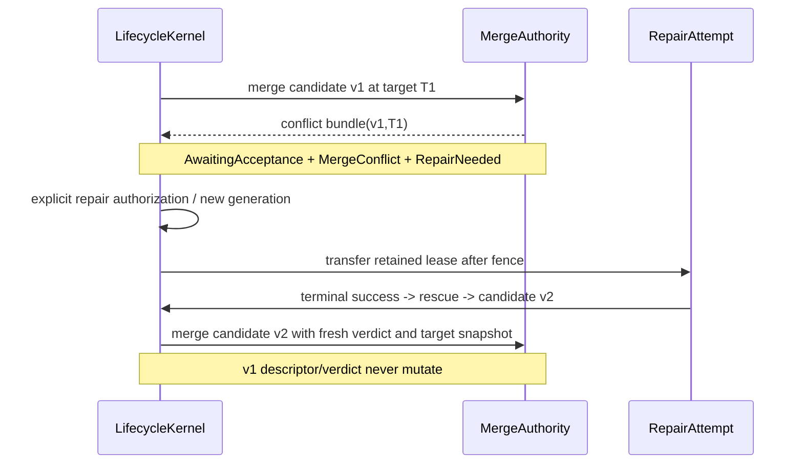
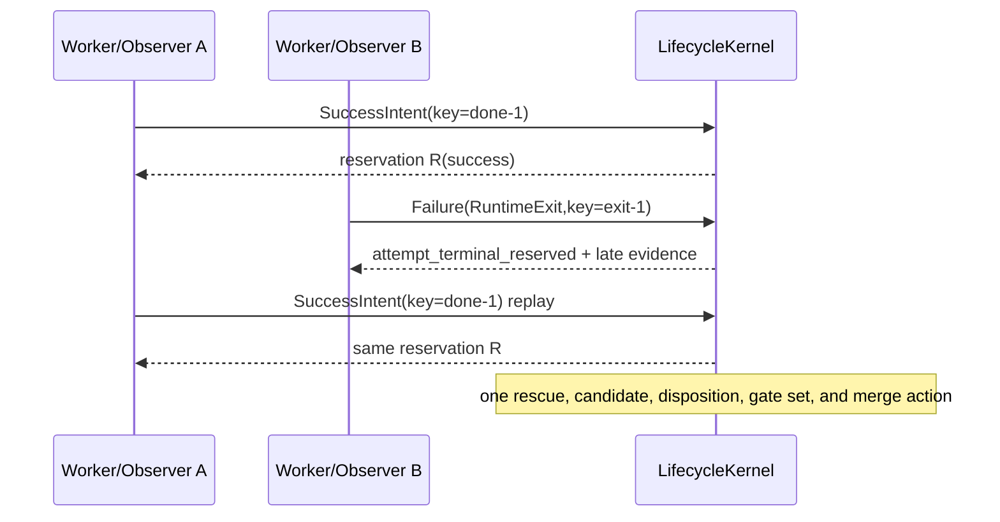

# Candidate finalization transaction

**Status:** Implementation-ready refinement

**Date:** 2026-07-26

**Owner:** `design-candidate-checkpoint`

**Normative dependencies:**

* [Simplified authoritative task lifecycle](design-simplified-task-lifecycle.md)
* [Pi task-worker session watchdog and continuation protocol](design-pi-session-watchdog.md)

**Scope:** crash-safe preservation, immutable candidate creation, validation,
evaluation handoff, merge, repair, retention, and operator diagnostics for
source-bearing isolated worktrees

**Out of scope:** production changes; Pi stall detection, progress
classification, session attestation, continuation budget, and process-epoch
launch; strong-agent conflict resolution

## 1. Decision

WG will finalize isolated-worktree output through one replayable transaction:

```text
Active
  -> Suspect / ContinuationProbe       (Pi watchdog projection only)
  -> TerminalIntent                    (kernel reservation, not terminal state)
  -> QuiescentNoTerminal               (process observation, not an outcome)
  -> NeedsFinalization
  -> RescueCheckpointed
  -> CandidateCheckpointed
  -> Validating
  -> [Evaluating]
  -> MergePending
  -> Merged | RepairNeeded | FailedPreserved
```

This is a **composite read model**, not a new task status machine. Every name
above is derived from the authoritative task-generation, attempt, process,
worktree-lease, evaluation, reconciliation, and outbox domains. Only
`LifecycleKernel::transition` changes task or attempt state. The existing
canonical states remain `Running`, `AwaitingAcceptance`, `Done`, `Failed`,
`Waiting`, and `Abandoned`; the existing attempt dispositions remain
`Succeeded`, `Failed`, `Parked`, `Cancelled`, and `Lost`.

The transaction has four non-negotiable properties:

1. A process that may still write is fenced and reaped before bytes are called
   stable. Main-tree content, wall-clock silence, a missing branch, and a
   missing push prove nothing about an isolated writer.
2. Every quiescent source-bearing path publishes a durable rescue object and
   manifest before terminal failure, lease release, reuse, or cleanup.
3. Validation, evaluation, and merge name one immutable candidate descriptor
   by commit, tree, and manifest CID. Main or a retained mutable worktree can
   never be substituted for it.
4. Every external action is driven by an append-only event/outbox record with a
   stable key. Restart repeats observation, not semantic effect.

A worker never has to push. A push is optional publication by an operator; it
is not checkpoint, evaluation, acceptance, merge, progress, or liveness
evidence.

## 2. Authority and domain boundaries

### 2.1 Actors

| Actor | Owns | Must not do |
|---|---|---|
| Worker | edit/test in its leased worktree; communicate; submit explicit done, fail, or wait intent | push as a completion requirement; checkpoint/promote; accept; merge; alter status |
| Lifecycle kernel | terminal-intent reservation CAS; canonical task/attempt transitions; lease projection changes; acceptance; generation creation | inspect prose; perform Git/process/model side effects |
| Process observer | persist exact spawn/exit/signal observations and request typed classification | infer success from prose, output, main, branch, or exit code alone |
| Process supervisor | for non-Pi processes, execute exact-identity fence/reap actions and produce quiescence proof | decide task success/failure; signal an identity it cannot prove |
| Pi watchdog | Pi `Suspect`, meaningful progress, completion-probe/continuation authorization, exact-session epochs, Pi PID/group fencing, and Pi quiescence/terminal receipts | checkpoint, create candidates, validate, evaluate, merge, or accept |
| Finalizer | consume kernel-approved terminal/quiescence inputs; create rescue/candidate objects; request downstream gates | detect a Pi stall; signal/resume/launch Pi; write task status; edit main |
| Validator | deterministically inspect a detached read-only candidate view and emit bound evidence | read main/mutable source as candidate; mutate candidate, task, or main |
| Evaluator/FLIP | read a detached read-only candidate view and append a bound verdict | mutate source/main/status; select substitute bytes; retry/reopen |
| Merge authority | mechanically integrate the exact accepted descriptor under a target-ref CAS and issue a receipt | evaluate correctness; edit the source candidate; silently resolve a real conflict |
| Acceptance controller | ask the kernel to accept/reject from exact pinned evidence | perform merge/evaluation; reopen a terminal generation |
| Operator | inspect, preserve, authorize repair/waiver/manual decision, or resolve a hold through typed commands | bypass fencing/content binding with a raw status assignment |

For Pi, “process supervisor” means the watchdog-owned signaling protocol. The
generic finalizer must not call the generic PID killer for a Pi attempt. For a
non-Pi executor, the generic process supervisor owns the same exact-identity
fence/reap obligation and exports the common receipt described below.

### 2.2 Evidence is not authority

An ordinary message, a worker log, stdout prose saying “done,” a zero exit,
Git branch visibility, a push, a file in main, or time since the last visible
change is evidence at most. None may reserve or commit a success transition.
A lifecycle tool request is authoritative only after the kernel accepts its
source tuple and idempotency key. A verdict is authoritative only as evidence
consumed by the pinned acceptance policy. A merge receipt is authoritative only
for integration, never source correctness.

## 3. One normative composite state machine

### 3.1 State mapping

The following table is normative. “No canonical edge” means exactly that: the
composite phase changed because another independent domain changed.

| Composite phase | Canonical task | Attempt | Process/watchdog | Worktree lease | Evaluation/outbox | Canonical transition on entry |
|---|---|---|---|---|---|---|
| `Active` | `Running` | current `Running` | exact current writer `Alive`/permitted; Pi phase `Active`, `WaitingUser`, or `LongTool` | `Active(attempt,fence,epoch)` | none or observations | prior `AttemptRunning`; no finalization edge |
| `Suspect` | `Running` | current `Running` | Pi watchdog `Suspect` | still `Active` | Pi probe/fence actions only | no task/attempt edge |
| `ContinuationProbe` | `Running` | current `Running` | watchdog-owned completion probe/continuation epoch | still `Active` | Pi continuation outbox | no task/attempt edge |
| `TerminalIntent` | `Running` | still nonterminal, disposition reservation present | writer may still be alive | `Active`, logically held | fence outbox pending | `AttemptDispositionReserved`, an internal kernel reservation; **not** `AttemptSucceeded/Failed` |
| `QuiescentNoTerminal` | `Running` | still current/nonterminal | exact exit observed; no accepted terminal tool | `Active`, non-reusable | generic failure classification pending, or Pi exit deferred/probe | no terminal edge |
| `NeedsFinalization` | `Running` | disposition reserved, still nonterminal | valid quiescence receipt for current process/source tuple | `Sealing` projection for the same holder and epoch | rescue action pending | no terminal edge; kernel validates reservation + receipt and emits rescue action |
| `RescueCheckpointed` | normally `Running` | normally still nonterminal | quiescent | `Sealing` or retained-held | durable rescue ref/object + manifest receipt | no task edge; `RescuePublished` evidence is linked |
| `CandidateCheckpointed` | `AwaitingAcceptance` | `Succeeded` | quiescent | `Sealed(from_attempt,epoch)` | immutable descriptor published | **same kernel commit:** `CandidatePromoted` evidence + `AttemptSucceeded`; success reservation consumed |
| `Validating` | `AwaitingAcceptance` | immutable `Succeeded` | terminal evidence only | `Sealed` | validation job running | no task/attempt edge |
| `Evaluating` | `AwaitingAcceptance` except advisory may already be `Done` | immutable `Succeeded` | terminal evidence only | `Sealed`, `MergePending`, `Integrated`, or cleanup state | evaluation job running | no task/attempt edge |
| `MergePending` | `AwaitingAcceptance` | immutable `Succeeded` | terminal evidence only | `MergePending(request)` | merge action pending | no task/attempt edge |
| `Merged` | first `AwaitingAcceptance`, then `Done` | immutable `Succeeded` | terminal evidence only | `Integrated(receipt)` then `CleanupPending(receipt)` | acceptance action, then cleanup | merge receipt link has no task edge; `AcceptanceSatisfied` changes `AwaitingAcceptance -> Done` |
| `RepairNeeded` | `AwaitingAcceptance` for merge conflict/hold, or terminal `Failed` after valid hard rejection | immutable `Succeeded` | none current | `MergeConflict` or `Retained(reason)` | rejection/conflict evidence, optional repair authorization | conflict: no task edge; hard reject: `AcceptanceRejected`; repair starts only through authorized generation/attempt policy |
| `FailedPreserved` | `Failed` (or `Abandoned` for cancel/abort) | `Failed`, `Lost`, or `Cancelled` | quiescent | `Retained(from_attempt,reason)` | durable rescue linked; cleanup prohibited by default | `AttemptFailed`/`AttemptLost`/`FenceEstablished` is committed **only after** rescue durability |

`NeedsFinalization`, `RescueCheckpointed`, `CandidateCheckpointed`,
`Validating`, `Evaluating`, `MergePending`, `RepairNeeded`, and
`FailedPreserved` are finalizer/worktree/evaluation projections. `Suspect` and
`ContinuationProbe` are watchdog projections. They are not additions to the
canonical status enum and must never be serialized into `Task.status`.

A park/wait intent takes the same preservation prefix:
`TerminalIntent -> NeedsFinalization -> RescueCheckpointed`, after which the
kernel commits `AttemptParked`, moves the generation to canonical `Waiting`,
and records the checkpoint on the parked attempt. It creates no candidate and
adds no extra composite task status.

### 3.2 Permitted edges and exact canonical effects

1. `Active -> Suspect` is Pi-watchdog-only and has no lifecycle edge.
2. `Suspect -> Active` occurs only when the watchdog observes new meaningful
   progress and wins its progress-sequence CAS. The finalizer is uninvolved.
3. `Suspect -> ContinuationProbe -> Active` consumes a watchdog continuation
   authorization and starts a new Pi process epoch in the **same** attempt. It
   has no source-attempt or lease transfer.
4. `Active -> TerminalIntent` reserves one proposed disposition. The task and
   attempt remain `Running` until process quiescence and rescue durability.
5. `Active -> QuiescentNoTerminal` records an exact process exit. It does not
   infer either source success or source failure.
6. A generic no-terminal process reserves `Failure(NoCompletionProtocol)` for a
   clean zero exit with useful bytes but no protocol, `Failure(NoUsefulOutput)`
   for proven empty output, or `Failure(RuntimeExit)` for a nonzero/signal exit,
   subject to first-terminal-wins. It then enters finalization. This preserves
   the lifecycle design's canonical mapping while delaying the terminal commit
   until rescue exists.
7. A Pi no-terminal process first follows §4. It enters finalization only after
   the watchdog/kernel returns a current terminal-intent plus quiescence pair.
8. `NeedsFinalization -> RescueCheckpointed` changes no canonical task or
   attempt state. It publishes source preservation.
9. A success reservation takes `RescueCheckpointed -> CandidateCheckpointed`.
   Candidate publication and canonical `AttemptSucceeded`/`Active -> Sealed`
   are one kernel commit referencing already-durable objects.
10. Failure/lost/cancel reservations take `RescueCheckpointed ->
    FailedPreserved`; the corresponding canonical terminal event and
    `Active -> Retained` occur together.
11. `CandidateCheckpointed -> Validating` is a validation outbox transition.
    A deterministic reject is exact hard evidence. The acceptance controller
    requests `AcceptanceRejected(ValidationRejected)`, leaving the source
    attempt `Succeeded`, retaining the candidate, and projecting
    `RepairNeeded` or `FailedPreserved` according to repair policy.
12. Required evaluation accepts only after validation pass and precedes merge.
    Advisory evaluation is independent as specified in §8.
13. A merge receipt links exact candidate and target content. It moves the
    lease to `Integrated`; only later `AcceptanceSatisfied` makes canonical
    `Done`. A conflict leaves canonical `AwaitingAcceptance` and projects
    `RepairNeeded` with `MergeConflict`.
14. Physical cleanup is an ancillary outbox action after semantic acceptance.
    Failure leaves `Done` unchanged and a visible cleanup issue.

### 3.3 False-stall rule

The following observations are explicitly inert for both stall and finalization:

* main lacks the worker's file or contains a smaller/different version;
* the worktree branch has not been pushed or is not visible remotely;
* no commit has appeared on main;
* wall-clock silence without watchdog-qualified evidence;
* ordinary messages/logs/status polls; and
* a branch name or path appears stale.

A still-current, unfenced process identity remains `Active`, even if every item
above is true. The finalizer rejects `FinalizeRequested` with
`finalize.writer_still_current`. It does not inspect file size to override the
process owner. Only a valid current quiescence receipt permits `Sealing`.

## 4. Pi and generic no-terminal precedence

### 4.1 Typed requests and receipts

The finalization implementation consumes these interfaces. Names may be
adjusted during implementation, but their fields and precedence may not.

```rust
TerminalIntentRequestV1 {
    source: SourceTuple,             // task, generation, attempt, fence
    process_epoch: u32,
    worktree_lease_epoch: u64,
    requested: Success | Failure(FailureClass) | Park | Cancel | Abort,
    actor: Actor,
    tool_call_id: Option<String>,
    idempotency_key: String,
    evidence: Vec<Cid>,
}

TerminalIntentReservedV1 {
    reservation_id: EventId,
    source: SourceTuple,
    process_epoch: u32,
    worktree_lease_epoch: u64,
    requested: Disposition,
    winning_idempotency_key: String,
}

ProcessExitedObservationV1 {
    source: SourceTuple,
    process_epoch: u32,
    identity: ProcessIdentity,       // pid, start, boot, nonce, group
    wait_status: WaitStatus,
    output_observation: OutputClass, // never prose-derived success
    observation_id: String,
}

ProcessQuiescenceReceiptV1 {
    source: SourceTuple,
    process_epoch: u32,
    identity: ProcessIdentity,
    wait_status: WaitStatus,
    nonce_pipe_eof: bool,
    process_group_empty: bool,
    containment_identity: Option<String>,
    reaped_at: Timestamp,
    observed_manifest_digest: Digest,
    receipt_cid: Cid,
}

FinalizationRequestedV1 {
    reservation_id: EventId,
    quiescence_receipt: Cid,
    expected_lease_epoch: u64,
    idempotency_key: String,
}
```

`PiTerminalIntentReceipt` and `PiQuiescenceReceipt` from the watchdog design
adapt losslessly to the first/common receipts. Their source tuple, process
epoch, PID/start/boot/nonce, group-empty proof, final session head, lease epoch,
and worktree manifest are mandatory; a generic receipt must provide the same
ownership guarantees without Pi session fields.

The Pi design describes the completion-probe behavior but does not give its
handoff a single result envelope. The implementation must expose the following
**interface seam**, without changing detector/session/budget semantics:

```rust
PiNoTerminalHandoffRequestV1 {
    source: SourceTuple,
    exited_process_epoch: u32,
    process_exit_observation: Cid,
    continuation_authorization_id: EventId,
    reason: ZeroExit | NonzeroExit | Signal | AgentSettled,
    idempotency_key: String,
}

PiCompletionProbeOutcomeV1 {
    handoff_id: String,
    source: SourceTuple,
    outcome: Terminal {
        terminal_intent_receipt: Cid,
        quiescence_receipt: Cid,
    } | Continued {
        continuation_receipt: Cid,
    } | OperatorHold {
        hold_event_id: EventId,
        issue_id: String,
    },
}
```

This envelope is only a typed index over the watchdog's already-ratified
`PiProcessExitDeferred`, `PiContinuationReceipt`, `PiTerminalIntentReceipt`,
`PiQuiescenceReceipt`, and `PiOperatorHoldRaised` records. It does not add a
new detector, prompt, launcher, budget, or process owner.

### 4.2 Pi completion-probe outcomes

For a Pi zero/nonzero/signal/`agent_settled` exit without terminal protocol:

1. The process observer appends `PiProcessEpochExited` and submits
   `PiNoTerminalHandoffRequestV1` to the kernel/watchdog interface.
2. If the exact `PiContinuationAuthorization` is active and safe, the kernel
   appends `PiProcessExitDeferred`; generic `NoCompletionProtocol` failure is
   not reserved.
3. The watchdog fences/reaps the old epoch, re-attests the exact durable
   session/leaf/route/worktree, and launches the same-session structured
   completion probe under its existing finite epoch/budget rules.
4. The probe inspects the immutable task completion contract and messages,
   `git status`/diff in the leased worktree, registered artifacts, and relevant
   tests. It must choose through explicit tools:
   * complete: submit `SuccessIntent`;
   * incomplete: continue unfinished safe work in the same attempt and later
     submit an explicit terminal/park intent;
   * blocked after an attempt: submit explicit `Failure` with evidence;
   * human input: submit a correlated `Park`/wait;
   * ambiguous replay safety: emit operator hold and no prompt/replay.
5. Only `PiCompletionProbeOutcomeV1::Terminal` lets the finalizer proceed. A
   `Continued` outcome returns the composite state to `Active`. An
   `OperatorHold` keeps task/attempt/lease `Running`/current/`Active`, held and
   non-dispatchable.

The finalizer never sends the completion prompt, chooses “complete,” resumes
Pi, or kills Pi. It validates and consumes receipts only.

### 4.3 Generic no-terminal mapping

A non-Pi process has no continuation extension. The observer records exit and
submits a typed disposition intent determined only from process protocol:

| Exact observation | Reservation request | Later canonical event after rescue |
|---|---|---|
| exit 0, nonempty/useful source observation, no terminal tool | `Failure(NoCompletionProtocol)` | `AttemptFailed(NoCompletionProtocol)` |
| exit 0, proven empty output and no source change | `Failure(NoUsefulOutput)` | `AttemptFailed(NoUsefulOutput)` |
| nonzero or signal, no earlier terminal reservation | `Failure(RuntimeExit)` | `AttemptFailed(RuntimeExit)` |
| exact identity conclusively vanished without wait status | `Failure(Lost)` | `AttemptLost` |
| identity/group quiescence ambiguous | no reservation completion | `ReconciliationIssue(ProcessIdentityAmbiguous)`; hold |

“Useful” affects preservation diagnostics, never turns the result into success.
Prose and main are not consulted. The failure event is delayed until rescue
publication; this is a sequencing refinement, not a change to the lifecycle
failure table.

### 4.4 Precedence and first-terminal CAS

The reservation CAS is:

```text
(task, generation, attempt, attempt_fence,
 current_process_epoch, terminal_reservation=None,
 worktree_lease_epoch)
```

Rules, in order:

1. The first kernel-accepted success/failure/park/cancel/abort reservation wins.
2. For Pi, `PiContinuationEpochReserved` and terminal reservation compete on
   the watchdog design's same CAS. If continuation wins, old-epoch terminal and
   exit reports are evidence only. If terminal wins, continuation/probe/launch
   actions are cancelled.
3. An accepted explicit terminal intent preceding a generic exit wins. The exit
   supplies quiescence/process evidence, not a contradictory disposition.
4. A generic exit reservation preceding a late explicit terminal request wins.
   The late request receives `attempt_terminal_reserved` or
   `stale_process_epoch` and becomes deduplicated evidence.
5. The terminal reservation is not the canonical attempt terminal. Final
   `AttemptSucceeded`, `AttemptFailed`, `AttemptParked`, `Cancelled`, or `Lost`
   requires current quiescence and rescue/candidate preconditions.
6. Duplicate requests with the winning idempotency key return the same
   reservation/event. Contradictory keys never replace it.
7. Old process epochs, old fences, old lease epochs, duplicate watchdog exits,
   stale verdicts, and stale merge receipts are evidence only.
8. The generic dead-owner reaper skips an exact current attempt with a terminal
   reservation or finalization action. It may append observations, but cannot
   race rescue by committing `AttemptLost`.

If quiescence is ambiguous, the reservation remains held. The tree is
`Quarantined`, not reusable, stable, mergeable, candidate-ready, or deletable.

## 5. Immutable source of truth

### 5.1 Source identity

```rust
SourceTupleV1 {
    task_id: TaskId,
    generation: u64,
    attempt_id: AttemptId,
    attempt_fence: u64,
}
```

Every rescue, candidate, gate, merge, and repair record also carries the
worktree ID and `lease_epoch`. Path and branch are diagnostic locators only.
They are never identity.

### 5.2 Rescue descriptor

A rescue preserves bytes without asserting correctness or completion:

```rust
RescueDescriptorV1 {
    schema_version: 1,
    rescue_id: Cid,
    source: SourceTupleV1,
    process_epoch: u32,
    terminal_reservation_id: EventId,
    quiescence_receipt_cid: Cid,
    worktree_id: String,
    worktree_lease_epoch: u64,
    worktree_path_digest: Digest,
    worker_head_oid: GitOid,
    rescue_commit_oid: GitOid,
    rescue_tree_oid: GitOid,
    manifest_cid: Cid,
    delta_manifest_cid: Cid,
    excluded_manifest_cid: Cid,
    created_by_action: String,
    created_event: EventId,
    created_at: Timestamp,
}
```

The object is canonical JSON, append-only, content-addressed, fsynced, and
published under an immutable local ref such as:

`rescue_id` is a derived envelope field, not part of its own hash preimage. WG
hashes a canonical `RescueDescriptorBodyV1` containing every other normative
field, then stores `{rescue_id, body}` and verifies that relationship on every
read. `candidate_id`, result IDs, and receipt IDs use the same non-self-referential
envelope rule. Creation event IDs are preallocated deterministically by the
originating ledger/outbox event before object construction; replay reuses them.

```text
refs/wg/rescues/<task-hash>/<generation>/<attempt>/<rescue-id>
```

Existing explicit worker commits remain ancestors. WG does not squash or
rewrite them during rescue. If the worktree has staged, unstaged, deleted, or
untracked source, WG uses a private temporary index to write a tree and creates
one local `commit-tree` snapshot parented by the exact worker `HEAD`. It does
not mutate the worker index or checkout. A clean worktree may use the exact
worker `HEAD` as `rescue_commit_oid`, but still publishes a rescue descriptor,
manifest, and immutable rescue ref. A missing/invalid `HEAD` uses an explicit
empty/base parent recorded in the descriptor; it is never guessed.

### 5.3 Inclusion policy

`CandidateInclusionPolicyV1`, snapshotted per generation, is deterministic:

1. Include every tracked index entry at its final content/mode, including
   staged and unstaged changes.
2. Encode tracked deletions as absent tree entries plus tombstones in the delta
   manifest.
3. Include every non-ignored untracked regular file and symlink beneath the
   worktree root. Symlinks are stored as links and never dereferenced.
4. Exclude `.git` administration and WG process/session/control files only by
   exact, versioned path rules. A broad `.wg/**` exclusion is forbidden because
   `.wg` may be repository source.
5. Ignored paths are not candidate source by default. Known volatile paths
   (`target`, cache/temp products) are listed with rule IDs. Other ignored
   source-bearing paths are copied into a content-addressed rescue sidecar and
   make candidate promotion hold with `candidate.ignored_source_unclassified`
   unless the pinned deliverable policy explicitly includes them.
6. A submodule is represented by its gitlink OID. A dirty/untracked submodule
   is preserved as a sidecar bundle and holds candidate promotion until an
   explicit policy classifies it.
7. Sockets, devices, FIFOs, unreadable files, escaping symlinks, sparse-checkout
   ambiguity, case-colliding paths, and racy mutations fail closed. They appear
   in the excluded/exception manifest; candidate promotion does not proceed.
8. File paths are repository-relative byte strings with `/` separators,
   normalized only as Git requires and sorted bytewise. No locale or wall-clock
   field enters a digest.

The canonical full-tree manifest contains for every entry:
`path, git_mode, kind, git_object_oid, blake3_content_digest, size`. The delta
manifest relative to the pinned base additionally contains `add`, `modify`,
`delete`, `rename-as-delete+add`, and gitlink changes. Canonical CBOR or
RFC-8785 JSON is hashed with BLAKE3 and encoded as `wgcid:v1:blake3:<hex>`.
Git commit/tree OIDs remain recorded with their object format (`sha1` or
`sha256`). The manifest CID and Git tree OID must both verify.

### 5.4 Candidate descriptor

Only a completion-ready rescue is promoted:

```rust
CandidateDescriptorV1 {
    schema_version: 1,
    candidate_id: Cid,
    candidate_version: u64,
    source: SourceTupleV1,
    terminal_reservation_id: EventId,
    worktree_id: String,
    worktree_lease_epoch: u64,
    process_epoch: u32,
    quiescence_receipt_cid: Cid,
    rescue_id: Cid,

    repository_object_format: Sha1 | Sha256,
    base_commit_oid: GitOid,
    base_tree_oid: GitOid,
    parent_commit_oids: Vec<GitOid>,
    worker_head_oid: GitOid,
    candidate_commit_oid: GitOid,
    candidate_tree_oid: GitOid,
    content_manifest_cid: Cid,
    delta_manifest_cid: Cid,

    completion_contract_cid: Cid,
    validation_policy_snapshot: ValidationPolicySnapshot,
    evaluation_policy_snapshot: EvaluationPolicySnapshot,
    merge_policy_snapshot: MergePolicySnapshot,
    dependency_revision_snapshot: Cid,
    route_snapshot_cid: Cid,

    creation_action_id: String,
    creation_event_id: EventId,
    created_at: Timestamp,
}
```

Descriptors are append-only and versioned. The immutable ref is:

```text
refs/wg/candidates/<task-hash>/<generation>/<attempt>/v<version>
```

An existing version is never force-updated. Candidate promotion CASes
`(source tuple, lease epoch, rescue ID, candidate_version slot absent)` and in
the same kernel commit links the descriptor, consumes the success reservation,
commits `AttemptSucceeded`, moves the task to `AwaitingAcceptance`, and changes
`Sealing -> Sealed`. Content-addressed objects written before that commit but
not linked are safe orphan preparations; replay either links the exact same
CID or later GC removes only an unreferenced, proven non-source preparation.

A repair always produces a new rescue and `CandidateDescriptor` version, even
if only metadata or one byte changed. Verdicts and merge receipts for v1 cannot
bind v2. As with rescue, `candidate_id` hashes the canonical descriptor body
excluding the derived ID envelope field; there is no self-referential digest.

### 5.5 Seal preconditions

Immediately before rescue tree write and again before descriptor publication,
the finalizer verifies:

* the lifecycle reservation is current and unconsumed;
* generation, attempt, fence, and lease epoch match;
* the process epoch is the reservation's current/terminal epoch;
* the quiescence receipt verifies exact PID/start/boot/nonce and empty group;
* no process sublease can admit another write;
* the canonical worktree identity/path/device matches its lease;
* the observed manifest equals the receipt's final manifest or an explained,
  no-writer deterministic rescan; and
* no competing candidate version occupies the slot.

A manifest difference after a valid reap is not silently accepted: it creates
`finalize.post_reap_manifest_drift` and rescans only after proving no writer.
A difference with ambiguous ownership quarantines. The finalizer never
“stabilizes” bytes merely by waiting.

## 6. Checkpoint-first finalization protocol

### 6.1 Success

1. Kernel accepts `SuccessIntent` reservation.
2. Supervisor/watchdog revokes process write permission, fences and reaps the
   exact identity/group, and publishes quiescence proof.
3. Kernel accepts `FinalizationRequested` and projects lease `Sealing`.
4. Finalizer writes/fsyncs Git objects, manifests, rescue descriptor, and
   immutable rescue ref; then links `RescuePublished`.
5. Finalizer verifies the completion-ready inclusion policy and writes/fsyncs
   candidate descriptor/ref.
6. Kernel atomically links `CandidatePromoted`, commits
   `AttemptSucceeded`, moves `Running -> AwaitingAcceptance`, and changes lease
   `Sealing -> Sealed`.
7. Validator/evaluator/merge act only on the descriptor.

### 6.2 Explicit failure, generic failure, lost, cancel, and abort

The same steps through rescue publication are mandatory. Only then may the
kernel commit:

* `AttemptFailed(SourceExecution)` for explicit worker failure;
* `AttemptFailed(NoCompletionProtocol|NoUsefulOutput|RuntimeExit)` for generic
  no-terminal classifications;
* `AttemptLost` for exact loss;
* `Cancelled` plus the requested abandon/reset transition; or
* operator abort's policy-selected failure/abandon disposition.

The lease becomes `Retained`, not available. Useful WIP remains materializable
by rescue ID. Cancellation does not mean discard. A reset/new generation may
transfer the retained worktree only in the same kernel commit that authorizes
that new attempt and only after the old rescue and fence proof exist.

If rescue object or ref publication fails (`EIO`, `ENOSPC`, permission, Git
failure), canonical terminalization waits in `NeedsFinalization`. This may hold
a logically dead attempt as `Running` longer, but it never lies about durable
preservation. Readiness remains held; the operator sees the storage failure.

### 6.3 No live terminalization

TERM/KILL ordering for a generic process is:

1. persist `FenceRequested` with exact identity and source tuple;
2. revoke its write/process sublease under the kernel lock;
3. re-read PID start identity, boot ID, nonce, and containment identity;
4. send TERM to the exact group once;
5. after pinned grace, reverify identity and send KILL once if necessary;
6. wait/reap; prove nonce-pipe EOF and group/cgroup/job emptiness;
7. publish `ProcessQuiescenceReceiptV1`; and
8. only then run rescue.

A reused PID or start/boot/nonce mismatch is never signaled. It produces
`process.pid_identity_mismatch` and an operator hold. A remaining descendant or
unknown containment produces `process.group_quiescence_unproven`. In either
case the worktree cannot be checkpointed as stable, reused, merged, or deleted.
For Pi, the watchdog performs these exact steps and the finalizer consumes its
receipt.

## 7. Read-only deterministic validation

A `ValidationRequestV1` contains candidate ID, commit/tree OIDs, both manifest
CIDs, completion-contract CID, policy snapshot CID, toolchain/environment
snapshot, and action ID. The validator:

1. verifies descriptor CID/signature/schema and all Git objects;
2. creates a detached, no-shared-writable-refs materialization from the exact
   candidate tree (temporary clone/object alternates mounted read-only, plus a
   disposable build overlay if tests need writes);
3. recomputes the full and delta manifests before running commands;
4. runs only the snapshotted deterministic policy;
5. records command argv, toolchain/environment IDs, exit/status/output digests,
   and materialized tree/manifest after the run; and
6. emits an immutable `ValidationResultV1` bound to candidate commit, tree,
   manifest CID, policy CID, validator identity, and request ID.

The validator does not `checkout main`, follow the candidate branch name, or
read the mutable retained worktree. Build products go outside the read-only
source view. Any source mutation by a command fails
`validation.source_view_mutated`; it is never folded into the candidate.

A stale, wrong-policy, wrong-tree, or wrong-manifest result is unlinked evidence
with `validation.binding_mismatch`. It cannot satisfy acceptance.

## 8. Evaluation policies and ordering

### 8.1 Common evaluator binding

An `EvaluationRequestV1` and every evaluator/FLIP verdict contain:

```text
candidate_id
candidate_commit_oid
candidate_tree_oid
content_manifest_cid
delta_manifest_cid
completion_contract_cid
validation_result_cid
policy_snapshot_cid
route_snapshot_cid
provider/model/reasoning/evaluator identity
request/action ID
```

The evaluator verifies and materializes the exact candidate as the validator
does, in a detached read-only view. Prompt evidence is bounded and labels
candidate bytes untrusted. Main and mutable source paths are unavailable.
Evaluator infrastructure state belongs only to the evaluation record.

### 8.2 Required

Normative order:

```text
checkpoint rescue
-> promote immutable candidate / AttemptSucceeded
-> deterministic validation pass
-> evaluate exact candidate
-> exact accepted verdict/quorum
-> merge exact candidate
-> link merge receipt
-> AcceptanceSatisfied / Done
```

A semantic reject is valid hard evidence for `AcceptanceRejected`; source
attempt remains `Succeeded`, candidate is retained, and repair requires policy.
Evaluator launch/auth/timeout/crash/corruption is infrastructure failure. The
task remains `AwaitingAcceptance`, normally projected as `Evaluating` with
`evaluation.infrastructure_unavailable`; it is not source failure and does not
rewrite a success verdict. Retry uses the evaluation retry budget, not source
attempt/retry budgets.

### 8.3 Advisory

After deterministic validation passes, merge and acceptance may proceed under
the pinned policy without waiting for evaluation. The lazy evaluation remains
bound to that exact candidate even if cleanup has removed the physical
worktree. A later advisory reject is append-only evidence/recommendation. It
cannot reopen, replace, fail, or create a generation for the accepted task.
Any follow-up is an explicit retry/new task through lifecycle policy.

### 8.4 None

No evaluation record is created for acceptance. Deterministic validation and
merge requirements still apply. An operator may later request an advisory
evaluation pinned to the same descriptor; it has no retroactive authority.
`None` never means “evaluate mutable main.”

### 8.5 Manual

After deterministic validation, the system creates a content-bound
`ManualDecisionRequestV1`. Approval/rejection records include operator identity,
candidate commit/tree/manifest, policy CID, decision, rationale, timestamp, and
idempotency key. Approval permits merge; it is not merge or acceptance by
itself. Rejection supplies hard evidence to `AcceptanceRejected`. A waiver of
required evaluation is a distinct policy-permitted manual evidence record and
never fabricates a model verdict. A stale decision for another candidate or
policy is rejected.

Policies may compose manual and required evaluation only if the generation's
snapshot explicitly specifies quorum/order. The default is one mutually
exclusive evaluation mode, avoiding hidden gate order.

## 9. Content-bound merge transaction

### 9.1 Merge request

`MergeRequestV1` contains:

```text
merge_request_id / action_id
candidate descriptor CID, commit, tree, full/delta manifest CIDs
base commit/tree
validation result CID
required verdict/manual evidence CIDs
target ref identity
expected target-head commit/tree
merge policy/tool version
```

The merge authority resolves no branch by name except the canonical target ref,
and it never uses main as candidate input. It first reconstructs the candidate
from the descriptor and verifies all bindings.

### 9.2 Mechanical integration and equality

In an isolated integration index, the authority deterministically computes the
merge of:

* pinned candidate base;
* exact candidate commit/tree/delta; and
* exact expected target-head commit/tree.

For every candidate-controlled delta entry, the result must contain the exact
candidate blob/mode/gitlink, or the exact deletion, unless the policy identifies
a conflict. Non-overlapping target content may remain. The authority computes a
`candidate_projection_digest` over those result entries and requires equality
to the descriptor's delta projection. It also records the complete resulting
tree OID and manifest CID. Thus “result equals candidate” means exact candidate
content is preserved while legitimate non-overlapping target content is
combined; it never means replacing the whole current repository tree.

Textual overlap, add/add, modify/delete, rename ambiguity, generated ownership
ambiguity, or a changed target that invalidates the prepared result creates a
conflict/repair record. The authority never checks out the 6KB main file and
calls it the candidate, never resolves conflict by taking main, and never asks
the evaluator to judge merged substitute bytes. Strong semantic resolution is
the downstream strong-agent design's concern and must produce a new immutable
descriptor.

### 9.3 Exactly-once target CAS

1. Persist `MergeRequested` and its outbox action.
2. Re-read canonical target. If it differs from `expected_target_head`, emit
   `MergeTargetMoved`; create a new target snapshot/request only through policy.
   Do not silently rebase.
3. Compute and fsync the integration commit/tree in a private ref
   `refs/wg/merge-results/<action-id>`.
4. Reverify candidate projection digest and complete result tree.
5. CAS the canonical target ref from expected head to the prepared integration
   commit. Only merge authority has this capability.
6. Write/fsync `MergeReceiptV1` and link it through the kernel.

The receipt contains request/action ID; descriptor CID; candidate commit/tree
and manifest CIDs; base; expected target commit/tree; integration commit and
complete result tree/manifest; candidate projection digest; merge tool/policy;
ref-CAS proof; and timestamps. Replay after CAS but before receipt finds the
immutable merge-result ref, verifies parents/tree/CAS evidence, and creates the
same receipt. It does not merge again. Duplicate delivery returns the existing
receipt.

An external uncoordinated main edit is target movement, never input
substitution. A conflict changes lease `MergePending -> MergeConflict`, leaves
task `AwaitingAcceptance` and attempt `Succeeded`, and projects
`RepairNeeded`. A successful receipt changes the lease to `Integrated`; the
acceptance controller then rechecks every pinned gate under `graph.lock` and
requests `AcceptanceSatisfied`.

## 10. Repair, rejection, and failure

Immutable source attempts and terminal generations are never reopened.
“Resume the retained candidate worktree/session” means reuse its bytes and
session provenance **under a lifecycle-authorized linked repair attempt**; it
does not authorize another process epoch on the terminal source attempt.
Specifically:

1. Validation/manual/required-evaluation rejection normally commits
   `AcceptanceRejected`, leaving source attempt `Succeeded` and generation
   `Failed` with candidate/rescue retained.
2. A merge conflict leaves the generation `AwaitingAcceptance`. The operator
   may retry a mechanical merge against an authorized new target snapshot, send
   it to the separately designed strong resolver, or request source repair.
3. Source repair first records an explicit rejection/repair cause if needed,
   then uses `RetryAuthorized`/operator `GenerationCreated`. The new attempt is
   linked by `repairs_candidate_id`, may atomically acquire the retained
   worktree after fence proof, and receives prior session only as provenance or
   an explicit new-session branch. The Pi watchdog may not continue the old
   terminal attempt/session epoch.
4. Repair edits create a new rescue, candidate version, validation result,
   verdict/manual record, and merge request. No record is overwritten.
5. If policy/operator declines repair, a rejected terminal generation projects
   `FailedPreserved`. Its candidate and rescue remain inspectable.
6. Explicit worker failure reaches `FailedPreserved` only after rescue
   retention is durable. Useful WIP is not promoted to a candidate unless a
   later repair attempt explicitly proposes it.

A repair can be in-place only in the physical sense of a fenced lease transfer.
It is always a new authoritative attempt/generation where the lifecycle design
requires one.

## 11. Append-only events, outbox, and replay

### 11.1 Stable keys

Canonical action IDs are BLAKE3 over a domain separator and canonical fields:

```text
terminal:<source>:<process_epoch>:<tool-call-or-observation>
pi-handoff:<source>:<exited-epoch>:<exit-observation-cid>
fence:<source>:<process_epoch>:<reservation-id>
signal:<fence-action>:TERM|KILL
reap:<fence-action>:<process-identity-digest>
rescue:<source>:<lease-epoch>:<reservation-id>:<quiescence-cid>
candidate:<rescue-id>:v<version>:<policy-snapshot-cid>
validate:<candidate-id>:<validation-policy-cid>
evaluate:<candidate-id>:<evaluation-policy-cid>:<route-cid>:<slot>
merge:<candidate-id>:<target-ref-id>:<expected-target-oid>:<merge-policy-cid>
accept:<task>:<generation>:<candidate-id>:<acceptance-evidence-set-cid>
cleanup:<worktree-id>:<lease-epoch>:<acceptance-event-id>
```

Outbox records are append-only projections with
`Pending | Claimed | ReceiptAvailable | Succeeded | Cancelled | OperatorHold`.
Claims are expiring execution leases, not semantic ownership. Every consumer
checks both action state and expected source/lease/target CAS immediately before
its side effect and before linking a receipt.

### 11.2 Boundary table

| Boundary | Durable-before-effect record | Receipt/replay rule |
|---|---|---|
| terminal intent | `TerminalIntentReserved` ledger event | same key returns reservation; loser is late evidence |
| Pi no-terminal handoff | `PiProcessExitDeferred` + handoff action | watchdog returns one indexed terminal/continued/hold outcome |
| fence request | `FenceRequested`, process sublease revoked | stale progress/epoch/reservation cancels action |
| TERM/KILL | separate signal action with exact identity | reverify identity; at most one acknowledged signal phase; mismatch holds |
| reap proof | wait/nonce/group evidence journal, then receipt CID | no rescue/launch/reuse without current receipt |
| rescue write | rescue action, private objects | recompute same tree/CIDs; immutable ref create is CAS/idempotent |
| candidate promotion | descriptor object/ref prepared | kernel links same CID/version or rejects occupied/drifted slot |
| validation start/result | request action | duplicate runner may compute, but only one exact result slot links; wrong binding is evidence |
| evaluation start/verdict | evaluation record/action | runner attempts append; exact verdict dedupes by candidate/policy/route/evaluator slot |
| merge start | request + expected target | private result ref permits recovery; target CAS occurs once |
| merge conflict | conflict bundle CID | same input returns same conflict; new target/candidate creates new request |
| merge receipt | immutable receipt CID | replay links prepared result/CAS proof; never repeats merge |
| acceptance | kernel request with evidence-set CID | one `AcceptanceSatisfied/Rejected`; duplicate returns event |
| cleanup | cleanup action after acceptance | retry ancillary cleanup; semantic state never rolls back |
| daemon restart | no special mutation | replay ledger, ingest receipts, reconcile exact identities, resume pending actions in order |

### 11.3 Cancellation of stale actions

When terminal reservation, process epoch, fence, lease epoch, candidate version,
policy snapshot, target snapshot, or generation loses its CAS, the kernel
appends `OutboxActionCancelled(stale_*)` for every unconsumed descendant action.
Consumers treat cancellation as final unless a receipt proves the effect had
already committed. In that case they reconcile the effect without granting it
authority: for example, a stale validation verdict remains evidence; a prepared
merge ref is retained; a canonical target CAS can be linked only if its exact
previously authorized request proves it occurred.

Cancellation is monotonic. Deleting an action row is forbidden. A new repair or
target snapshot gets new keys and cannot revive old actions.

### 11.4 Restart convergence

Startup order refines the lifecycle design:

1. checksum/replay lifecycle ledger and projection;
2. verify rescue/candidate descriptors and immutable refs;
3. ingest quiescence, validation, verdict, conflict, and merge receipts by CID;
4. reconcile processes by exact PID/start/boot/nonce and containment;
5. reconcile worktree lease epoch/path and quarantine ambiguity;
6. cancel stale outbox actions;
7. resume current fence/rescue/candidate/gate/merge/acceptance actions in order;
8. schedule cleanup only after acceptance; and
9. compute readiness last.

At no point does restart infer success, failure, retry, or candidate bytes from
current main.

## 12. Sequence diagrams

### 12.1 Normal explicit done

```mermaid
sequenceDiagram
  participant W as Worker
  participant K as LifecycleKernel
  participant S as Supervisor
  participant F as Finalizer
  participant V as Validator
  participant M as MergeAuthority
  W->>K: SuccessIntent(source, epoch, toolCallId)
  K-->>W: TerminalIntentReserved
  K->>S: FenceRequested(action, exact PID identity)
  S->>S: TERM/KILL exact group; reap
  S->>K: ProcessQuiescenceReceipt
  K->>F: RescueRequested(source, lease, receipt)
  F->>K: RescuePublished(commit, tree, manifest CID)
  F->>K: CandidatePromote(descriptor CID)
  K->>K: AttemptSucceeded + AwaitingAcceptance + Sealed
  K->>V: Validate exact descriptor
  V->>K: bound pass receipt
  K->>M: Merge exact descriptor
  M->>K: bound merge receipt
  K->>K: AcceptanceSatisfied -> Done
```

### 12.2 Pi no-terminal exit and structured completion probe

```mermaid
sequenceDiagram
  participant O as ProcessObserver
  participant K as LifecycleKernel
  participant P as PiWatchdog
  participant F as Finalizer
  O->>K: PiProcessEpochExited(no terminal)
  K->>P: PiNoTerminalHandoffRequest
  P->>K: PiProcessExitDeferred
  P->>P: exact reap + session/route re-attest
  P->>P: same-session completion probe
  alt complete or blocked
    P->>K: PiTerminalIntentReceipt
    P->>K: PiQuiescenceReceipt
    K->>F: FinalizationRequested
  else incomplete and safe
    P->>K: PiContinuationReceipt
    Note over K,F: same attempt Active; finalizer does nothing
  else replay ambiguous
    P->>K: PiOperatorHoldRaised
    Note over K,F: Running/current/held; no checkpoint as stable
  end
```

For generic no-terminal exit, replace the watchdog lane with the generic
`Failure(NoCompletionProtocol|RuntimeExit)` reservation and supervisor
quiescence; rescue precedes the canonical failure.

### 12.3 False stall and late write

```mermaid
sequenceDiagram
  participant D as Daemon/Finalizer
  participant P as PiWatchdog
  participant W as CurrentWriter
  D->>D: observe main=6KB, no push, wall-clock silence
  D-->>D: no progress/finalization inference
  P->>P: apply only native meaningful-progress protocol
  W->>W: write late 28KB candidate in isolated worktree
  W->>P: receipt-backed progress
  P->>P: suspect CAS cancelled / Active
  Note over D,W: writer remains current; no seal, merge, reuse, or cleanup
```

### 12.4 Explicit fail with useful WIP

```mermaid
sequenceDiagram
  participant W as Worker
  participant K as LifecycleKernel
  participant S as Supervisor
  participant F as Finalizer
  W->>K: Failure(SourceExecution, evidence)
  K->>S: reserve failure + fence exact writer
  S->>K: quiescence receipt
  K->>F: RescueRequested
  F->>K: RescuePublished(useful WIP commit/tree/manifest)
  K->>K: AttemptFailed(SourceExecution) + Retained
  Note over K,F: FailedPreserved; no candidate correctness claim
```

### 12.5 Required evaluation accept, reject, and crash

```mermaid
sequenceDiagram
  participant K as Kernel/Acceptance
  participant V as Validator
  participant E as Evaluator
  participant M as MergeAuthority
  K->>V: validate(candidate v1)
  V-->>K: pass bound to v1
  K->>E: evaluate(candidate v1, route/policy)
  alt accepted exact verdict
    E-->>K: accepted verdict(v1)
    K->>M: merge(v1)
    M-->>K: merge receipt(v1)
    K->>K: AcceptanceSatisfied -> Done
  else semantic reject
    E-->>K: reject verdict(v1)
    K->>K: AcceptanceRejected -> Failed
    Note over K,E: candidate retained; RepairNeeded/FailedPreserved
  else evaluator crash/auth/timeout
    E-->>K: infrastructure failure
    Note over K,E: source attempt stays Succeeded; task AwaitingAcceptance
  end
```

### 12.6 Merge conflict and repair version



### 12.7 PID reuse, late writer, and uncertain group

```mermaid
sequenceDiagram
  participant K as LifecycleKernel
  participant S as Supervisor
  participant F as Finalizer
  K->>S: FenceRequested(pid=42,start=A,boot=B,nonce=N,group=G)
  S->>S: observe pid=42,start=C
  S-->>K: PIDIdentityMismatch receipt
  K->>K: ReconciliationIssue + Quarantined
  K-->>F: reject seal(finalize.quiescence_unproven)
  Note over S,F: never signal reused PID; possible descendants/tree remain held
```

A write after a purported reap changes the manifest. Without proof it came from
an authorized no-writer source, promotion fails and quarantine wins.

### 12.8 Duplicate/contradictory terminal reports



### 12.9 Daemon restart at every boundary

```mermaid
sequenceDiagram
  participant D1 as Daemon before crash
  participant L as Ledger/ObjectStore
  participant D2 as Restarted daemon
  D1->>L: append event/action or content-addressed receipt
  D1-xD1: crash before/after adjacent boundary
  D2->>L: replay ledger; verify refs/CIDs; ingest receipts
  D2->>D2: check source/fence/lease/target CAS
  alt effect absent
    D2->>L: execute same stable action once
  else exact effect present
    D2->>L: link/reconstruct same receipt
  else evidence ambiguous
    D2->>L: operator hold; preserve source
  end
```

This diagram is instantiated at terminal intent, Pi handoff, fence, TERM, KILL,
reap, rescue objects, rescue ref, candidate objects, candidate link,
validation request/result, evaluation request/verdict, merge request/conflict,
merge-result ref, target CAS, merge receipt, acceptance, and cleanup.

## 13. Operator contract and reason codes

### 13.1 Commands

The implementation should provide these read/control surfaces, using existing
lifecycle commands where possible:

```text
wg finalize status <TASK> [--json]
wg rescue show|verify|materialize <RESCUE-ID> [--to DIR]
wg rescue preserve <RESCUE-ID> --reason TEXT
wg candidate show|verify|materialize <CANDIDATE-ID> [--to DIR]
wg candidate repair <CANDIDATE-ID> [--fresh|--reuse-worktree]
wg validation status|retry <TASK|CANDIDATE-ID>
wg evaluate status <TASK|CANDIDATE-ID>
wg merge status|retry <TASK|CANDIDATE-ID>
wg worktree status <TASK>
wg lifecycle show <TASK>
wg finalize reconcile <TASK> --dry-run
wg candidate gc --dry-run
```

`repair`, retry, waiver, manual decision, target refresh, and destructive GC are
explicit typed requests. `status`, `show`, `verify`, `materialize`, and dry-run
are read-only.

### 13.2 Required status fields

Human and JSON output expose:

* task generation/state/revision, attempt/disposition, attempt fence;
* executor and Pi continuation/process epoch by watchdog receipt reference;
* PID, PGID, start identity, boot ID, nonce, containment and reap proof;
* worktree ID/path, lease epoch/state, quarantine/retention reason;
* terminal reservation and winning idempotency key;
* rescue ID, commit/tree OIDs, manifests, ref, inclusion exceptions;
* candidate ID/version, base/parent/commit/tree and manifest CIDs;
* validation policy/request/result binding and commands;
* evaluation mode, policy/route/evaluator identity, verdict binding/status;
* merge request, target snapshot, conflict bundle, result ref, receipt/CAS;
* acceptance event/record and cleanup action/status;
* retained path/ref/archive, GC eligibility and retention reason;
* last replayed action, next pending action, retry count, and safe next command.

A branch/path equality line is never rendered as “verified candidate.” Verification
requires tree + manifest CID.

### 13.3 Stable reason codes

| Code | Meaning / safe action |
|---|---|
| `finalize.writer_still_current` | do nothing; inspect process/watchdog |
| `finalize.terminal_intent_reserved` | wait for exact quiescence |
| `finalize.stale_terminal_intent` | late evidence only |
| `finalize.quiescence_missing` | fence/reap through owner |
| `finalize.quiescence_unproven` | operator reconcile containment; no reuse |
| `process.pid_identity_mismatch` | do not signal; inspect PID reuse |
| `process.group_quiescence_unproven` | quarantine until containment proof |
| `finalize.lease_epoch_mismatch` | inspect lease; stale action cancelled |
| `finalize.post_reap_manifest_drift` | rescan only with no-writer proof |
| `rescue.write_failed` | repair storage; terminalization held |
| `rescue.ref_publish_failed` | replay immutable ref CAS |
| `candidate.inclusion_ambiguous` | classify special/ignored/submodule bytes |
| `candidate.ignored_source_unclassified` | preserve sidecar; explicit inclusion decision |
| `candidate.version_exists` | verify same CID or create next repair version |
| `candidate.binding_mismatch` | reject stale/wrong descriptor evidence |
| `validation.failed` | inspect result; authorize repair/reject |
| `validation.infrastructure_unavailable` | retry validator; source success unchanged |
| `validation.source_view_mutated` | reject validator run; inspect command policy |
| `validation.binding_mismatch` | unlink result and rerun exact candidate |
| `evaluation.rejected` | hard policy rejection; candidate retained |
| `evaluation.infrastructure_unavailable` | retry/waive per policy; do not fail source |
| `evaluation.binding_mismatch` | stale evidence only |
| `merge.target_moved` | create fresh target snapshot/request |
| `merge.content_binding_mismatch` | quarantine merge result; never accept |
| `merge.conflict` | inspect conflict; repair/strong resolution/human action |
| `merge.receipt_missing` | replay from immutable merge-result ref/CAS proof |
| `acceptance.evidence_missing` | remain AwaitingAcceptance |
| `cleanup.failed_preserved` | task accepted; retry cleanup without deleting source refs |
| `retention.source_identity_unknown` | never age-delete; operator investigation |

Reason text is bounded; arbitrary process/model/diff text is referenced by CID,
not interpolated into category fields.

## 14. Retention and garbage collection

| Class | Physical worktree | Rescue/candidate refs and descriptors | Automatic age deletion |
|---|---|---|---|
| active/ambiguous/unknown | retained + quarantined | retain all | forbidden |
| rescue only, no terminal commit yet | retained | retain all | forbidden |
| failed/cancelled/lost with WIP | retained by default; archive allowed | retain rescue + sidecars | forbidden |
| candidate validating/evaluating | retained or safely removable only if all objects independently materialize | retain all | forbidden |
| rejected/repair/conflict | retained for repair | retain all versions/evidence | forbidden |
| merged + accepted | worktree cleanup allowed after verification | retain descriptor, manifests, merge/acceptance receipts indefinitely | metadata never; object compaction only with proof |
| abandoned by explicit operator | removable only after rescue/export and CID-confirmed disposition | retain tombstone, descriptor, disposition, archive locator | no implicit age deletion |
| unreferenced preparation object | no source lease association and proven duplicate | none authoritative | bounded GC allowed after ledger/ref reachability proof |

Default policy never age-deletes an unmerged, rejected, failed,
source-bearing, unknown, or incompletely classified object. “Old branch” is not
GC eligibility. Git refs protect objects from ordinary `git gc`.

Optional compaction of a merged candidate may drop a duplicate Git object only
when the accepted integration commit or a verified immutable archive bundle can
materialize every candidate entry and both manifests still verify. A squashed
merge that cannot reconstruct original candidate history keeps the candidate
ref. Cleanup failure is an ancillary issue and cannot roll back `Done`.

Destructive disposition requires an operator to name the rescue/candidate CID,
review the manifest/exclusions, and append a signed `RetentionDisposition`.
Unknown legacy/source identity always fails closed.

## 15. Migration and rollout

### 15.1 Schema and compatibility

Add serde-defaulted, versioned finalization references to the lifecycle/attempt,
worktree, evaluation, and acceptance projections. The authoritative records
remain in the ledger/content store; compatibility graph fields are read models.

Legacy data maps as follows:

* A live exact attempt remains `Active`; it receives modern rescue/candidate
  records only on future finalization.
* A dirty/unmerged legacy worktree with provable owner is imported as
  `RetainedLegacy` plus `MigrationIssue(CandidateUnknown)`. Before release or
  repair, create a rescue. Do not infer a candidate from main.
* Ambiguous owner/process identity becomes `Quarantined` and
  `retention.source_identity_unknown`.
* Existing `Done` remains terminal through the lifecycle design's
  `LegacyAcceptance`; migration records that modern candidate/merge binding is
  unknown. It must not fabricate OIDs/CIDs retroactively.
* Legacy pending evaluation maps according to the lifecycle design. Exact old
  verdicts remain historical; no old path/branch binding is upgraded to a
  candidate binding without recomputation and provenance.
* Existing cleanup markers cannot authorize deletion until modern rescue/
  integration reachability is verified.

### 15.2 Rollout

1. Add RED model/fault fixtures and candidate manifest/reference types.
2. Run descriptor/checkpoint/merge classification in shadow mode without
   changing current completion.
3. Enable rescue-before-terminalization for new isolated attempts.
4. Enable candidate-bound validation/evaluation handoff.
5. Enable central merge authority and acceptance binding.
6. Turn direct inline `wg done` merge/status paths into request adapters.
7. Enable cleanup only after retention diagnostics are clean.
8. Remove compatibility paths after one release with zero unexplained direct
   mutation/binding mismatch.

During dual mode, a disagreement holds and preserves source. It never falls
back to old main-based merge.

## 16. File-level implementation seams

The downstream implementation should use the modules introduced by
`implement-authoritative-lifecycle`; exact filenames may follow that task's
layout, but responsibilities are fixed:

| File/seam | Required work |
|---|---|
| lifecycle kernel/event/projector (`src/lifecycle.rs` or new `src/lifecycle/{kernel,event,projector}.rs`) | terminal reservation, finalization requests, rescue/candidate links, canonical transition preconditions, acceptance, stale action cancellation |
| new `src/finalization/mod.rs` | orchestrator/read projection only; no status writes |
| new `src/finalization/descriptor.rs` | versioned rescue/candidate/gate/merge schemas and CID verification |
| new `src/finalization/manifest.rs` | private-index inclusion policy, full/delta/exclusion manifests, canonical hashing |
| new `src/finalization/checkpoint.rs` | quiescence/lease validation, Git object/ref publication, repair versioning |
| new `src/finalization/outbox.rs` | action keys, receipt ingestion, cancellation, restart reconciliation |
| new `src/finalization/validation.rs` | detached read-only materialization and bound deterministic results |
| new `src/finalization/merge.rs` | private integration ref, candidate projection equality, target CAS, conflict/receipt |
| new `src/finalization/retention.rs` | reachability, archive, fail-closed GC eligibility |
| Pi watchdog modules from `implement-pi-stalled` | expose/index §4 handoff outcomes; no checkpoint logic |
| generic process supervisor / `src/service/registry.rs` | exact PID/start/boot/nonce/group receipt adapter; never classify success |
| `src/commands/done.rs`, `fail.rs`, retry/reset/kill commands | become typed intent/repair adapters; remove inline merge/direct terminalization |
| `src/commands/spawn/execution.rs` | wrapper emits intents and process observations; no implicit done/fail before finalization |
| `src/commands/service/worktree.rs`, `worktree_cmd.rs`, `worktree_gc.rs` | lease-aware retention, no source deletion, central cleanup consumer |
| `src/eval_lifecycle.rs`, `src/commands/evaluate.rs`, `src/service/llm.rs` | consume descriptor events, persist exact route/policy/binding, read-only materialization |
| `src/cli.rs`, `src/main.rs`, show/TUI modules | §13 commands/status/reasons and safe next action |
| persistence migration | schema versions, legacy holds, descriptor/ref indexes, ledger replay checkpoint |
| unit/model tests | manifests, CAS, first-terminal interleavings, fault injection, retention |
| `tests/fixtures/fake-pi-watchdog` | extend ratified Fake-Pi scenarios for the no-terminal incident, not a second watchdog |
| `tests/smoke/scenarios/candidate_finalization_transaction.sh` | installed-binary real daemon/worktree/operator flow |
| `tests/smoke/manifest.toml` | grow-only entry owned by `implement-crash-safe` |

The current `attempt_worktree_merge` path in `src/commands/done.rs` is migration
input, not the final authority. It must not remain as a second merge/status
writer.

## 17. RED-first incident and test design

### 17.1 Planted 28KB candidate versus 6KB main

Before implementation, add a credential-free fixture that fails against
pre-change behavior:

1. Build/install the candidate binary with `cargo install --path . --locked`
   into an isolated prefix; invoke that installed binary throughout.
2. Create two real Git repositories/graphs to model the historical cross-repo
   observation and initialize a real `wg service` daemon with isolated
   `HOME`, `.wg`, registry, and real linked worker worktree.
3. Put deterministic 6,144-byte content at `incident/payload.txt` on canonical
   main. Record its blob/tree/manifest digests.
4. Dispatch a real Pi-routed task through the daemon/wrapper using Fake-Pi only
   as provider behavior. It must receive the real isolated worktree and exact
   session/watchdog protocol.
5. Fake-Pi writes a prefix, crosses the configured short test equivalent of the
   historical false-stall boundary, remains current, then writes deterministic
   28,672-byte content in the isolated worktree. It never pushes and exits
   without `wg_done`.
6. While it is current, assert main stays 6KB and no finalizer/cleanup/merge
   action starts. Main difference, silence, and no push must not fence it.
7. Exercise the watchdog-authorized same-session completion probe. It inspects
   the contract, immutable messages, exact worktree diff/status, and tests,
   then emits explicit done (complete fixture). Separate branches exercise
   incomplete continuation, explicit blocked fail, and ambiguous-side-effect
   hold.
8. Assert exact PID/start/boot/nonce/group fence and reap precede rescue.
9. Assert rescue and candidate commits contain the 28KB blob; full/delta
   manifest CIDs verify; candidate descriptor IDs survive daemon restart and
   physical worktree mutation/removal.
10. Make validator and fake evaluator record the candidate descriptor/commit/
    tree/manifest they materialized and the file size/digest. Require 28KB and
    exact equality; fail if either opens main or the retained worktree.
11. In the clean branch, central merge integrates that exact candidate once.
    Compare descriptor delta projection, merge input/receipt, resulting tree,
    and 28KB blob digest. Repeat delivery/restart and assert one merge receipt.
12. In the conflict branch, edit main after candidate checkpoint with a
    conflicting 6KB substitute. Require `MergeConflict`/`RepairNeeded`, retained
    v1 candidate and explicit repair/strong-resolution action. Never accept the
    6KB substitute.

Assertions use Git tree/blob OIDs and canonical manifest CIDs. Path, branch,
file-name, and size equality alone are insufficient; size is included only to
make the historical substitution visible.

### 17.2 Fault barrier matrix

A deterministic failpoint harness kills the daemon immediately before and
after every row in §11.2, including separate barriers for:

* terminal intent ledger append/projection;
* Pi handoff request/outcome;
* process sublease revoke, TERM, KILL, wait, and reap receipt;
* Git object write, rescue descriptor write, rescue ref publication, and link;
* candidate descriptor write, candidate ref publication, and promotion link;
* validation request/start/result write/link;
* evaluation request/start/verdict write/link;
* merge request, private result ref, conflict, target CAS, receipt write/link;
* acceptance event/projection; and
* cleanup request/effect/receipt.

After each restart, assert one winning reservation, signal phase, rescue ID,
candidate version, validation result slot, evaluator charge/verdict slot, merge
CAS/receipt, acceptance, and cleanup disposition. No source byte may become
unreachable.

### 17.3 Race and failure matrix

Permanent model/unit/integration fixtures cover:

1. PID reuse/start identity mismatch: no signal and quarantine.
2. Late writer/descendant after TERM: no stable checkpoint until group-empty
   proof; manifest drift holds.
3. All pairwise duplicate/contradictory done, fail, exit, lost, cancel, abort,
   watchdog epoch, verdict, and merge reports: first reservation/terminal wins.
4. Explicit fail with staged, unstaged, deleted, symlink, and untracked useful
   WIP: rescue materializes exactly; no candidate correctness claim.
5. Dirty submodule, ignored source, FIFO/socket, unreadable file, ENOSPC, EIO:
   source retained and promotion/terminalization held as specified.
6. Evaluator crash/auth/timeout: required task remains `AwaitingAcceptance`;
   advisory task stays accepted; no source retry charge.
7. Evaluator reject and stale/wrong candidate verdict: exact reject follows
   policy; stale verdict is evidence only.
8. Main edit before merge, textual conflict, target movement, and crash after
   target CAS: no substitution, explicit conflict/new request, or same receipt.
9. Retained worktree mutation after v1: v1 descriptor unchanged; repair creates
   v2 and requires fresh gates.
10. Cleanup/archive/push failure: accepted semantics unchanged; refs survive.
11. No push executable is present/invoked in the worker environment.
12. Evaluator cannot write source/main/refs; finalizer cannot call Pi
    probe/signal/launch; watchdog cannot call checkpoint/evaluator/merge.

### 17.4 Model properties

Extend the lifecycle reference model with rescue/candidate/outbox projections
and randomize process epochs, source tuples, fence/lease epochs, intent order,
manifest changes, policy modes, verdict binding, target movement, and restart.
Required properties:

* no canonical terminal failure/cancel is committed before rescue durability;
* no candidate exists without exact quiescence and a completion reservation;
* each immutable candidate version has one commit/tree/manifest tuple forever;
* every linked validation/verdict/merge receipt exactly matches that tuple;
* no old epoch/fence/lease/version action changes current state;
* exactly one canonical target CAS occurs per accepted merge action;
* repair never mutates prior candidate/evidence;
* unknown/source-bearing content is never automatically GC-eligible; and
* every `Done` source task has an exact accepted merge/deferred-merge receipt
  and policy-valid acceptance record.

### 17.5 Permanent smoke scenario

Register the grow-only scenario
`candidate_finalization_transaction` in `tests/smoke/manifest.toml` with:

```toml
owners = ["implement-crash-safe"]
```

It must first be demonstrated RED on pre-change main. It runs the real installed
binary, service daemon, registry, wrapper, isolated worktree, lifecycle
requests, finalizer, status/materialize commands, validator, evaluator adapter,
and merge authority. Fake-Pi is allowed only for deterministic provider/session
behavior. Direct Rust helper-only and main-worktree-only tests do not satisfy
it.

The scenario includes the 28KB/6KB no-terminal case, one daemon restart at a
rotating durable boundary per run (with the complete matrix in lower-level
fault tests), explicit useful-WIP failure rescue, dirty/untracked/deleted
content, required evaluation accept/reject/crash, merge conflict and linked
repair v2, PID identity mismatch, duplicate terminal reports, cleanup failure,
and exactly-once merge. Human-visible terminal output must show IDs/bindings,
retained refs/path, replay action, and a safe operator next command.

## 18. Acceptance checklist

Implementation is conformant only when all of the following are true:

* the composite state table is a read model over the single lifecycle kernel;
* a current writer cannot be finalized from silence/main/no-push observations;
* Pi completion probing and exact-session continuation remain watchdog-owned;
* generic no-terminal exit retains the authoritative failure mapping but
  checkpoints first;
* exact identity/group reap, fence, and lease epoch precede stable bytes;
* every failure/cancel/lost path has durable rescue before terminal cleanup;
* candidate, validator, evaluator, merge request/receipt, and result are
  cryptographically bound to one immutable version;
* required/advisory/none/manual ordering behaves as specified;
* repair creates new lifecycle authority and a new candidate version;
* restart and duplicate delivery converge at every boundary;
* physical cleanup is never semantic acceptance; and
* the installed-binary 28KB/6KB smoke remains permanently green.

## 19. Rationale and rejected alternatives

### Why rescue before terminal failure?

A terminal task row is cheap to reconstruct; uncommitted source is not. An
attempt can fail semantically while containing valuable WIP. Publishing rescue
first makes every later retry, archive, or operator decision reversible without
claiming the bytes are correct.

### Why both Git OIDs and a canonical manifest CID?

Git OIDs bind repository objects efficiently, but object format varies and a
commit alone does not state inclusion/exclusion policy or tombstones. The
manifest makes content comparisons, external evaluators, archives, and tests
explicit. Requiring both catches path-based and conversion mistakes.

### Why not evaluate or merge the source worktree?

The worktree is a mutable recovery surface. A late repair, cleanup marker,
operator edit, or stale process could change it after evaluation. A detached
view of the immutable descriptor makes the verdict and merge replayable and
prevents main substitution.

### Why delay `AttemptSucceeded` until candidate promotion?

Source success for an isolated worktree is a proposal whose source bytes must
be durably identified. Committing success before the candidate ref creates a
crash window in which `AwaitingAcceptance` names no recoverable input. The
atomic link closes that window while preserving the authoritative lifecycle's
`Succeeded` versus `Done` distinction.

### Why is evaluator infrastructure failure a hold?

It says nothing about source correctness. Under required policy the exact
candidate still lacks evidence, so `AwaitingAcceptance` is honest. Under
advisory policy acceptance need not wait. Rewriting source success would mix
independent domains and could discard good work.

### Why not automatically take main on conflict?

Main may contain the very stale or reduced substitute that caused the incident.
Conflict is evidence that mechanical integration lacks authority. Preserving
both inputs and requiring repair/strong/human resolution is safer than silently
choosing either.

### Why no automatic age deletion?

Age does not prove integration, duplication, ownership, or worthlessness.
Content reachability plus an explicit disposition can prove safe cleanup; a
clock cannot. Unknown and source-bearing objects therefore fail closed.

## 20. Final rule

> A worker proposes a disposition. The process owner proves the exact writer is
> quiescent. The finalizer preserves and identifies bytes. Validators and
> evaluators read those immutable bytes. The merge authority integrates those
> exact bytes. Only the lifecycle kernel records the resulting attempt and task
> transitions.

No push, prose inference, main-tree approximation, evaluator shortcut, restart,
or cleanup path may bypass that chain.
