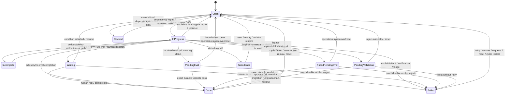
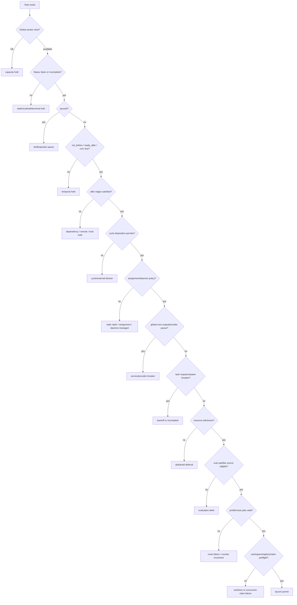

# Task lifecycle and coordinator deep survey

**Audit date:** 2026-07-26  
**Audited revision:** `059c71e117daa5b0246f746e7af5d23ae845e810`  
**Scope:** persisted task and attempt lifecycle, transition authorities, coordinator repair, message semantics, evaluation, worktrees, restart/recovery, and a regression strategy.  
**Out of scope:** production changes. This document is an audit and design recommendation only.

## Executive judgement

WG has a crash-safe **graph-file transaction**, but not one lifecycle state machine. A task's effective state is the product of at least six independently persisted domains:

1. `.wg/graph.jsonl` (`Task`, edges, logs, lifecycle counters);
2. `.wg/service/registry.json` (agent/PID liveness and output paths);
3. `.wg/messages/*.jsonl` plus per-consumer cursor files;
4. agent output, raw/canonical streams, archived attempts and evaluation verdict files;
5. Git branches/worktrees and cleanup markers; and
6. daemon/chat/cron/circuit-breaker side state.

Graph mutations are serialized and atomically renamed, which prevents partial graph reads and ordinary lost updates. Cross-domain operations are deliberately repaired after crashes rather than committed atomically. That is workable, but the repair surface is large and several paths bypass the strongest completion gates.

The highest-confidence findings are:

* **There are many transition authorities, not one.** CLI commands, the wrapper, coordinator maintenance, triage, evaluation reconciliation, cron/cycle logic, IPC/chat handlers, remote-exec accounting, migration, and recovery tools all write status directly. The direct writers are catalogued below.
* **`wg done` is not ownership-fenced.** Its expensive gates run against a snapshot; its final transaction checks only whether the task is already `Done`, not whether it is still owned by the calling attempt or whether blockers remain resolved. A stale worker can therefore race reset/reassignment, and an upstream reset can invalidate a pre-checked blocker before final completion (`src/commands/done.rs:1636-1711,2630-2693`). Spawn has a much stronger compare-and-check protocol (`src/commands/spawn/execution.rs:400-497,1405-1572`).
* **Dead-agent triage can write `Done` directly.** A model verdict of `done` bypasses deliverable preflight, smoke/verify gates, worktree merge-back, and attempt-bound required evaluation (`src/commands/service/triage.rs:1098-1121`). This is a second completion protocol with weaker invariants.
* **Ordinary message resurrection is level-triggered, content-blind, and non-consuming.** Any still-`Sent` message from an allowed sender can reopen any `Done` task (or create a response child); neither relevance nor explicit intent is represented. The trigger is left `Sent`, so the same message can trigger again after cooldown, up to five times (`src/commands/service/coordinator.rs:674-890`). A disposable live fixture reproduced the same irrelevant message reopening the same paused task twice.
* **`PendingValidation` is simultaneously produced and deprecated.** `wg done` still enters it for separate verify, LLM validation and external validation, while every coordinator tick promotes non-`human-review` rows immediately to `Done` (`src/commands/done.rs:1911-1973,2287-2434`; `src/lifecycle.rs:10-48`; `src/commands/service/coordinator.rs:5046-5060`). The behavior is documented in code, but the status/output wording still implies a gate that the next tick intentionally removes.
* **Message persistence has weaker concurrency semantics than graph persistence.** Append holds an exclusive flock, but status upgrades read/rewrite/rename with no common lock and a fixed `.tmp` name; concurrent append or rewrite can be lost (`src/messages.rs:112-198,329-382`). Cursors are independent, and global delivery status is not consumer-specific.
* **Attempts are not one entity.** `retry_count`, `dispatch_count`, agent IDs, archive directories, `loop_iteration`, `cycle_failure_restarts`, `spawn_failures`, evaluation `source_attempt`, registry records and session IDs each model a different kind of attempt. This makes repair possible, but invariants such as “only the current attempt may finish” cannot be stated or enforced globally.

The recommended direction is not a rewrite. Keep graph transactions, immutable verdict evidence, worktree retention, and idempotent repair. Introduce one attempt identity and one transition function; make completion compare-and-set on that attempt; permit message-driven state change only when consuming a correlation-bound wait that is already `Waiting(Message)`; and retire duplicate completion authorities.

---

## 1. Method and evidence strength

### 1.1 Source audit

The audit traced:

* status definition, deserialization, task fields and graph transaction code;
* every production assignment of a task `Status` found under `src/`, then grouped by authority;
* readiness/dependency logic and cycle exceptions;
* claim/spawn/wrapper completion and failure paths;
* required and advisory evaluation scaffolding and durable verdict reconciliation;
* wait, message, chat, retry/reset/recover/replay/requeue/sweep/triage flows;
* worktree creation, merge-back, retention and cleanup markers; and
* daemon tick ordering, restart liveness and registry reconciliation.

References use repository-relative file and line ranges at the audited revision. Line numbers will drift; function names and quoted invariants are the durable anchors.

### 1.2 Disposable behavioral fixture

A credential-free fixture was created outside the repository at:

`/tmp/wg-lifecycle-survey.o4HJsW`

The fixture explicitly unset `WG_DIR`, `WG_TASK_ID`, and `WG_AGENT_ID`. Its final evidence remains in `.wg/graph.jsonl` and `.wg/messages/*.jsonl`.

Observed sequence:

| Observation | Result |
|---|---|
| Paused task completed, then user sent `irrelevant: weather is sunny` | Send changed `last_interaction_at`; status remained `Done` before a tick. |
| One coordinator tick | `Done → Open`, assignment cleared, `resurrection_count=1`; `paused=true` remained. |
| Task completed again, cooldown aged, second tick with no new message | The same message triggered `Done → Open` again; `resurrection_count=2`. Message remained `status=sent`. |
| Ordinary message to paused `InProgress` task | Status and assignment stayed unchanged; `last_interaction_at` advanced. |
| `msg poll` then `msg read` | Poll did not move the cursor or status; read moved the cursor and upgraded the message to `read`. |
| `Waiting` with `WaitCondition::Message`, then message and tick | `Waiting → Open`; wait and assignment cleared; a resume checkpoint containing the message was persisted. |

This is direct behavioral evidence for the message findings. Other findings are source-backed unless explicitly labelled unknown.

### 1.3 Confidence labels

* **Confirmed:** direct source path, usually also covered by tests or fixture evidence.
* **Strong inference:** all participating source paths were found, but the exact interleaving was not stress-tested here.
* **Unknown:** a boundary that cannot be proved from this audit without additional fault injection, platform testing, or product intent.

---

## 2. The persisted model

### 2.1 Task status

The serialized enum is:

`Open`, `InProgress`, `Waiting`, `Done`, `Blocked`, `Failed`, `Abandoned`, `PendingValidation`, `PendingEval`, `FailedPendingEval`, `Incomplete`.

`pending-review` is accepted only as a legacy spelling and deserializes to `Done` (`src/graph.rs:701-824`).

Three predicates have different meanings:

| Predicate | Included statuses | Consequence |
|---|---|---|
| `is_terminal()` | `Done`, `Failed`, `Abandoned` | No automatic forward progress expected; also used to reap live processes for terminal tasks. |
| `is_dep_satisfied()` | `Done`, `Abandoned` | Ordinary downstream edges may proceed. `Failed` correctly does **not** satisfy. |
| `is_active()` | `InProgress`, `PendingValidation`, `PendingEval`, `FailedPendingEval` | Presentation/HUD notion of work in flight. |

Source: `src/graph.rs:328-375`.

The owning `.flip-X` or `.evaluate-X` satellite has a narrow exception: it may cross a source in `Failed`, `PendingEval`, or `FailedPendingEval`, because that satellite is the mechanism that resolves the source. Other system tasks and ordinary dependents do not get the bypass (`src/query.rs:340-453`).

### 2.2 Status is not scheduling state

A task can be `Open` and still not dispatchable. Readiness requires:

* status `Open` or `Incomplete`;
* `paused == false`;
* valid time/cron gates due;
* every ordinary dependency satisfied, archived, or validly resolved remotely;
* no pending evaluation gate on a completed blocker; and
* cycle-specific back-edge treatment where applicable.

Source: `src/query.rs:1-31,307-453,482-732`.

`paused` is orthogonal and survives most status transitions. The fixture therefore reached `status=open, paused=true`: logically reopened but intentionally unschedulable.

`Blocked` is partly materialized scheduling state and partly derived state. Pure readiness can leave an `Open` task non-ready, while coordinator spawn planning also writes `Blocked`/`InProgress` in some paths (`src/commands/service/coordinator.rs:3207-3260,4280-4350`). This dual representation is a source of repair logic.

### 2.3 Task row fields that participate in lifecycle

The task row contains more lifecycle state than `status`:

* ownership: `assigned`, `agent`, `started_at`;
* completion/failure: `completed_at`, `failure_reason`, `failure_class`;
* retry/repair: `retry_count`, `max_retries`, `spawn_failures`, `last_spawn_failure_at`;
* waiting/resume: `wait_condition`, `checkpoint`, `session_id`;
* cycles/cron: `loop_iteration`, `iteration_round`, cycle fields, `ready_after`, cron fields;
* evaluation: `evaluation_lifecycle`, `agency_dispatch`, `rescue_count`, `rescued`, verification counters;
* resurrection: `resurrection_count`, `last_resurrected_at`;
* scheduling: `paused`, `not_before`, `dispatch_count`; and
* accounting/provenance: `token_usage`, artifacts, log, `last_interaction_at`.

Defaults and touch semantics are at `src/graph.rs:720-873`. `modify_graph` automatically bumps `last_interaction_at` for any substantive task mutation (`src/parser.rs:292-335`). Outside of display/sorting and prompt guidance, this audit found no reaper or agent-liveness decision based on `last_interaction_at`; liveness uses PID, heartbeat and stream evidence instead. Message sends therefore change recency/UI order, not worker survival.

### 2.4 “Attempt” is fragmented

There is no persisted `Attempt` row referenced by every transition. Existing identities are:

| Attempt-like datum | Meaning |
|---|---|
| agent ID + registry row | One launched process/wrapper. |
| output directory / archived agent log | One captured execution record. |
| `retry_count` | Number of selected retry/recovery events; increments are not uniform across every respawn. |
| `dispatch_count` | Fair-scheduling proxy, not semantic retry count. |
| `spawn_failures` | Pre-useful-launch circuit breaker. |
| `loop_iteration` / cycle restart count | Iterative graph semantics. |
| evaluation `source_attempt` + `pipeline_id` | Semantic source generation to which verdicts are pinned. |
| `session_id` | Model conversation continuity, optionally preserved across retry. |
| worktree branch | Source-bearing execution lineage, often reused by retry-in-place. |

The evaluation subsystem already demonstrates the right shape: a source attempt and immutable pipeline identity are persisted, verdicts are matched to them, and stale evidence is rejected or repaired (`src/eval_lifecycle.rs:1240-1400,2760-2860`). The same identity should guard task completion and failure.

### 2.5 Persistence boundaries

Graph writes use an exclusive `graph.lock` across load/modify/save, write a same-directory temp file, flush+`fsync`, then rename. Readers may proceed without a shared lock when a writer holds the exclusive lock, relying on atomic rename to see either old or new (`src/parser.rs:20-132,202-335`). This is a strong single-file primitive.

It is **not** a transaction across:

* graph and registry;
* graph and message/cursor files;
* graph and immutable verdict files;
* graph and Git/worktree state;
* graph and archived output/provenance; or
* graph and cache ownership/daemon state.

The system handles these as ordered commits plus reconciliation. That design must be evaluated by invariants across every crash point, not by graph atomicity alone.

---

## 3. Lifecycle state machine

### 3.1 Conceptual diagram



This diagram is descriptive, not a claim that one module enforces these edges.

### 3.2 Per-status semantics and surprising edges

| Status | Intended meaning | Normal exits | Notable caveat |
|---|---|---|---|
| `Open` | Available candidate | claim to `InProgress`, derived/materialized block | May retain `paused`, time gates, or (after bugs) stale assignment. |
| `InProgress` | Owned execution | wait, completion, eval, failure, incomplete, abandon, repair | No universal requirement that `assigned` names a live registry attempt. |
| `Waiting` | Explicit persisted condition | `Open`, human `Done`, impossible `Failed` | Message waits use timestamps, not cursor/ack/relevance. |
| `Done` | Accepted terminal output | normally none; many reactivation paths | Message resurrection and cron/cycles make it non-monotonic. |
| `Blocked` | Persisted non-runnable state | coordinator repair or operator reopening | Readiness also computes blocking without needing this status. Missing deps are blocked in readiness but “satisfied” in stuck-block repair. |
| `Failed` | Terminal invalid/no output | retry/recover/reset/cycle restart | Explicit manual `wg done` on a downstream ignores failed blockers by design. |
| `Abandoned` | Operator intentionally skipped | reset/replay/restore | Satisfies dependencies. |
| `PendingValidation` | Legacy or human review | migration/approve/reject | Non-human rows are deliberately migrated to `Done` each tick. |
| `PendingEval` | Source said done; exact required evidence pending | verdict pass/fail/rescue | Verdict files and persisted route/threshold are authoritative, not satellite terminal status. |
| `FailedPendingEval` | Implicit process failure awaiting possible rescue | verdict rescue/fail | Explicit `wg fail` does not mean this; it is a wrapper-classified path. |
| `Incomplete` | Retryable, needs evaluator/operator/another attempt | dispatch or retry/fail | Readiness treats it like `Open`, but some commands normalize it first. |

### 3.3 Transition matrix by authority

The following table is the practical authority map. “Direct” means the module assigns status itself rather than asking a central state machine.

| Authority | Important transitions | Evidence |
|---|---|---|
| `wg claim`, unclaim/claim lifecycle | eligible → `InProgress`; claimed → `Open` | `src/commands/claim.rs:79-128,205-245`; `claim_lifecycle.rs:140-194` |
| spawn transaction | `Open/Blocked/Incomplete → InProgress`; ownership-checked rollback to snapshot | `src/commands/spawn/execution.rs:400-497,1405-1572` |
| `wg done` | active-ish → `Done/PendingEval`; legacy validation → `PendingValidation`; verify circuit → `Failed` | `src/commands/done.rs:1636-1973,2110-2185,2287-2434,2522-2750` |
| wrapper-generated shell | clean exit calls `wg done`; classified nonzero calls `wg fail`; missing operational output can drive incomplete/fail logic | `src/commands/spawn/execution.rs:900-1240` |
| `wg fail` / `wg incomplete` | execution → `Failed`, `FailedPendingEval`, retry `Open`, or `Incomplete` | `src/commands/fail.rs:103-205`; `src/commands/incomplete.rs:48-112` |
| approve/reject | `PendingValidation → Done/Failed/Open` | `src/commands/approve.rs:19-57`; `src/commands/reject.rs:22-82` |
| wait/resume | execution → `Waiting`; wait → `Open` | `src/commands/wait.rs:115-190`; `src/commands/resume.rs:1-150`; coordinator `src/commands/service/coordinator.rs:500-674` |
| retry/requeue/recover | failed/incomplete/eval-held → `Open`; system followups → `Abandoned` | `src/commands/retry.rs:220-410`; `requeue.rs:25-70`; `recover.rs:270-374` |
| reset/replay/archive restore | selected closure/history → `Open`, with optional deletion of satellites | `src/commands/reset.rs:1-275`; `replay.rs:230-290`; `archive.rs:240-295` |
| abandon/kill/dead-agent commands | current → `Abandoned` or repair `Open` | `src/commands/abandon.rs:20-105`; `kill.rs:320-445`; `dead_agents.rs:125-175` |
| sweep/orphan reconciliation | orphan `InProgress` or stale-claimed `Open` → clean `Open` | `src/commands/sweep.rs:1-120,220-305,360-490` |
| zero-output detector | `InProgress → Open/Incomplete` | `src/commands/service/zero_output.rs:320-465` |
| dead-agent triage | `InProgress → Done/Failed/Open` | `src/commands/service/triage.rs:233-615,1098-1224` |
| durable eval reconciler | `PendingEval/FailedPendingEval → Done/Failed/Open`; satellite repair `Blocked/Open` | `src/eval_lifecycle.rs:1070-1400,2760-2860` |
| cycle engine | complete/failed cycle members → `Open` | `src/graph.rs:2600-2730,2930-3020`; coordinator phases 2.5–2.6 |
| waiting evaluator/human tail | `Waiting → Failed/Open/Done` | `src/commands/service/coordinator.rs:500-674`; `src/commands/service/human_dispatch.rs:75-115,235-280` |
| resurrection | `Done → Open` or creates `.respond-to-*` | `src/commands/service/coordinator.rs:674-890` |
| stuck-block repair | `Blocked → Open` | `src/commands/service/coordinator.rs:918-990` |
| cron | `Done → Open` | `src/cron.rs:190-235`; coordinator phase 2.95 |
| eager agency scaffolding | creates/repairs `.assign-*`, `.flip-*`, `.evaluate-*`, verify tasks | `src/commands/eval_scaffold.rs`; `src/commands/service/coordinator.rs:1000-2900,5180-5260` |
| assignment/evaluation helpers | satellite/source direct writes | `src/commands/evaluate.rs:2150-2190`; `src/eval_lifecycle.rs` |
| matrix/autonomous-agent helpers | `InProgress`, `Done`, `Failed`, `Open` | `src/matrix_commands.rs:340-550`; `src/commands/agent.rs:420-520` |
| command execution helpers | command task `InProgress → Done/Failed` | `src/commands/exec.rs:45-150,275-490` |
| remote exec acceptance/accounting | graph task → `Done` when accepted with `complete` | `src/commands/exec_fed_cmd.rs:1080-1130` |
| chat/IPC/service handlers | chat task `InProgress/Open/Done/Abandoned` | `src/commands/chat_cmd.rs:950-1060`; `service/ipc.rs:1670-1730,1810-1880,1970-2025,2120-2180`; `service/mod.rs:4920-4970` |
| add/edit/evolve/import/migration | create statuses; parent wait; stale assignment/migration abandon | `src/commands/add.rs:630-710,840-900`; `edit.rs:670-715`; `evolve/fanout.rs`; `migrate.rs:230-265` |
| legacy lifecycle migration | `PendingValidation → Done` | `src/lifecycle.rs:10-48` |
| generic graph cycle/reset helpers | selected tasks → `Open` | `src/graph.rs:2600-2730,2930-3020`; `src/commands/mod.rs:240-275` |

The inventory intentionally includes specialized control-plane tasks. Creation with a non-`Open` initial state (chat/user-board/system tasks, imported history, completed partition markers) is also lifecycle authority even though it is not an edge on an existing row.

A mechanical scan of production task-status assignments at the audited revision found no persisted writer family outside the table. The exact direct-writer burn-down set is: core `src/graph.rs`, `src/lifecycle.rs`, `src/eval_lifecycle.rs`, `src/cron.rs`, `src/matrix_commands.rs`; command lifecycle `claim.rs`, `claim_lifecycle.rs`, `done.rs`, `fail.rs`, `incomplete.rs`, `approve.rs`, `reject.rs`, `wait.rs`, `retry.rs`, `requeue.rs`, `recover.rs`, `reset.rs`, `replay.rs`, `abandon.rs`, `kill.rs`, `dead_agents.rs`, `sweep.rs`, `archive.rs`; execution/specialized `exec.rs`, `agent.rs`, `evaluate.rs`, `exec_fed_cmd.rs`, `spawn/execution.rs`; constructors/migrations `add.rs`, `insert.rs`, `func_apply.rs`, `eval_scaffold.rs`, `evolve/fanout.rs`, `evolve/deferred.rs`, `edit.rs`, `migrate.rs`, `commands/mod.rs`; and service/control-plane `service/coordinator.rs`, `service/triage.rs`, `service/zero_output.rs`, `service/human_dispatch.rs`, `service/ipc.rs`, `service/mod.rs`, plus `chat_cmd.rs`. Constructors write an initial status rather than transition an existing row. Registry `AgentStatus`, identity key status, remote status snapshots and test fixtures are separate enums/not local task-status authorities and were excluded.

### 3.4 Readiness and admission: why an open/retried task does not spawn

An `Open` middle-of-chain task can pass the status check and still be stopped by many gates. Today the evidence is scattered among `wg show`, daemon stderr, graph logs, registry state, disk snapshots and config resolution. `check_ready_or_return` reports only aggregate “No ready tasks”; later gates print skip reasons to the daemon log (`src/commands/service/coordinator.rs:185-240,3973-4735`). This is not deterministic task diagnosis.

The existing `wg why-blocked` is a useful dependency-tree view, but it is not this diagnostic. Its local `is_task_ready` checks only `status == Open` plus dependency disposition, omitting `Incomplete`, pause, time/cron, assignment, capacity, breakers, resource, route and workspace gates. Its remote-tree inclusion uses `!remote.status.is_terminal()`, which can hide a remote `Failed` blocker even though ordinary readiness correctly requires `is_dep_satisfied()` (`src/commands/why_blocked.rs:16-48,116-183,202-212`). `why-not-ready` should reuse the dispatcher pipeline rather than extend that partial predicate with another list of guesses.

The actual gate pipeline, in effective coordinator order, is:



Some gates are intentionally non-mutating deferrals; others originate a new task state. A diagnosis must distinguish them.

| Gate | Exact predicate/evidence | What currently happens | Originating transition to report |
|---|---|---|---|
| Task state | status must be `Open` or `Incomplete` | excluded by readiness | Last state-changing graph log plus status-specific evidence; `Waiting` includes wait spec, eval-held states include pipeline/source attempt. |
| Publication/pause | `paused == false` | excluded by readiness | `wg add` creates a paused draft; `wg publish/resume` atomically clears it and logs `Task published/resumed` (`src/commands/add.rs:540-575`; `src/commands/resume.rs:80-145,499-510`). |
| Time/cron | `not_before`, `ready_after`, and due cron | excluded by readiness; invalid timestamps are treated ready | Field value and writer: add/reschedule, cycle delay, or cron reset (`src/query.rs:5-31`). |
| Local dependency | `dependency_disposition` must be satisfied | missing, failed, open, waiting and ordinary eval-held blockers stop readiness | Name blocker, its exact status, edge, and last transition. Archived boundary and `Abandoned` satisfy; `Failed` does not. |
| Remote dependency | remote ref must resolve and be `Done` or `Abandoned` | unresolved/refused remote blocks | Remote name/task, resolution source and observed status/error. |
| Evaluation hold | completed blocker with live `.evaluate-X`, or source soft-state for non-owning dependent | dependent remains non-ready | Source generation, satellite ID/status, required/advisory policy and verdict-evidence state (`src/query.rs:290-453`). |
| Cycle | unsatisfied edge may be an allowed structural back-edge; unconfigured deadlock may select alphabetical break-in | otherwise no ready member; external failed blocker suppresses break-in | SCC members, selected back-edge/break-in, external blocker and cycle config (`src/query.rs:513-690`). |
| Claim | spawn loop requires `assigned.is_none()` | claimed task skipped even when query says ready | Assigned agent; registry status/PID identity. If dead/missing, identify stale-claim origin and say `sweep/reconcile pending` (`src/commands/service/coordinator.rs:4397-4404`; `src/commands/sweep.rs:35-120`). |
| Assignment policy | with auto-assign, non-system/non-shell source needs `task.agent`; `.assign-X` may be a blocker; grace period delays scaffold | source skipped or blocked behind assignment | Agent field, `.assign-X` status/edge, auto-assign config, grace remaining and assignment failure route (`src/commands/service/coordinator.rs:1018-1175,4540-4560`). |
| Daemon-managed class | tags such as chat/coordinator/user-board loops | excluded from regular worker spawn | Matching tag and the daemon subsystem that owns it (`src/commands/service/coordinator.rs:164-183,4406-4410`). |
| Capacity | alive process count `>= max_agents`; later loop also stops at `slots_available` | tick can return before lifecycle maintenance; lower-priority ready tasks wait after slots fill | Alive agent IDs/PIDs/tasks, configured maximum, and priority order (`src/commands/service/coordinator.rs:60-160,4397-4400`). |
| Global zero-output pause | persisted backoff has not expired | all ready spawns paused | Backoff reason, resume time, zero-output kills that activated it (`src/commands/service/zero_output.rs:1-165`; `src/commands/service/coordinator.rs:5220-5242`). |
| Provider health pause | provider health breaker says pause | all ready spawns paused | Typed health route/failures and breaker summary (`src/service/provider_health.rs`; `src/commands/service/coordinator.rs:5244-5270`). |
| Rapid respawn throttle | recent death logs in five-minute window | exponential deferral; fifth rapid death writes `Failed` | Count, matching log entries, elapsed/backoff; originating dead-agent/triage events (`src/commands/service/coordinator.rs:3973-4050`). |
| Per-task spawn breaker | `spawn_failures >= max`, cooldown not elapsed | task skipped; cooldown decay or retry clears; repeated failed spawn can write `Incomplete` | Counter, threshold, last failure timestamp/message, cooldown (`src/commands/service/coordinator.rs:4052-4150,4414-4455`). |
| Resource admission | build-capable class under blocked disk projection, or heavy budget full | **defers without changing task status** | Task build class, sentinel snapshot/projection, candidate/reserved bytes, active/max heavy builders (`src/commands/service/coordinator.rs:185-205,4462-4502`). |
| Eval satellite eligibility | source must be `Done`, `Failed`, `PendingEval` or `FailedPendingEval` | satellite skipped without charging spawn failure | Satellite/source IDs and source transition; catches stale edge/race (`src/commands/service/coordinator.rs:4152-4208,4590-4610`). |
| Profile | stamped profile loads, else code warns and falls back to global | not itself a blocker; can alter subsequent route | Task profile, load result, fallback and profile-stamping transition (`src/dispatch/profile.rs:1-88`). |
| Route/model/endpoint | `plan_spawn` resolves compatible executor/model/endpoint | error records spawn failure; agency route errors may park `Waiting` then `Blocked` | Full provenance or exact planner error, selected profile generation, model/reasoning/endpoint source (`src/dispatch/plan.rs:318-620`; `src/commands/service/coordinator.rs:4630-4735`). |
| Execution selection/credential | non-shell spawn requires selected valid execution plane; endpoint/handler setup must be usable | preflight/launch error, spawn failure accounting | Exact strict validation/error code; never generic “provider issue” (`src/commands/spawn/execution.rs:520-700`). |
| Worktree | reusable worktree must verify ownership; new path/branch must be collision-free; required isolation cannot degrade to shared | spawn aborts before useful handler; graph claim rolls back if already taken | Existing path/branch/owner token/cleanup marker and the attempt/retry that created it (`src/commands/spawn/worktree.rs:1-250`; `src/commands/spawn/execution.rs:330-497`). |
| Registry/cache/claim race | registry lock/save, cache ownership, metadata and final graph ownership recheck | gated child killed and exact claim rolled back, or ownership-changed error | Failed transaction boundary and current graph/registry owner (`src/commands/spawn/execution.rs:1405-1572`). |

#### Required diagnostic: `wg why-not-ready TASK`

The simplified design should include a read-only, deterministic command—not a list of possible causes:

```text
$ wg why-not-ready synth-middle
NOT READY  gate=dependency.after  stage=readiness
  task: synth-middle  status=open generation=4 paused=false assigned=none
  blocker: implement-middle  status=open
  disposition: blocked (dependency status is open)
  origin: retry event at 2026-07-26T10:41:12Z by operator
          log[17] "Task reset for retry from failed (attempt #3)"
  downstream effect: synth-middle cannot enter the ready set
  next automatic change: none; waits for implement-middle -> done|abandoned
```

Machine output should be stable and singular:

```json
{
  "task": "synth-middle",
  "ready": false,
  "stage": "readiness",
  "gate": "dependency.after",
  "predicate": "dependency_disposition(implement-middle,synth-middle)=blocked",
  "subject": {"id":"implement-middle","status":"open","generation":4},
  "origin": {"event":"retry","at":"2026-07-26T10:41:12Z","actor":"operator","event_id":"..."},
  "automatic_release": null
}
```

Algorithm and contract:

1. Evaluate gates in the same ordered pipeline and through the same pure functions as the coordinator. Do not reimplement predicates in CLI prose.
2. Return the **first effective blocking gate** plus all subordinate facts needed to prove it. A `--all` flag may return ordered secondary gates, but default output stays singular.
3. Resolve origin from structured transition events. During migration, use the last matching task log and name confidence as `legacy-inferred`; if no writer can be proved, return `origin=unknown` as an invariant violation—not “possible causes.”
4. For global gates, report the exact competing agents, breaker record or resource snapshot. For priority/capacity, show the ready tasks ahead of this task and the sort keys.
5. For a task that is ready but lost the current tick's finite slots, say `gate=capacity.priority-queue`, not `ready=true` alone.
6. Dry-run the canonical `plan_spawn` and non-mutating workspace/registry checks. Never increment `spawn_failures` from diagnosis.
7. Include `observed_graph_version`/digest and config/profile generation so a changed answer is attributable to a new snapshot.
8. Exit codes: `0=ready now`, `2=deterministically held`, `3=invariant/diagnostic evidence unavailable`; configuration/I/O errors remain ordinary nonzero failures.

This command is also the best boundary for removing persisted `Blocked`: it can derive and explain the gate without relying on stale materialized status.

### 3.5 Resource deferral sequence

Resource admission is a scheduling hold, not implementation failure. The current per-task path correctly `continue`s without status mutation, while separate repeated spawn/zero-output failures can change state.

```mermaid
sequenceDiagram
    participant D as Dispatcher
    participant G as Graph snapshot
    participant S as Disk sentinel
    participant T as Task

    D->>G: compute ready set
    D->>S: classify task + project candidate/reserved bytes
    alt build blocked or heavy budget full
        S-->>D: denied with exact reason
        D-->>T: defer this tick; status/counters unchanged
        Note over D,T: why-not-ready = resource admission + snapshot
    else allowed
        S-->>D: allowed
        D->>T: continue route/worktree/claim pipeline
    end
```

A future transition model should preserve this distinction: admission denial is an observation with expiry/snapshot ID, never `Failed` or `Incomplete`. Only an attempted launch that actually fails should move its spawn-failure breaker.

---

## 4. Normal execution sequences

### 4.1 Claim and gated spawn

Spawn is the strongest cross-file protocol in the audited system.

```mermaid
sequenceDiagram
    participant D as Dispatcher/spawn
    participant G as graph.jsonl
    participant W as Worktree/output
    participant P as gated wrapper
    participant R as registry.json

    D->>G: read candidate and resolve plan
    D->>W: reserve output; create/reuse and verify worktree
    D->>G: locked CAS: eligible + unassigned -> InProgress(agent A)
    D->>P: spawn wrapper behind unpublished permit
    D->>R: persist A, PID, model, output, worktree
    D->>W: persist metadata/cache ownership
    D->>G: lock and re-check task still owned by A
    D->>P: atomically publish launch permit
    P->>P: start handler
    D->>G: best-effort audit log / synthesize completed .assign task
```

If any pre-permit step fails, the child is killed, registry/cache entries are removed, and the graph claim is rolled back only if ownership still matches the snapshot (`src/commands/spawn/execution.rs:400-522,1405-1645`). This gives a clear point of no return: permit publication.

Residual gaps are explicit:

* The permit commits graph ownership and process launch, not registry, graph, metadata, cursor and audit as one transaction.
* Post-permit cursor/audit writes are best effort. A launched attempt can exist without its spawn audit.
* Agent registry uses its own lock; the graph is authoritative for assignment while registry/PID is authoritative for liveness.

### 4.2 Completion

```mermaid
sequenceDiagram
    participant A as Current or stale caller
    participant S as Snapshot graph
    participant V as gates / filesystem
    participant Git as worktree + main
    participant G as fresh graph transaction
    participant R as registry/output

    A->>S: load task and blockers
    A->>V: deliverable, smoke, verify, validation checks
    A->>Git: squash merge or create deferred merge task
    A->>G: load fresh graph
    G->>G: if already Done: no-op
    G->>G: choose Done or PendingEval; persist timestamps/log/eval policy
    A->>R: mark agent done, archive output, release cache (best effort)
```

Important properties:

* Merge happens before graph completion. A crash after merge but before status commit leaves source on main and task nonterminal; the no-commits/already-merged handling is designed to make a repeated completion tolerable (`src/commands/done.rs:188-320,487-639,2522-2630`).
* Uncommitted work or an undeferred merge conflict refuses completion. `--ignore-unmerged-worktree` creates `.merge-X` and allows source completion (`src/commands/done.rs:641-708,2522-2625`).
* The final graph transaction snapshots required/advisory gate meaning and enters `PendingEval` only for a persisted required policy (`src/commands/done.rs:1490-1590,2640-2750`).
* **Missing fence:** there is no check that `WG_AGENT_ID == task.assigned`, no attempt ID, and no re-check of blockers/gates in the fresh transaction. The comment that stale pre-checks remain valid because state “can only move forward” is contradicted by reset, retry, resurrection, cron and cycle transitions (`src/commands/done.rs:2630-2645`).

### 4.3 Required evaluation

```mermaid
sequenceDiagram
    participant C as wg done
    participant G as graph
    participant E as evaluator/FLIP satellites
    participant F as immutable verdict files
    participant D as coordinator reconciler

    C->>G: persist gate policy, source_attempt, PendingEval
    E->>F: write attempt/pipeline/route-bound verdict
    D->>F: load durable verdicts before graph lock
    D->>G: link exact verdict IDs once
    alt all required scores pass
        D->>G: PendingEval/FailedPendingEval -> Done
    else hard reject and rescue budget remains
        D->>G: PendingEval -> Open; mint new source attempt; rearm satellites
    else hard reject
        D->>G: -> Failed
    end
```

The reconciler does **not** infer success from a missing or terminal evaluator. It verifies persisted route/generation/pipeline/source-attempt identity, threshold policy and one-time consumption. Evidence load failure is fail-closed for that tick (`src/commands/service/coordinator.rs:5010-5090`; `src/eval_lifecycle.rs:1070-1400`). This is the most rigorous lifecycle subsystem.

Advisory evaluation is different: the source becomes `Done`; the satellite may still run, but cannot retroactively redefine the source's required gate. That distinction is persisted by `EvaluationGatePolicy` rather than recomputed from current ambient config.

### 4.4 Failure and restart

The wrapper classifies exit evidence and invokes a CLI transition. Explicit `wg fail` is terminal `Failed`; eligible implicit nonzero exits can enter `FailedPendingEval`; transient classes can reset/open according to policy (`src/commands/fail.rs:1-220`; wrapper generation in `src/commands/spawn/execution.rs`).

On the next tick:

1. dead registry rows are detected from PID/identity, heartbeat and stream evidence;
2. registry rows are marked dead and saved;
3. still-`InProgress` graph tasks are triaged or reopened;
4. selected fields are replayed into a fresh locked graph snapshot;
5. a new semantic source attempt is minted when reopening; and
6. dead worktrees are preserved for forensic/manual archive (`src/commands/service/triage.rs:233-615`).

Because registry save and graph save are separate, `reconcile_orphaned_tasks` is a second safety net on every tick. It repairs `InProgress` with dead/missing assignment and `Open` with a stale claim (`src/commands/sweep.rs:360-490`).

---

## 5. Messages, waits and chat semantics

### 5.1 There are two local message systems

**Task messages** live in `.wg/messages/{task-id}.jsonl`, with cursor files under `.wg/messages/.cursors/{agent}.{task}`. A message has an ID, sender, free-form body, priority and global delivery status (`Sent`, `Delivered`, `Read`, `Acknowledged`) (`src/messages.rs:1-108`).

**Chat messages** use per-session `inbox.jsonl` and `outbox.jsonl`, request IDs and separate cursor/state files. Chat activity best-effort touches an attached graph task; streaming token writes intentionally do not (`src/chat.rs:330-500`). Chat tasks are long-lived daemon-managed graph rows, not ordinary dispatcher work.

Federated messages use signed/sealed identity envelopes and an inbox transport, then optionally pass the inbound review gate. They should not be conflated with the local task queue (`src/commands/msg.rs:225-390`).

### 5.2 Task-message state is globally lossy, cursors are per consumer

The queue append path locks, scans max ID, appends one JSON line, then best-effort touches the graph task (`src/messages.rs:112-205`).

Delivery behavior:

* prompt formatting marks all messages globally `Delivered`;
* `poll` returns `id > consumer_cursor` but does not advance cursor or status;
* `read` writes the consumer cursor, then upgrades returned messages globally to `Read`;
* spawn advances the new agent's cursor to the latest pre-launch message only after the permit, while prompt construction is responsible for marking queued messages delivered; and
* delivery status is monotonic but not per consumer (`src/messages.rs:329-512`; `src/commands/spawn/execution.rs:1574-1585`).

Consequences:

1. “Read” means **some** consumer executed the upgrade, not all consumers.
2. A consumer cursor can say read while a failed status rewrite leaves the message `Sent`/`Delivered`.
3. Status rewrite can race append: it reads the whole file, writes a fixed `*.tmp`, and renames without taking the append flock. An append after its read can disappear. Two rewrites can collide on the same temp file. This is a confirmed code-level race, not live stress-test evidence.
4. `Acknowledged` exists in the enum, but the audited local CLI exposes list/read/poll rather than a clear task-message acknowledgement transition.

### 5.3 Wait-on-message is timestamp-level-triggered

`WaitCondition::Message` is satisfied by any message with a timestamp later than the “Agent parked” log entry. `HumanInput` uses the same rule but excludes senders whose name starts with `agent-`. It does not consult cursor, delivery status, priority, correlation, topic, or reply-to (`src/commands/service/coordinator.rs:240-365`).

When satisfied, ordinary AI work goes `Waiting → Open`, clears assignment/wait, and stores a generated resume delta as checkpoint. Human-assigned work can instead complete directly on the reply (`src/commands/service/coordinator.rs:500-674`; `src/commands/service/human_dispatch.rs`).

This is simple and understandable, but timestamp equality/clock parsing and unrelated messages are semantic inputs. If the “Agent parked” log cannot be found, any historical message satisfies the wait.

### 5.4 Done-task resurrection is a separate, unsafe consumer

Resurrection scans only `Done` tasks and only messages whose **global status is exactly `Sent`**. Allowed senders are `user`, `coordinator`, or anything beginning `agent-`; only the assigned agent itself is excluded. It ignores message body and priority.

If no downstream task is `InProgress|Done`, it reopens the source and a completed assignment satellite. Otherwise it creates one `.respond-to-{source}` child. It increments a per-task counter, enforces 60-second cooldown and maximum five resurrections, and respects only a `resurrect:false` tag (`src/commands/service/coordinator.rs:674-890`).

It does **not** consume, acknowledge, deliver, cursor-pin, or record the triggering message IDs.

```mermaid
sequenceDiagram
    participant U as User
    participant M as task message JSONL
    participant G as graph
    participant D as coordinator tick

    U->>M: append message #1 status=Sent
    U->>G: best-effort touch last_interaction_at
    D->>M: scan all Sent messages (no cursor)
    D->>G: Done -> Open; resurrection_count++
    Note over M: message #1 remains Sent
    G->>G: task completes again
    D->>M: after cooldown, scan same #1
    D->>G: Done -> Open again
```

Therefore:

* the same `Sent` message is still eligible after the cooldown;
* a paused or archived-by-status-only task can churn status even though it cannot dispatch;
* any semantic irrelevance is ignored;
* a pre-existing `.respond-to-*` suppresses further child creation without consuming triggers; and
* the trigger's behavior depends on whether some unrelated consumer globally changed its delivery status.

The disposable fixture confirmed repeated reopening from one irrelevant message. This is the clearest place where a reliability helper amplifies an ordinary event into repeated graph mutation.

### 5.5 `last_interaction_at`

Every substantive `modify_graph` mutation bumps it, and message/chat append explicitly touches it (`src/parser.rs:292-335`; `src/messages.rs:198-213`; `src/chat.rs:409-448`). Its concrete readers are display, `wg show`, TUI ordering and prompt guidance. Agent death uses registry heartbeats/PID/stream; the audit found no lifecycle reaper that treats a fresh task interaction timestamp as a worker heartbeat. An irrelevant message can make stale work look recent in the UI, but does not keep the process alive.

---

## 6. Evaluation lifecycle and scaffolding

### 6.1 Eager satellites

Depending on config and task shape, publishing or coordinator catch-up creates `.assign-X`, `.flip-X`, `.evaluate-X`, and separate verification tasks. They are real graph tasks with edges and status, but internal visibility. Creation is spread across `src/commands/eval_scaffold.rs`, add/publish paths, and coordinator phases 3–4.8 (`src/commands/service/coordinator.rs:5180-5260`).

Benefits:

* visible schedulable/auditable units;
* persisted route/model/reasoning plans; and
* recovery after daemon restart.

Costs:

* source state, satellite state and verdict state can disagree;
* dispatcher repair must migrate historical plans, rearm stale satellites, catch missing ones, and distinguish execution failure from semantic verdict;
* reset/retry must delete or mint all related identities atomically; and
* assignment tasks themselves have completion and resurrection semantics unless carefully filtered.

### 6.2 Durable verdicts are stronger than satellite status

The durable verdict file is semantic evidence; satellite `Done` merely says its process task ended. Reconciliation verifies exact attempt identity and consumes evidence once. Terminal/missing satellites never imply a pass (`src/eval_lifecycle.rs:1240-1400`; coordinator comment and phases at `src/commands/service/coordinator.rs:5010-5090`). This invariant should be retained.

### 6.3 Retry and repair

`begin_source_attempt` mints a fresh semantic attempt and rearms evaluation satellites on operator retry, dead-agent retry, zero-output retry, orphan reconciliation and bounded eval rescue. Retry/recover explicitly clear an operator-stuck eval lifecycle before minting a new attempt (`src/commands/retry.rs:241-410`; `src/commands/recover.rs:286-374`; `src/commands/service/triage.rs:470-525`; `src/commands/sweep.rs:260-305,455-480`).

This is good anti-stale-evidence design. The problem is coverage: every path that reopens source execution must remember to call it. Cycle, cron, resurrection, replay, reset and specialized helpers need an explicit policy; a central transition function could make omission impossible.

### 6.4 PendingValidation split-brain

The code's current policy is explicit: non-human `PendingValidation` is legacy and becomes `Done` next tick; only `human-review` is exempt (`src/lifecycle.rs:10-48`). Yet three live `wg done` paths still:

* set `PendingValidation`;
* mark the worker registry row done;
* archive/release resources; and
* print that separate, LLM, or external validation is pending.

This makes `approve`/`reject`, separate verifier scaffolding, and migration race for authority. Even if immediate promotion is desired, the user-visible contract and state should say “Done with advisory validation scheduled,” not “pending validation.” If actual blocking validation is desired, the unconditional migration must go. Keeping both meanings in one enum is not defensible.

---

## 7. Worktree and source lifecycle

### 7.1 Allocation and retry

Writing workers normally receive required isolated worktrees. Spawn reserves the agent/output ID, creates or verifies a reusable task worktree, then claims only after fallible preparation. Isolation failure leaves the task dispatchable and does not launch (`src/commands/spawn/execution.rs:330-400,520-700`).

Default `wg retry` preserves and reuses the prior worktree/branch, clearing a cleanup-pending marker. `--fresh` explicitly removes it and forces new allocation (`src/commands/retry.rs:172-210,480-510,690-725`). This makes retry-in-place the safe source-preserving default.

### 7.2 Completion merge-back

`wg done`:

1. detects the managed worktree;
2. refuses uncommitted/staged changes;
3. takes a merge lock;
4. squash-merges to main and commits/pushes where configured;
5. marks the worktree cleanup-pending; then
6. commits task status.

Conflict either refuses completion or, with explicit ignore, creates `.merge-X` and permits source completion (`src/commands/done.rs:325-708,2522-2625`).

This ordering protects source but leaves a cross-domain crash window. It is mostly idempotent because an already-landed squash yields no new content on repeat. What is not guaranteed is atomic correspondence between “task accepted” and “commit on main”; provenance logs and deferred merge tasks are compensating records.

### 7.3 Dead attempts and cleanup

Dead-agent cleanup no longer removes worktrees. It validates metadata, reports preserved paths and leaves manual `wg worktree archive` as the destructive action (`src/commands/service/triage.rs:551-610,1227-1308`). Build caches are separately leased and reclaimable; source is not treated as cache.

This is the correct failure direction. Keep it.

### 7.4 Completion bypasses

Any authority that writes `Done` without calling the merge protocol can accept a source-bearing attempt whose changes remain only in a worktree. Confirmed examples include dead-agent triage and specialized helpers. Remote execution may legitimately have a different artifact protocol, but that exemption should be typed and explicit. A direct `task.status = Done` should not be the extension point.

---

## 8. Restart and recovery behavior

### 8.1 Daemon restart

Spawned workers are detached into their own session/process group, so daemon death does not necessarily kill them (`src/commands/spawn/execution.rs:1360-1403`). Registry rows retain PID and process identity. A restarted coordinator first processes chat, cleans dead agents, reconciles graph/registry orphans, reaps live processes whose task is terminal, and counts truly alive processes before dispatch (`src/commands/service/coordinator.rs:60-145,4959-5010`).

This supports continuation across dispatcher restarts.

### 8.2 Crash matrix

| Crash point | Persisted shape | Recovery |
|---|---|---|
| Before graph claim | workspace/output may be reserved | RAII/preparation cleanup; task remains eligible. |
| After claim, before permit | graph says `InProgress`; gated wrapper/registry may partially exist | spawn rollback checks exact ownership and restores snapshot; kills child/removes registry/cache. |
| Just after permit | live worker; audit/cursor may be absent | registry and graph usually sufficient; post-permit audit is best effort. |
| Worker exits before task transition | registry alive/dead row plus `InProgress` task | dead cleanup triage/reopen; orphan reconciler fallback. |
| Task terminal before registry update | terminal graph plus live registry/PID | task-status-aware reaper marks/kills zombie process. |
| Registry marked dead before graph replay | dead registry + stale `InProgress` | known split-save shape; coordinator/manual sweep repairs. |
| Git merged before task completion | main contains work; task nonterminal | rerun completion; merge code treats no new content as expected. |
| Verdict durable before graph link | immutable evidence, pending source | next tick reloads and links exact verdict. |
| Graph linked before later audit/output | semantic state durable, ancillary output incomplete | best-effort capture/reaper; some audit can remain missing. |
| Message append races status rewrite | potential queue truncation/lost append | **No dedicated repair found.** |

### 8.3 Operator recovery surfaces

* `wg retry`: one retriable source, preserves worktree by default, clears claim/failure/breaker, optionally preserves session, mints source attempt, cleans stale downstream claims.
* `wg requeue`: simple reopen.
* `wg recover`: dry-run-first batch recovery; user sources reopen, failed agency followups abandon so they regenerate, optional model/endpoint changes.
* `wg reset`: graph closure reset, optional meta deletion, always removes stale eval satellites for reset sources; does not kill live processes.
* `wg sweep`: idempotent orphan detection/fix, archives prior attempt best effort.
* `wg replay`/archive restore: historical/reactivation surfaces.
* `wg kill`/dead-agents/cleanup: process and assignment repair.

These overlap substantially. Their differences—worktree retention, session retention, counter reset, satellite deletion, downstream closure, process kill—are not encoded as one policy object, so users must know which repair semantics they need.

---

## 9. Invariants

### 9.1 Invariants the code currently enforces well

1. **Graph-file atomicity:** a reader observes an old or new complete graph, not a partial JSONL rewrite.
2. **No ordinary graph lost update:** supported writers using `modify_graph` serialize load-modify-save.
3. **Spawn before-use ownership:** a handler cannot pass its launch gate unless the graph still says `InProgress` and assigned to that reserved agent.
4. **Spawn rollback ownership:** rollback refuses to overwrite a claim that changed owner.
5. **Ordinary dependency validity:** only `Done`/`Abandoned` satisfies; `Failed` does not.
6. **Evaluation evidence specificity:** required verdicts are attempt-, pipeline-, route- and threshold-bound and consumed once.
7. **Missing evaluation evidence fails closed:** terminal evaluator status is not semantic success.
8. **Source-preserving failure:** dead worktrees are retained; retry reuses them by default.
9. **Message cursor monotonic intent:** poll is non-consuming; read advances a per-consumer cursor; status upgrades never intentionally downgrade.
10. **Terminal process cleanup:** a live process whose task is terminal is reaped.

### 9.2 Invariants that should exist but do not hold universally

1. **Only the current attempt may finish or fail a task.** Violated by completion/failure commands lacking a persisted attempt CAS.
2. **All paths to accepted `Done` satisfy the same acceptance policy.** Violated by triage/direct helper/legacy migration paths.
3. **Completion preconditions are checked in the same transaction as completion.** Violated by `wg done` snapshot pre-checks and external filesystem gates.
4. **Every new execution generation mints exactly one semantic attempt ID.** Coverage depends on each reopening caller remembering `begin_source_attempt`.
5. **A message changes lifecycle only by satisfying an already-persisted wait.** Violated by terminal-task resurrection; replay makes the violation repeat.
6. **Wakeup is explicit and relevant.** No structured intent/correlation exists for ordinary task messages.
7. **Queue append cannot be lost by status bookkeeping.** Violated by unlocked whole-file status rewrite.
8. **`PendingValidation` has one meaning.** It currently means human blocking review or a short-lived legacy marker intentionally auto-promoted.
9. **An `Open` task is unowned.** Repair exists specifically because stale-claimed `Open` rows occur.
10. **`Done` implies source/artifact integration or an explicit typed exemption.** Direct status writers bypass merge/artifact protocols.
11. **Status/timestamps are coherent.** Reopened tasks can retain historical `completed_at` (fixture resurrection did); some paths clear it and others do not.
12. **Repair is monotonic and idempotent.** Most repair is intended to be, but resurrection and duplicate retry/status writes create repeatable effects.

### 9.3 Proposed canonical invariants

These should become executable assertions around a central transition API:

```text
I1  InProgress => current_attempt_id != null && assigned == attempt.agent_id
I2  Open|Blocked|Waiting => no live exclusive attempt owns the task
I3  terminal transition by worker => supplied attempt_id == current_attempt_id
I4  Done => acceptance_record exists with policy kind + evidence IDs
I5  PendingEval|FailedPendingEval => evaluation lifecycle source_attempt == current attempt generation
I6  each reopen-for-execution increments generation exactly once
I7  a message changes status only by satisfying an already-persisted Waiting(Message) correlation, once
I8  ordinary downstream readiness => every after edge has Satisfied disposition
I9  message log append is immutable; per-consumer delivery is separate state
I10 source-bearing Done => merge/artifact receipt exists OR completion kind is explicitly non-source/remote
I11 status transition + lifecycle counters + task audit event commit in one graph transaction
I12 repair functions are idempotent: applying twice produces byte-equivalent semantic state
I13 first terminal event for an attempt wins; later contradictory events are retained evidence, not transitions
I14 an evaluation verdict resolves its gate to Done/Failed only; any retry is a distinct authorized event
I15 terminalization fences the attempt/process and records release or deliberate retention of its named worktree lease
I16 stale ownership is breaker-neutral and repaired/deferred once; it is never charged as repeated launch failure
I17 reset/retry cannot expose Ready while an unavailable attempt/worktree owner still dominates execution
I18 repeated transition signatures trip a loop detector whose output is the exact why-not-ready gate and origin
```

---

## 10. Ranked failure and foot-gun catalogue

Severity is impact if triggered; likelihood reflects reachable current paths, not incident frequency.

| Rank | Finding | Severity / likelihood | Failure mode | Evidence / mitigation |
|---:|---|---|---|---|
| 1 | Completion has no attempt ownership CAS | Critical / plausible under reset, retry, late wrapper | Stale worker marks reassigned/reopened task done; can merge stale branch first. | `done.rs:1636-1711,2630-2693`. Add `current_attempt_id` and compare in final transaction. |
| 2 | Dead-agent triage is an alternate acceptance gate | Critical / config-dependent | LLM “done” bypasses deliverables, smoke, verify, required eval and worktree merge. | `src/commands/service/triage.rs:1098-1121`. Triage may recommend, never accept; route through canonical completion or `Incomplete`. |
| 3 | Done resurrection replays irrelevant messages | High / confirmed | One `Sent` message repeatedly reopens terminal work; creates status churn/extra spend up to cap. | `src/commands/service/coordinator.rs:674-890`; live fixture. Remove terminal message wake; correlate and consume only an existing `Waiting(Message)`. |
| 4 | Message status rewrite can lose concurrent append | High / concurrency-dependent | Whole-file unlocked rewrite replaces a later append; fixed temp path races another rewrite. | `messages.rs:112-198,329-382`. Immutable append log + separate delivery journal, or common lock and unique temp. |
| 5 | Completion preconditions are stale | High / concurrency-dependent | Upstream reset or task policy edit after checks but before final transaction permits invalid completion. | `done.rs:1636-1768,2630-2693`. Recheck graph predicates under lock; pin filesystem evidence digest. |
| 6 | `PendingValidation` has contradictory live surfaces | High / routine when configured | CLI says blocking validation pending; next tick converts to `Done` unless tagged human-review. | `done.rs` producers; `lifecycle.rs:10-48`. Remove legacy producers or split `HumanReviewPending` from advisory validation. |
| 7 | Direct `Done` writers bypass source integration | High / path-dependent | Task accepted while commits/artifacts remain only in preserved worktree or external location. | triage, remote bridge, human/chat/matrix helpers. Require typed completion receipts. |
| 8 | Graph/registry split-save needs broad replay | Medium-high / known crash shape | Dead registry with stale `InProgress`, or open task with stale claim stalls dispatch. | `sweep.rs:1-120,360-490`; comments identify known race. Keep reconciler; add transition journal/outbox. |
| 9 | Attempt counters are semantically inconsistent | Medium-high / routine diagnostics | `retry_count`, dispatch, spawn failures, eval attempts disagree; policy budgets can count different events. | Distributed fields/writers. Introduce first-class attempt records and derived counters. |
| 10 | Reopen paths can forget eval generation changes | Medium-high / maintenance risk | Stale verdict binds to reactivated work or satellite route is not rearmed. | Many direct `→ Open` writers; only some call `begin_source_attempt`. Centralize reopen. |
| 11 | Stuck-block repair treats missing dependency as satisfied | Medium / uncommon | A `Blocked` task reopens after dependency deletion while ordinary readiness treats a missing dependency as blocked. | `src/commands/service/coordinator.rs:918-990` vs `src/query.rs:307-453`. Use `dependency_disposition` everywhere. |
| 12 | Manual completion ignores failed blockers | Medium / intentional but sharp | Downstream may be declared complete against known-invalid upstream output. | `done.rs:1660-1698`. Require explicit override with audit rather than implicit manual exception. |
| 13 | Delivery status is global but cursors are per consumer | Medium / routine multi-consumer | One reader suppresses resurrection/changes UI for all; status and cursor can diverge. | `messages.rs:329-512`. Make deliveries per consumer. |
| 14 | Wait-message relevance is only timestamp/sender prefix | Medium / routine | Unrelated task chatter resumes or completes human work; missing park log lets old message satisfy. | `src/commands/service/coordinator.rs:240-365,500-674`. Correlation/wake token. |
| 15 | Status and timestamps are not normalized | Medium-low / confirmed | `Open` task retains `completed_at`; UI/audit queries can misclassify history. | Fixture resurrection; distributed writers. Central transition field policy. |
| 16 | Post-permit spawn audit/cursor are best effort | Medium-low / rare I/O failure | Live process lacks spawn audit or sees cursor mismatch. | `spawn/execution.rs:1574-1650`. Durable outbox processed after permit. |
| 17 | Reliability helpers can multiply work | Medium / config-dependent | eager satellites + resurrection + rescue + triage + cycle/cron + orphan retry produce multiple retries or hidden spend. | coordinator phase ordering at `4959-5260`. Expose transition cause/generation and global attempt budget. |
| 18 | `Blocked` is both derived and persisted | Low-medium / routine complexity | Repair and query semantics drift; stuck statuses need scanning. | coordinator direct writes and `query::ready_tasks`. Prefer derived blocker reason. |

### Incident-to-invariant mapping

Several source comments name prior incident classes. They map to the proposed invariants as follows:

| Incident class named in code | Repair now | Preventive invariant |
|---|---|---|
| split-save orphan / stale downstream claim | sweep + eager downstream cleanup | I1, I2, I11 plus durable outbox |
| stale evaluator / wrong source attempt | durable pipeline identity + satellite rearm | I5, I6 |
| unmerged/uncommitted worktree | loud refusal + merge task + retention | I10 |
| zero-output respawn loop | task/global circuit breakers | first-class attempt budget derived from attempts |
| pending-validation migration | automatic `Done` migration | one status/one meaning; I4 |
| no deliverable / talked-but-did-not-act | preflight and wrapper classification | I4 acceptance record |
| zombie process after task terminal | task-aware reaper | terminal transition emits process-cancel outbox |
| message-triggered terminal wake | cooldown/cap/tag | I7: messages can satisfy only an already-persisted wait |

### Composite cross-graph nightmare trace

A user supplied this concrete cross-graph incident trace after the initial audit:

```text
stall failure
  -> late wrapper done
  -> low-score evaluation nevertheless reconciled source to Done
  -> unrelated Sent message reopened source
  -> respawn hit the still-owned Done-attempt worktree five times
  -> each ownership refusal charged the spawn breaker
  -> manual Done
  -> same message resurrected source again
  -> reset left Ready with stale attempt/worktree ownership
  -> daemon reported spawned=0
```

**Evidence label:** the entire historical sequence was not reproduced end-to-end in this audit. Its constituent mechanisms are source-confirmed or fixture-confirmed: terminal commands lack one attempt CAS; evaluation has source-reopen/rescue authority; irrelevant `Sent` resurrection and replay were reproduced; spawn errors feed `record_spawn_failure`; reset clears graph claim fields but does not atomically settle the live process/worktree lease; and a ready-set task can later be skipped/fail before permit. The claimed “low score → Done” must be verified against the incident's exact historical verdict/policy bytes—current strict required-gate reconciliation maps low score to bounded rescue `Open` or `Failed`, not `Done` (`src/eval_lifecycle.rs:1240-1400`). Treat that hop as historical/unknown, not as current behavior proved by this survey.

The important result is not one more special-case patch. Each hop violates a specific boundary:

| Hop | Current ambiguity/failure direction | Required invariant |
|---|---|---|
| stall failure, then late wrapper `done` | contradictory terminal writers race without current-attempt identity | **I13:** first terminal event for an attempt wins; later terminal output is evidence only. |
| evaluation changes execution state | evaluator and rescue policy can reopen the source | **I14:** verdict resolves evidence to `Done`/`Failed`; a retry is a separate, attributable policy event and generation. |
| unrelated message reopens `Done` | message data is interpreted as lifecycle command and not consumed | **I7:** only a matching message may satisfy an already-persisted `Waiting(Message)` once. |
| old worktree still owns source after terminal event | graph terminality, process and worktree lease commit separately | **I15:** terminalization fences/reaps the process and atomically records named lease release or deliberate retention. |
| five ownership refusals charge breaker | invariant/ownership conflict is classified as five launch failures | **I16:** stale ownership produces one breaker-neutral recovery or deferral event. |
| manual `Done`, then same resurrection | operator terminal transition does not consume message and terminal state is non-monotonic | **I7/I13:** no message transition from terminal; explicit new generation only. |
| reset says Ready while owner/worktree unavailable | graph claim reset is not coupled to process/worktree settlement | **I17:** reset/retry must cancel/fence or deliberately adopt the prior lease before advertising readiness. |
| `spawned=0` after repeated cycle | aggregate tick output loses exact first gate and cycle identity | **I18:** repeated transition signatures trip a loop detector and `why-not-ready` names the exact gate, owner and originating transition. |

A model-based regression must encode this exact sequence, including daemon restart between any two arrows. Expected result: the late `done` is rejected as stale evidence; low evaluation cannot itself reopen; the unrelated message is inert; one stale lease observation is breaker-neutral; reset either adopts/releases the lease or remains explicitly held; and the transition-cycle detector stops the sequence before a second identical loop.

---

## 11. Keep, simplify, remove

### 11.1 Keep

1. **`modify_graph` lock + fsync + atomic rename.** It is a sound local commit primitive.
2. **Gated spawn with ownership-checked rollback.** Generalize its CAS pattern to all terminal transitions.
3. **Immutable attempt-bound evaluation verdicts.** This is the reference design for evidence handling.
4. **Fail-closed missing eval evidence.** Never infer score from satellite task status.
5. **Worktree isolation, retry-in-place and preservation of dead worktrees.** Source loss is worse than cleanup debt.
6. **Explicit wait state and checkpoint resume delta.** The abstraction is useful; only message matching needs structure.
7. **Orphan reconciliation.** Cross-file repair remains necessary even after simplification.
8. **Dry-run-first batch recovery and reset closure preview.** These are good operator ergonomics.
9. **Per-task circuit breaker and observable transition logs.** Keep, but derive from attempt records.

### 11.2 Simplify

1. **One transition API.** Replace direct `task.status =` at lifecycle boundaries with `transition(task_id, expected, event, evidence)` under the graph lock. Specialized modules can propose events; the state machine applies field normalization and audit.
2. **One execution generation.** Persist `generation` and `current_attempt_id`; every launch has an `AttemptRecord`. Evaluation `source_attempt` should reference generation rather than maintain a parallel counter.
3. **One accepted-completion route.** Human, shell, remote and model workers provide different evidence adapters, but all produce an `AcceptanceRecord` and use the same terminal transition.
4. **Derived blocking.** Keep `Waiting` because it carries explicit intent. Prefer `Open + blocker diagnostics` over routine persisted `Blocked`; reserve `Blocked` only for explicit operator/policy hold if needed.
5. **Unify retry/requeue/recover/reset policy.** Expose one engine with flags for closure, worktree (`reuse|fresh`), session (`reuse|clear`), process (`leave|cancel`), counters (`continue|reset`), and satellites (`rearm|remove`). Existing commands become safe presets.
6. **One message wait model.** Append immutable messages and per-consumer delivery rows. Only an already-persisted `Waiting(Message {correlation})` may consume a matching message into a one-shot `WaitSatisfied` event. A terminal task requires an explicit operator retry/new follow-up task; there is no message wake transition from `Done`.
7. **One validation vocabulary.** Required evidence belongs in `PendingEval`/acceptance policy; human approval gets its own explicit state or policy flag. Advisory validation never claims to be pending.
8. **One coordinator maintenance report.** Each tick should emit events with `(task, generation, cause, before, after)`, making automated amplification visible.
9. **One readiness explainer.** `wg why-not-ready` and dispatch must call the same ordered gate functions and return exact gate/origin evidence; retire duplicated partial readiness predicates.

### 11.3 Remove or deprecate

1. **Content-blind automatic resurrection of all `Sent` messages.** Remove it. A reply-to-wait token may satisfy a task already in `Waiting(Message)`; ordinary messages never reopen terminal work. Follow-up after `Done` is an explicit operator retry or a new task.
2. **Triage `done` authority.** Triage can choose `retry`, `fail`, `incomplete`, or “candidate complete requiring canonical gates.”
3. **Legacy non-human `PendingValidation` producers.** Their current next-tick promotion provides no blocking guarantee.
4. **Whole-file mutable message delivery status.** Keep the message append log immutable.
5. **Direct public status mutation in specialized modules.** Exceptions must be typed migrations or imports and recorded as such.
6. **Implicit manual bypass of failed blockers.** Make it a named `--accept-broken-deps` override with provenance if retained.
7. **Duplicate second write in `wg retry` that sets `Open` again** after the main transaction (`src/commands/retry.rs:398-410`). It adds a race window without changing intended state.

---

## 12. Migration options

### Option A — harden in place (lowest disruption)

* Add `generation` and `current_attempt_id` to `Task` with serde defaults.
* Spawn assigns both under its existing claim transaction.
* `done`, `fail`, `wait`, heartbeat-driven park and wrapper calls pass attempt ID; human/operator calls use an explicit operator event.
* Recheck graph-only completion predicates under the final lock.
* Remove terminal resurrection; correlation-bind and consume only messages satisfying an existing `Waiting(Message)`.
* Put message append and rewrite under the same flock with unique temp files as an immediate safety patch.

**Pros:** small schema addition, preserves commands.  
**Cons:** direct writers remain easy to add; message/status models still complex.

### Option B — transition journal plus projector (recommended staged target)

Persist append-only `TaskEvent` rows with event ID, task, generation, actor/attempt, expected prior state, cause and evidence references. Under `graph.lock`, apply an event and update the materialized task row atomically. Cross-domain actions use an outbox event (`LaunchPermitted`, `CancelAttempt`, `ArchiveAttempt`, `ConsumeWake`).

**Pros:** deterministic replay, audit, model-based testing, idempotency keys, crash recovery.  
**Cons:** migration/projector complexity; graph JSONL remains a snapshot plus journal unless storage is redesigned.

### Option C — first-class SQLite lifecycle store (largest change)

Move tasks, attempts, messages/deliveries and outbox into one WAL database; keep Git/worktrees/verdict blobs external by content reference.

**Pros:** transactional relational invariants and indexes.  
**Cons:** large operational and compatibility migration; not required to fix current semantic flaws.

### Recommended staged plan

**Stage 0: tests before behavior changes**

* Add the model/state-machine tests in section 14.
* Add deterministic fault points to done, message rewrite and triage.
* Snapshot current legacy behavior, including explicit tests for behaviors selected for removal.

**Stage 1: completion fencing**

* Add generation/current attempt and compare-and-set on done/fail/wait.
* Recheck blockers/status/assignment in the final transaction.
* Route triage completion through canonical gates.
* Require `AcceptanceRecord` for new `Done` transitions; synthesize legacy records on read/migration.

**Stage 2: messages**

* Stop mutating message JSONL; introduce delivery journal or per-consumer sidecar.
* Replace implicit resurrection with one-shot `WaitSatisfied` receipts valid only for an already-waiting task/generation.
* Migrate existing `Sent` messages as ordinary unread data, never terminal wake intent.

**Stage 3: status simplification**

* Stop producing non-human `PendingValidation`.
* Derive routine dependency blocking instead of persisting `Blocked`.
* Normalize transition-owned fields (`assigned`, timestamps, failure, wait, eval generation).

**Stage 4: transition journal/outbox**

* Convert commands to events behind compatibility wrappers.
* Make registry/process/archive/cache side effects idempotent outbox consumers.
* Delete legacy repair paths only after telemetry shows no unmatched shapes for at least one release.

### Backward compatibility

* Old rows without generation become generation 0; if `InProgress`, mint a synthetic legacy attempt bound to `assigned` and registry evidence, otherwise no current attempt.
* Existing `PendingEval` lifecycle retains its source attempt and maps it to generation.
* Existing `PendingValidation` with `human-review` remains blocking; all other rows receive an explicit `LegacyValidationMigrated` acceptance record rather than silent field assignment.
* Existing message statuses are imported as delivery observations. No old `Sent` message gains lifecycle authority; only a matching, already-persisted wait may consume it.
* Existing command names remain as presets over the new transition engine for at least one deprecation cycle.

---

## 13. Unknowns and decisions required

1. **Product intent for ordinary post-completion messages:** should they notify, create a child, or reopen? Source implements both based on downstream state, but there is no user-level relevance contract. Recommendation assumes no implicit reopen.
2. **Required meaning of separate/LLM/external validation:** code explicitly deprecates their blocking status while CLI wording still promises it. Product must choose advisory or required.
3. **Cross-platform atomicity:** same-directory rename assumptions are strong on audited Unix behavior; Windows sharing/rename and non-Unix no-op graph lock need dedicated validation (`src/parser.rs:25-35`).
4. **Durability of containing directory metadata:** graph file is fsynced before rename, but the parent directory is not visibly fsynced. Power-loss guarantees depend on filesystem/platform.
5. **Message race frequency:** the race is source-confirmed, but no concurrent stress test quantified it in this audit.
6. **All external callers of library mutation helpers:** repository source was audited; third-party users may call public graph/parser APIs directly.
7. **Remote-exec completion policy:** its signed/reviewed acceptance protocol may intentionally replace local worktree/eval gates. It should still emit a typed acceptance receipt and document which policies it satisfies.
8. **Cycle reactivation and evaluation generations:** source paths were traced, but a full property test across cycle+required-eval+rescue+cron combinations is still needed.
9. **Message timestamp trust:** local timestamps come from WG, federated timestamps have separate authentication/freshness semantics. Wait matching should not inherit remote sender time without definition.
10. **Acknowledgement semantics:** `Acknowledged` exists, but no audited local task CLI path established a canonical actor/correlation rule.

---

## 14. Regression and model-based test plan

### 14.1 Reference model

Build a pure model with:

```rust
struct ModelTask {
    state: State,
    generation: u64,
    current_attempt: Option<AttemptId>,
    accepted: Option<AcceptanceRecord>,
    pending_wait: Option<CorrelatedWait>,
    consumed_wait_receipts: BTreeSet<WaitReceiptId>,
}

enum Event {
    Claim { attempt }, LaunchPermit { attempt },
    Wait { attempt, condition }, WaitSatisfied { receipt, generation },
    Complete { actor, attempt, evidence }, Fail { actor, attempt, class },
    Verdict { pipeline, source_generation, score },
    Retry { policy }, Reset { closure }, ReconcileDead { attempt },
    CronFire, CycleAdvance,
}
```

Generate event sequences and compare the model with a disposable real graph after each command/library action. Invalid events must leave semantic state unchanged and return a diagnostic.

### 14.2 Core properties

1. **Current-attempt fencing:** for any two attempts A/B, after B owns generation N, completion/failure/wait from A cannot mutate task state.
2. **Single launch:** concurrent spawns yield at most one permit and one current attempt.
3. **Single acceptance:** duplicate completion with the same idempotency key is a no-op; different stale completion is rejected.
4. **Gate equivalence:** every transition to `Done` has an acceptance record satisfying the task's pinned policy.
5. **Eval freshness:** verdict from generation N never resolves N+1.
6. **Reopen freshness:** every execution reopen increments generation exactly once and rearms or invalidates satellites exactly once.
7. **Wait at-most-once:** one matching message can satisfy one already-persisted correlated wait no more than once, regardless of ticks/restarts.
8. **Ordinary message is data:** arbitrary body/priority/sender messages cannot change status unless they match the task's current `Waiting(Message)` correlation.
9. **Queue no-loss:** concurrent append, read, poll and delivery updates preserve every unique appended message exactly once and monotonically advance only the relevant consumer.
10. **Dependency consistency:** `ready`, completion gate and stuck repair use the same `DependencyDisposition` for the same graph.
11. **Field normalization:** after every transition, state-specific assignment/timestamp/failure/wait invariants hold.
12. **Repair idempotency:** running each maintenance phase twice yields the same semantic graph as once.
13. **Crash convergence:** after a crash at every injected boundary, finite repair ticks reach either a valid runnable attempt, a valid terminal acceptance/failure, or a loud operator-required state—never silent stuck ownership.
14. **Source preservation:** no automated failure/retry/reaper removes unmerged source work.
15. **Cost bound:** one execution generation cannot exceed configured launch/rescue budgets even when multiple repair helpers fire.

### 14.3 Deterministic concurrency tests

Add barriers/hooks at:

* `wg done` after snapshot blockers, after filesystem gates, after merge, before final lock;
* spawn after claim, wrapper spawn, registry save, metadata save, before/after permit;
* triage after registry dead save and before graph replay;
* message status rewrite after read and before rename;
* retry/reset after graph reopen while old worker is still alive; and
* verdict file write before graph link.

Required interleavings:

1. A owns task; A begins `done`; operator resets; B claims; A resumes → A rejected, B remains owner.
2. Downstream begins `done`; upstream changes `Done → Open` before final commit → downstream rejected or explicit override required.
3. Append message 2 while message 1 status rewrite is paused → both messages survive.
4. Two readers upgrade different messages simultaneously → all messages and both cursors survive.
5. Crash after registry dead save before graph replay → next tick repairs once and mints one generation.
6. Crash after Git merge before graph terminal → repeated done records one acceptance without duplicate semantic attempt.
7. Verdict for generation N arrives after retry to N+1 → stored as historical/stale, never consumed for N+1.

### 14.4 Fault-injection matrix

For every write/rename/process boundary, inject `EIO`, `ENOSPC`, process kill and restart. Assert:

| Component | Safety assertion |
|---|---|
| graph temp write/fsync/rename | old or new parseable graph; no partial row. |
| registry save | graph attempt either has recoverable live evidence or is reconciled. |
| permit publication | no handler executes before ownership and registry are durable. |
| message append/delivery | no accepted append is removed by later bookkeeping. |
| cursor write | failed cursor does not globally mark read; retry is idempotent. |
| verdict write/link | no partial verdict consumed; durable unlinked verdict reconciles. |
| worktree merge/commit/push | source retained; repeat detects already-landed content. |
| archive/output capture | terminal semantic state remains valid, missing ancillary evidence is loudly repairable. |

### 14.5 Scenario regressions

Add credential-free smoke scenarios for:

* stale worker completion after `wg reset` and reassignment;
* dead-agent triage “done” with missing deliverable and unmerged commit (must not reach `Done`);
* irrelevant post-completion message (must not reopen);
* an explicit `Waiting(Message)` correlation survives daemon restart and a matching message satisfies it once;
* wait correlation: unrelated message does not wake; matching reply does;
* concurrent message append/read stress (thousands of operations, no missing IDs);
* `PendingValidation` chosen policy: either truly blocks until evidence or is never emitted;
* orphan split-save recovery and terminal zombie reap;
* retry-in-place preserves dirty/committed worktree; `--fresh` is explicit/destructive;
* required eval pass, reject, bounded rescue, stale verdict, missing evidence, route migration;
* cycle+cron+eval generation interactions; and
* graph parent-directory/power-loss behavior on supported platforms where practical; and
* the full composite nightmare trace in section 10, with a restart/fault injected between every adjacent pair of events and assertions for I7 and I13–I18.

### 14.6 Transition-coverage test

Create a CI check that scans production Rust for direct assignments matching task `.status = Status::...`. Allow only:

* the central transition module;
* deserialization/migration code with an explicit allow annotation; and
* test fixtures.

The current writer inventory in section 3.3 becomes the migration burn-down list. This prevents the system from regrowing hidden authorities.

### 14.7 Observability assertions

Every transition should expose:

* event/idempotency ID;
* task ID and generation;
* old/new state;
* actor and current attempt;
* reason enum (not only prose);
* evidence/wait-receipt/verdict/merge receipt IDs; and
* whether it was operator action, normal execution, or repair.

Metrics should count transitions by reason and detect: repeated reopen of one generation, repair applied more than once, `Done` without acceptance receipt, `Open` with owner, stale-attempt mutations, message-driven terminal mutation, stale ownership charged as launch failure, and repeated transition signatures.

---

## 15. Recommended acceptance criteria for a lifecycle hardening project

A future implementation should not be considered complete until:

1. no worker terminal transition succeeds without matching the current attempt;
2. all `Done` paths produce a typed acceptance record through one API;
3. triage cannot independently accept work;
4. blockers are rechecked in the completion transaction;
5. ordinary messages never mutate terminal task state, and a message may change status only by satisfying an already-persisted correlated `Waiting(Message)` once;
6. the first terminal event for an attempt wins and later contradictory events remain evidence only;
7. evaluation verdict application cannot itself reopen source execution;
8. terminalization fences the process and records release or deliberate retention of its named worktree lease;
9. stale ownership is one breaker-neutral recovery/deferral, never repeated charged launch failures;
10. reset/retry never advertises Ready while an unavailable owner or worktree lease still dominates;
11. concurrent message append/read cannot lose a message;
12. non-human `PendingValidation` is either removed or genuinely blocking, with no ambiguous middle ground;
13. every explicit execution reopen advances one canonical generation and invalidates stale verdicts;
14. restart fault injection at all documented boundaries, including the composite nightmare trace, converges without source loss or silent stuck state;
15. `wg why-not-ready TASK` deterministically names the exact first blocking gate and originating transition for every gate in section 3.4, including a retried middle-of-chain task and transition-loop stop; and
16. CI rejects new direct status writers outside the transition module.

## Conclusion

WG's lifecycle is sophisticated because it has accumulated real defenses: atomic graph writes, gated launches, durable verdicts, worktree preservation, orphan reconciliation, bounded rescue and multiple operator escape hatches. The problem is not lack of reliability logic; it is that reliability logic has become a second set of transition authorities.

The safest simplification is to preserve those defenses while changing their role. Spawn, triage, messages, eval, cron, cycles and recovery should emit typed events against a generation/attempt. One graph-locked transition engine should decide status, normalize fields and record evidence. Side effects should be idempotent outbox consumers. That makes the state machine auditable, turns repair into replay rather than guesswork, and prevents a helpful message, stale worker, or recovery loop from silently becoming a new completion protocol.
