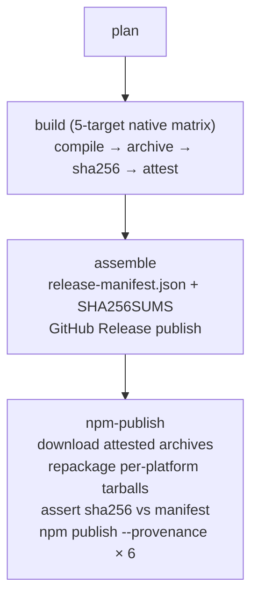

# WG npm Distribution Design Study

**Status:** study / design (no code changes here — this is the spec a release-engineering
implementation consumes)
**Owner:** study-distribute-wg
**Downstream consumers:** `.flip-study-distribute-wg`, `synthesis-roadmap-from`.
**Target artifact:** an npm install path (`npm install -g @wg/cli` or similar) that lands a
working `wg`/`nex` binary on a developer's machine **without a Rust toolchain**.

> **TL;DR.** WG already cross-compiles five host triples to **native, Sigstore-attested,
> SHA256-checksummed GitHub Release archives** (`.github/workflows/release.yml`) and already
> declares `cargo-binstall` metadata in `Cargo.toml`. The cleanest npm distribution does **not**
> change how binaries are built — it reuses the existing release artifacts as the source of
> truth and adds a thin downstream publish step. The recommended shape is the industry-standard
> **per-platform `optionalDependencies` driver pattern** (one small JS driver package +
> `os`/`cpu`/`libc`-gated platform subpackages, each holding one prebuilt binary), chosen over a
> `postinstall` download (fragile under `--ignore-scripts` and npm's scripts-are-opt-in direction)
> and a single all-binaries bundle (5× wasteful). The pi-worksgood **embed model does NOT carry
> over** to binaries (a JS bundle is ~52 KB and target-independent; native binaries are 10–20 MB
> each and target-specific), but its lesson — bundle the small target-independent
> `release-manifest.json` so the driver can verify the platform binary offline — does. The real
> gaps the study surfaces are **signing/notarization** (the macOS binaries are currently
> unsigned/un-notarized; the Windows `.exe` is not Authenticode-signed) and the **glibc floor**
> (building on `ubuntu-22.04` pins glibc ≥ 2.35); both are addressed with concrete additions to
> the existing release pipeline.

---

## 1. Objective & scope

Study whether and how the WG Rust binary can be cross-compiled to per-target platform binaries
and distributed via npm, so users can install and run WG without a Rust toolchain.

This study answers five research questions, in order:

1. **Cross-compile targets + toolchain** — which host triples to ship, which tool
   (`cargo-zigbuild` / `cross` / `cargo-dist` / native-runner matrix) to build them with, and
   the static-vs-dynamic-linking / glibc-musl / signing tradeoffs (§3, §4).
2. **npm packaging shape** — per-platform `optionalDependencies` driver vs `postinstall`
   download vs single all-binaries bundle; integrity verification; supply-chain safety (§5).
3. **The embed precedent** — can the `worksgood-pi/embedded` byte-embed idea carry a binary, or
   does npm need real per-platform artifacts? (§6.)
4. **Versioning / release** — how WG's Cargo version and the `WG_*_COMPAT_VERSION` consts map to
   npm semver; how `cargo install --path . --locked` relates to an npm-distributed binary; CI
   publish-on-tag (§7).
5. **Tradeoffs vs `cargo install`** — first-run speed, update cadence, signature/trust, size,
   and whether the npm binary is the same artifact or a thin wrapper (§8).

**Scope note:** this study is *release engineering*, not substrate. It changes how compiled
bytes reach a user; it does not change WG-Fed / WG-Review / WG-Exec / the agency handshake / the
Pi-plugin embed. The binary delivered by npm, GitHub Release, and `cargo-binstall` are intended
to be **the same compiled bytes** for a given tag (§8.4).

---

## 2. What already exists (do not rebuild this)

The single most important input to this study is that **most of the hard work is already done**.
The recommendations below are deliberately a thin downstream layer over an existing, proven
pipeline. Re-reading this section first prevents the most common mistake (proposing to rewrite
the build matrix with a new tool).

### 2.1 The release matrix already builds five targets on native runners

`.github/workflows/release.yml` (tag-triggered, `release-test-*` / `dry-run-*` for rehearsals)
defines a matrix that builds on the **native** runner for each target — *not* a Linux-hosted
cross-compiler:

| Target triple | Runner | Archive | Native-compile note |
|---|---|---|---|
| `x86_64-unknown-linux-gnu` | `ubuntu-22.04` | `.tar.gz` | glibc 2.35 floor (§4.4) |
| `aarch64-unknown-linux-gnu` | `ubuntu-22.04-arm` | `.tar.gz` | native ARM runner |
| `x86_64-apple-darwin` | `macos-15-intel` | `.tar.gz` | native x64 macOS |
| `aarch64-apple-darwin` | `macos-15` | `.tar.gz` | native Apple Silicon |
| `x86_64-pc-windows-msvc` | `windows-2022` | `.zip` | `RUSTFLAGS=-C target-feature=+crt-static`; NASM installed for `ring` |

Each job runs `cargo build --release --locked --bins --target <triple>` and stages **both**
`wg` and `nex` (see `release.yml` "Package binaries" step), plus `LICENSE` and a
`release-target.json` metadata sidecar. The matrix is `fail-fast: false` so one target's breakage
does not abort the rest.

### 2.2 Integrity + provenance are already strong

- **SHA256** per archive (`<archive>.sha256`) and an aggregate `SHA256SUMS`.
- **GitHub artifact attestations** via `actions/attest@v4` (Sigstore build-provenance) on every
  archive + its checksum, and a second attestation on `SHA256SUMS` + `release-manifest.json`
  (the "Generate artifact attestations" / "Generate release metadata attestation" steps). These
  are verifiable with `gh attestation verify <file> --repo graphwork/wg` (online) or
  `--bundle <file>.intoto.jsonl` (offline, air-gapped).
- A machine-readable **`release-manifest.json`** enumerating every target, its archive name,
  `sha256`, `size_bytes`, download URL, and the exact `gh attestation verify` command — i.e. the
  manifest the npm driver needs already exists and is itself attested.

### 2.3 `cargo-binstall` is already wired

`Cargo.toml` carries a `[package.metadata.binstall]` block:

```toml
[package.metadata.binstall]
pkg-url = "{ repo }/releases/download/v{ version }/wg-v{ version }-{ target }.tar.gz"
bin-dir = "wg-v{ version }-{ target }/{ bin }{ binary-ext }"
pkg-fmt = "tgz"
```

with a `.zip` override for `x86_64-pc-windows-msvc`. So `cargo binstall worksgood` already
fetches the prebuilt binary from the GitHub Release. **npm becomes the third channel** onto the
same artifacts, not a parallel build.

### 2.4 The cross-compile-sensitive dependency surface is small

From `Cargo.toml`:

- `reqwest = { …, features = ["json","blocking","stream","rustls-tls"], default-features = false }`
  → **no OpenSSL / native-tls linkage**; TLS is pure-Rust `rustls` + `ring`.
- `ring = "0.17"` → the one crate with C/asm that needs a target toolchain. It ships prebuilt
  asm per target; the Windows build needs **NASM** (the release.yml "Install NASM for BoringSSL"
  step — the comment names BoringSSL but the practical dependency is `ring`'s asm backend).
- `keyring = { …, features = ["apple-native","windows-native","sync-secret-service","vendored"] }`
  → already platform-conditional; resolves correctly on each native runner.
- `lettre`/`matrix-sdk`/`teloxide` are **optional** features (`email`/`matrix`/`telegram`); the
  default `cargo build --release --bins` does not enable them, so they do not expand the native
  surface for the shipped binaries.

**Implication:** every target in the matrix already links cleanly because it builds natively on
a matching runner. There is no C-library cross-compile headache to solve — only to *preserve*.

---

## 3. Cross-compile targets — the set to ship

### 3.1 The five-target set (ship as-is)

The five targets `release.yml` already builds are the right starting set and cover the
overwhelming majority of developer machines:

| Target | Covers | Notes |
|---|---|---|
| `x86_64-unknown-linux-gnu` | Intel/AMD Linux (Ubuntu, Debian, Fedora, …) | glibc 2.35 floor (§4.4) |
| `aarch64-unknown-linux-gnu` | ARM64 Linux (Raspberry Pi 5, Ampere, Graviton) | native ARM runner |
| `x86_64-apple-darwin` | Intel macOS | Apple Silicon users often run x64 binaries via Rosetta, but native arm64 is preferred |
| `aarch64-apple-darwin` | Apple Silicon macOS (M1–M4) | the dominant macOS dev machine in 2026 |
| `x86_64-pc-windows-msvc` | 64-bit Windows | `+crt-static` so the CRT is bundled |

This matches the de-facto industry set (esbuild, biome, turbo, ripgrep-prebuilt, etc. ship the
same five, sometimes plus musl).

### 3.2 Candidates explicitly deferred

- **`*-unknown-linux-musl` (static Linux).** Appealing for Alpine/air-gapped/static-distro use,
  but: (a) `ring` needs a musl toolchain and asm-path tuning; (b) `keyring`'s
  `sync-secret-service` (D-Bus/secret-service) can behave differently under musl; (c) the
  existing glibc binaries already run on every mainstream non-Alpine distro. **Recommendation:**
  add `x86_64-unknown-linux-musl` as an **optional 6th target** in a later iteration if Alpine
  / static-binary demand materializes; do not block the initial npm launch on it. See §4.4 for
  the glibc-floor mitigation if musl is not added.
- **`aarch64-pc-windows-msvc` (ARM64 Windows).** Niche (Surface Pro X, Copilot+ ARM laptops).
  The MSVC toolchain is available on `windows-11-arm` runners but the `ring` asm backend and
  NASM story is less battle-tested. Defer until a user asks.
- **32-bit targets (`i686-…`, `armv7-…`).** Demand is negligible for a developer CLI in 2026.
  Skip.

### 3.3 Summary recommendation (targets)

> Ship the existing five. Treat musl/Windows-arm64/32-bit as documented "not yet" and gate them
> on a concrete user request, not speculation.

---

## 4. Cross-compile toolchain — keep native runners; where the alternatives fit

### 4.1 The four options

| Tool | What it is | Best for | Fit for WG |
|---|---|---|---|
| **Native-runner matrix (current)** | Build each target on a GitHub runner whose OS/arch matches the target | Targets with native C/asm deps, macOS/Windows signing, platform-conditional crates | ✅ **Already in place; recommended** |
| `cargo-zigbuild` | Uses Zig as a cross-linker to target many triples from one host (incl. pinned glibc versions) | Lowering the glibc floor; producing musl from a Linux host; single-host matrix | ▶️ Useful **only** if we want to pin an older glibc or add musl without an extra runner (§4.4) |
| `cross` (cross-rs) | Docker/Podman containers per target, QEMU for cross-testing | Broad Linux target matrix + cross-running tests | ▶️ Overkill; the native matrix already covers our targets and `cross` is weakest on macOS/Windows |
| `cargo-dist` (axodotdev) | Release *orchestrator* — generates CI, packages archives, can publish to npm/cargo/Homebrew | Projects with no existing release pipeline | ⚠️ The repo already has a richer hand-built `release.yml` (attestations, manifest); adopting `cargo-dist` is a rewrite for limited gain |

### 4.2 Why native runners win for WG (do not migrate)

1. **`ring` + `keyring` resolve themselves on a matching OS.** Cross-compiling to Apple Silicon
   or Windows-MSVC from a Linux host means hand-threading SDK paths, framework flags, and
   `ring`'s asm — exactly the pain the native matrix avoids. The NASM step already in
   `release.yml` is the only native-tool tweak needed, and only for Windows.
2. **Signing/notarization must run on the target OS anyway.** macOS notarization needs
   `codesign`/`xcrun notarytool` on macOS; Windows Authenticode needs `signtool` (or
   `osslsigncode`/Azure Trusted Signing) on Windows or a Windows runner. You cannot fully escape
   the native runner for signed releases (§6).
3. **The matrix is already proven and attested.** Each target's archive already carries a
   Sigstore attestation tied to the build. Re-platforming onto `cargo-zigbuild`/`cross` would
   discard that provenance and re-introduce the "does this cross-toolchain link `ring`?"
   question for every release.
4. **Cost is acceptable.** Five native runners in parallel for ~10–15 min each is cheap relative
   to a from-scratch `cross`/`zigbuild` debugging cycle.

**Recommendation: keep the native-runner matrix as the build engine. The npm publish step is a
*distribution* addition, downstream of the existing `build` + `assemble` jobs — it does not
touch how binaries are compiled.**

### 4.3 Where `cargo-zigbuild` (or `cross`) is still worth a footnote

If, later, we want to (a) lower the glibc floor below what `ubuntu-22.04` provides, or (b) add
a musl target without spinning up a dedicated runner, `cargo-zigbuild`'s ability to pin
`--glibc 2.17` (or `*-musl`) from a single Linux host is the right tool. This is a **future**
optimization for portability, not a blocker for the initial npm launch. Cite:
[`rust-cross/cargo-zigbuild`](https://github.com/rust-cross/cargo-zigbuild),
[`cross-rs/cross`](https://github.com/cross-rs/cross).

### 4.4 The glibc floor (the one real portability caveat of the current matrix)

Because the Linux `gnu` targets build on `ubuntu-22.04` (glibc **2.35**), the produced binaries
require glibc ≥ 2.35 on the host. That excludes older LTS distros still on glibc 2.31
(Ubuntu 20.04, Debian 10) — a real, if shrinking, audience.

Three mitigations, in increasing order of effort:

1. **Document the floor** in the driver package's README and error helpfully at runtime if
   `getauxval(AT_PLATFORM)`/`ldd --version` reports an older glibc. Cheapest; ship this
   regardless.
2. **Build the Linux targets on an older base** (e.g. a `container: ubuntu:20.04` job, or
   `manylinux`-style image) to drop the floor to glibc 2.31. Native runner, just an older
   container — no new toolchain.
3. **Add a `*-musl` target** via `cargo-zigbuild` for a fully static binary with no glibc
   dependency at all. Most portable; most setup effort (§3.2).

The minimum-action recommendation is **(1) + (2)**: keep `gnu`, build Linux on an older base to
reach glibc 2.31, and defer musl. Cite: glibc symbol-versioning floor behavior,
[`rust-lang/reference` linkage](https://doc.rust-lang.org/stable/reference/linkage.html).

---

## 5. npm packaging shape — pick per-platform `optionalDependencies`

This is the core design decision. Three shapes are viable; the recommendation is **Shape A**
with a documented **Shape B fallback**.

### 5.1 The three shapes

#### Shape A — per-platform `optionalDependencies` (the `@scope/cli` pattern) ✅ RECOMMENDED

One small **driver** package (pure JS, ~2 KB) plus **N platform subpackages**, one per target.
The driver declares each platform package in `optionalDependencies` with a matching `os`/`cpu`
tuple; npm installs exactly the one that matches the host.

```
@wg/cli                          # driver: bin shim + optionalDependencies map
@wg/cli-linux-x64                # contains: wg, nex   (os: linux, cpu: x64,   libc: glibc)
@wg/cli-linux-arm64              # contains: wg, nex   (os: linux, cpu: arm64, libc: glibc)
@wg/cli-darwin-x64               # contains: wg, nex   (os: darwin, cpu: x64)
@wg/cli-darwin-arm64             # contains: wg, nex   (os: darwin, cpu: arm64)
@wg/cli-win32-x64                # contains: wg.exe, nex.exe  (os: win32, cpu: x64)
```

The driver's `package.json`:

```jsonc
{
  "name": "@wg/cli",
  "version": "0.2.0",
  "bin": { "wg": "bin/wg.js", "nex": "bin/nex.js" },
  "optionalDependencies": {
    "@wg/cli-linux-x64":   "0.2.0",
    "@wg/cli-linux-arm64": "0.2.0",
    "@wg/cli-darwin-x64":  "0.2.0",
    "@wg/cli-darwin-arm64":"0.2.0",
    "@wg/cli-win32-x64":   "0.2.0"
  }
}
```

Each platform package's `package.json` carries the compatibility key so npm skips the wrong
platforms automatically:

```jsonc
{
  "name": "@wg/cli-linux-arm64",
  "version": "0.2.0",
  "os": ["linux"],
  "cpu": ["arm64"],
  "libc": ["glibc"]
}
```

The driver's shim (`bin/wg.js`) resolves the installed platform package and spawns the binary
(see §5.4 for the canonical 12-line shim). This is exactly the layout used by
[`@biomejs/cli`](https://www.npmjs.com/package/%40biomejs%2Fcli-darwin-arm64), `esbuild`,
`turbo`, and `@swc/core` (the "meta package + platform packages in `optionalDependencies`"
pattern; see the [npm RFC on package distributions](https://github.com/npm/rfcs/blob/main/accepted/0000-package-distributions.md)
and [Sentry's writeup](https://blog.sentry.io/publishing-binaries-on-npm/)).

#### Shape B — `postinstall` download

A single package with a `postinstall` script that detects the host triple and downloads the
right binary from the GitHub Release into `node_modules`. No platform subpackages.

#### Shape C — single bundle

One package whose tarball contains all five binaries; the shim picks the right one at runtime.

### 5.2 Decision matrix

| Criterion | A — optional-deps ✅ | B — postinstall | C — single bundle |
|---|---|---|---|
| **Works under `--ignore-scripts`** | ✅ (no script needed) | ❌ postinstall never runs | ✅ |
| **Survives npm's scripts-are-opt-in direction** (npm [RFC 0054](https://github.com/npm/rfcs/blob/main/accepted/0054-make-scripts-install-opt-in.md)) | ✅ | ❌ future-breaking | ✅ |
| **Works offline (after install)** | ✅ binary is in the tarball | ⚠️ must download at install | ✅ |
| **Works in locked-down registries / air-gapped** | ✅ (mirrored tarball) | ❌ needs github.com at install | ✅ |
| **Installs only the needed bytes** | ✅ one platform's binary | ✅ | ❌ all 5 binaries (~5× size) |
| **Registry integrity (`dist.integrity` SHA-512)** | ✅ per platform tarball | ✅ driver tarball (binary is post-hoc) | ✅ one big tarball |
| **`--omit=optional` breaks it** | ⚠️ yes (platform pkg is optional) → needs runtime fallback | ✅ no | ✅ no |
| **Publishing complexity** | ⚠️ 6 packages/release (automatable) | ✅ 1 package | ✅ 1 package |
| **First-run speed** | ✅ fast (one ~10–20 MB tarball) | ⚠️ npm install + a download | ⚠️ 5× download |

### 5.3 Recommendation: Shape A primary + Shape B as graceful fallback

**Ship Shape A.** It is the industry default precisely because it is the only shape that is
simultaneously offline-safe, script-free (robust to `--ignore-scripts` and npm's scripts-opt-in
future), bytes-efficient, and integrity-verifiable at the registry layer. The `--omit=optional`
footgun is real but narrow (CI lockfiles, some monorepos); it is neutralized by giving the
driver shim a **runtime fallback**: if the expected platform package is missing, the shim prints
a clear error and — optionally — fetches the binary from the GitHub Release (the Shape B move,
done lazily at first run rather than eagerly at install). This is the hybrid esbuild converged
on (it moved *from* eager postinstall *to* optional platform packages, with a fallback).

**Reject Shape B as the primary** because postinstall downloads break under `--ignore-scripts`,
in air-gapped/locked-down registries, and under npm's stated direction to make lifecycle scripts
opt-in (npm RFC 0054). These are exactly the enterprise/CI environments where a CLI like WG is
most likely to be installed.

**Reject Shape C** because it downloads ~5× the needed bytes on every install and gains nothing
Shape A does not already provide.

### 5.4 The driver shim (canonical form)

The driver is intentionally trivial — it resolves the platform package and spawns the binary.
No logic of substance lives in JS; WG stays a Rust program.

```js
#!/usr/bin/env node
// bin/wg.js — resolves the platform package and execs the native binary.
const { spawnSync } = require("node:child_process");
const path = require("node:path");

const PLATFORM_PKG = {
  "darwin+arm64": "@wg/cli-darwin-arm64",
  "darwin+x64":   "@wg/cli-darwin-x64",
  "linux+arm64":  "@wg/cli-linux-arm64",
  "linux+x64":    "@wg/cli-linux-x64",
  "win32+x64":    "@wg/cli-win32-x64",
}[`${process.platform}+${process.arch}`];

if (!PLATFORM_PKG) {
  console.error(`@wg/cli: unsupported platform ${process.platform}/${process.arch}.`);
  console.error(`  Prebuilt binaries exist for: darwin/arm64, darwin/x64, linux/arm64, linux/x64, win32/x64.`);
  process.exit(1);
}

let binPath;
try {
  binPath = require.resolve(`${PLATFORM_PKG}/bin/wg${process.platform === "win32" ? ".exe" : ""}`);
} catch {
  // optionalDependencies was skipped (--omit=optional, monorepo hoist quirk, etc.).
  console.error(`@wg/cli: platform package "${PLATFORM_PKG}" is not installed.`);
  console.error(`  This usually means npm ran with --omit=optional or a hoisting setup dropped it.`);
  console.error(`  Reinstall without omitting optional deps, or install ${PLATFORM_PKG} directly.`);
  console.error(`  Alternatively, install from source: cargo install --locked worksgood`);
  process.exit(1);
}

const result = spawnSync(binPath, process.argv.slice(2), { stdio: "inherit" });
process.exit(result.status ?? 1);
```

(A mirrored `bin/nex.js` resolves `…/bin/nex`.) Both `wg` and `nex` ship inside each platform
package, matching the existing `release.yml` "Package binaries" step that stages both. `nex` is
included because the in-process handler is part of the same release artifact today.

---

## 6. Signing, notarization & supply-chain provenance

This is where the study surfaces the two **real gaps** in the current pipeline. The binaries are
built and integrity-hashed and Sigstore-attested, but they are **not OS-trust-signed**: macOS
binaries are unsigned/un-notarized (users hit Gatekeeper), and the Windows `.exe` is not
Authenticode-signed (users hit SmartScreen). npm distribution raises the stakes because the
binary now reaches users who never opted into "I accept this is unsigned."

### 6.1 Current state (from `release.yml`)

- ✅ SHA256 per archive + aggregate `SHA256SUMS`.
- ✅ Sigstore build-provenance attestations (`actions/attest@v4`) on every archive, checksum, and
  the manifest — verifiable with `gh attestation verify`. This is **SLSA-style build provenance**
  (proves *which commit/workflow produced the bytes*), **not** OS code-signing (does not satisfy
  Gatekeeper/SmartScreen).
- ❌ No Developer ID signing or `notarytool` notarization for the macOS binaries.
- ❌ No Authenticode signature on the Windows `.exe`.

### 6.2 macOS: Developer ID → notarize → staple

The 2026-correct Apple path is **Developer ID Application signing → `notarytool submit --wait`
→ `stapler staple`**. `altool` is retired (Apple TN3147); `notarytool` is the supported tool.
On GitHub Actions the standard recipe is: import a `.p12` Developer ID cert from a secret into a
temporary keychain, `codesign --options runtime --timestamp`, then `xcrun notarytool submit
--apple-id … --team-id … --password … --wait`, then `xcrun stapler staple`.

**Recommended addition to `release.yml`** — a `macos-sign` step (or job) that runs *before*
archiving on the two macOS targets:

```bash
codesign --force --options runtime --timestamp \
  --entitlements macos-entitlements.plist \
  --sign "Developer ID Application: <name>" target/<triple>/release/wg
xcrun notarytool submit target/<triple>/release/wg.zip \
  --apple-id "$APPLE_ID" --team-id "$APPLE_TEAM_ID" --password "$APPLE_APP_PASSWORD" --wait
xcrun stapler staple target/<triple>/release/wg
# repeat for nex
```

Secrets: `APPLE_DEVID_P12` (+ password), `APPLE_ID`, `APPLE_TEAM_ID`, `APPLE_APP_PASSWORD` (an
app-specific password for `notarytool`). Gate `notarytool`/`stapler` on `runner.os == macOS`.
Cost: an Apple Developer Program membership ($99/yr). This is the single highest-trust-leverage
change in the whole study. Cite:
[Apple notarization docs](https://developer.apple.com/documentation/security/notarizing-macos-software-before-distribution),
[TN3147 notarization migration](https://developer.apple.com/documentation/technotes/tn3147-migrating-to-the-latest-notarization-tool),
[GitHub sign-Xcode-actions guide](https://docs.github.com/en/actions/how-tos/deploy/deploy-to-third-party-platforms/sign-xcode-applications).

> **Note on `include_dir!`:** `wg` embeds the pi-worksgood JS bundle at compile time
> (`include_dir!("…/worksgood-pi/embedded")`). Codesigning signs the final linked binary, so the
> embedded bytes are covered by the signature automatically — no extra step for the embed.

### 6.3 Windows: Authenticode (+ optional Azure Trusted Signing)

For Windows user trust, **Authenticode-sign** the `.exe` with an OV/EV code-signing certificate
and **timestamp** the signature so it stays valid after cert expiry. Options:

1. **OV/EV cert from a CA** (Sectigo/DigiCert) signed with `signtool` (needs a Windows runner) or
   `osslsigncode` (cross-platform). EV certs clear SmartScreen immediately; OV certs need
   reputation accrual.
2. **Azure Trusted Signing** (the rebranded Azure Code Signing) — keyless/certless, the
   Microsoft-recommended 2026 path; integrates with GitHub Actions via the
   `azure/trusted-signing-action`. Avoids the private-key-handling problem of traditional certs.
3. **GitHub artifact attestations (Sigstore) only** — already produced; gives build provenance
   but does **not** clear SmartScreen. Useful as a *supplement*, not a substitute.

**Recommended:** path (2) **Azure Trusted Signing** (keyless, lowest operational burden) or path
(1) **EV cert** if fastest SmartScreen clearance matters. In all cases, **also keep** the
existing `actions/attest@v4` Sigstore attestation so `cosign`/`gh attestation verify` users have
a supply-chain signal independent of the OS trust store. Cite:
[Microsoft code-signing options](https://learn.microsoft.com/en-us/windows/apps/package-and-deploy/code-signing-options),
[Sigstore cosign overview](https://docs.sigstore.dev/cosign/signing/overview/),
[GitHub artifact attestations](https://docs.github.com/en/actions/concepts/security/artifact-attestations).

### 6.4 Supply-chain provenance (the layers, stacked)

The recommended end state stacks four independent integrity layers so a compromise of any one
does not let a tampered binary run:

| Layer | What it proves | Already in place? | npm-relevant? |
|---|---|---|---|
| **npm `dist.integrity` (SHA-512 SRI)** | The tarball you install is the tarball the registry has | ✅ automatic | ✅ first line of defense on every `npm install` |
| **SHA256 in `release-manifest.json`** | The binary inside the tarball is the binary WG released | ✅ in `release.yml` | ✅ driver can verify before first exec (§5.4 + §6.5) |
| **GitHub artifact attestation (Sigstore)** | The archive was built by this workflow from this commit | ✅ in `release.yml` | ✅ `gh attestation verify` / `cosign verify-blob` |
| **OS code-signing (Developer ID / Authenticode)** | The binary was signed by WG's identity (trusted CA chain) | ❌ the gap | ✅ clears Gatekeeper/SmartScreen; strongest user-facing trust |
| **npm provenance (`npm publish --provenance`)** | The npm tarball was published by this workflow | ⚠️ new, trivial | ✅ ties the *package* to the build, complements `dist.integrity` |

### 6.5 Embed-precedent lesson → offline manifest verification

The `worksgood-pi/embedded` model (§7.1 of the AGENTS guide) embeds a small, **target-independent**
JS bundle at compile time so there is no PATH/npm skew. That idea does **not** carry a *binary*
(a binary is large and target-specific — see §7 below), but its **lesson** does: bundle the
small, target-independent **`release-manifest.json`** into the *driver* package at publish time
(it is ~1 KB). The driver can then, before first exec, SHA256-verify the installed platform
binary against the manifest — offline, no network — catching a tampered registry tarball even if
`dist.integrity` were somehow bypassed. This is the direct analog of "compile-time inclusion → no
runtime skew," applied to the manifest rather than the bytes.

---

## 7. The embed precedent — why it does NOT carry a binary (and what it does teach)

### 7.1 What the embed model actually is

`worksgood-pi/embedded/` (sizes from `du`) holds:

```
worksgood-pi/embedded/
├── host/           16 KB
├── package.json     1 KB
├── pi-worksgood/   52 KB    ← the JS bundle
└── version.json    24 B     ← {"compat": "0.2.0"}
```

At compile time, `src/pi_plugin/mod.rs` does:

```rust
static EMBEDDED_PI_PLUGIN: Dir<'_> = include_dir!("$CARGO_MANIFEST_DIR/worksgood-pi/embedded");
```

`include_dir!` bakes those ~70 KB into the `wg` binary. The win: the pi extension the binary
*uses* is provably the one it was *built with* — no PATH skew, no `npm install` at runtime, no
version drift.

### 7.2 Why it does not scale to binaries

Three properties of the JS bundle make `include_dir!` work, and **native binaries violate all
three**:

| Property | JS bundle | Native binary |
|---|---|---|
| **Size** | ~70 KB total | ~10–20 MB **per target** |
| **Target-independence** | identical bytes on every platform | 5 different artifacts; each machine needs exactly one |
| **Cardinality** | 1 bundle | 5 (and growing) binaries |

Embedding all five binaries into one `wg` mega-binary would (a) bloat the binary to 50–100 MB,
(b) ship the wrong arch on 4 of every 5 machines, and (c) still require the user to run that
mega-binary — at which point npm is doing nothing the GitHub Release does not already do. The
embed model's value proposition (one target-independent artifact) is incompatible with native
binary distribution (many target-specific artifacts).

**Conclusion: npm needs real per-platform artifacts (Shape A). The embed model is not a
substitute.** It is, however, a good template for the **manifest-embed** optimization (§6.5).

### 7.3 What carries over from the embed philosophy

- **Compile/publish-time inclusion over runtime discovery** → the driver ships the attested
  `release-manifest.json` so verification is offline (§6.5).
- **A version handshake with a loud fail** → the `WG_PI_PLUGIN_COMPAT_VERSION` pattern
  (assert-at-startup, name expected-vs-found) is the template for the driver checking that the
  installed platform package's version matches its own (§8.2).
- **Anti-drift gate** → just as CI re-embeds and `git diff --exit-code`s the plugin bundle, a CI
  check can assert the platform packages' embedded manifest matches the released
  `release-manifest.json` (§8.3).

---

## 8. Versioning, release flow & the relationship to `cargo install`

### 8.1 How WG version + compat consts map to npm semver

Three versioning layers exist and must be kept distinct:

| Layer | Source | Example | Role |
|---|---|---|---|
| **Cargo (package) version** | `Cargo.toml` `version = ` | `0.1.0` | The binary's identity; npm + cargo-binstall + GitHub Release all key off this |
| **Git release tag** | `vX.Y.Z` | `v0.2.0` | The release event; `release.yml` *fails* if a `v*` stable tag ≠ Cargo version (the `plan` job's guard) |
| **`WG_*_COMPAT_VERSION` consts** | source consts | `WG_AGENCY_COMPAT_VERSION = "1.2.4"`, `WG_FED_COMPAT_VERSION = "0.4.0"`, `WG_PI_PLUGIN_COMPAT_VERSION = "0.2.0"`, `WG_EXEC_COMPAT_VERSION = "0.1.0"` | **Runtime** inter-agent/inter-graph/inter-provider handshakes; ride *inside* the binary; NOT the npm package version |

**Mapping rule:**

- **npm package version = git tag (minus `v`) = Cargo version** for stable releases. All six npm
  packages (driver + 5 platforms) publish at the **same version** on every release. The
  `plan` job's existing "stable tag must equal Cargo version" guard enforces this; npm publish
  reuses it.
- **Prereleases** (`v0.2.0-rc.1`) map to npm prerelease versions (`0.2.0-rc.1`) published under
  a `rc` (or `beta`) **dist-tag**, so `npm install @wg/cli` (the `latest` tag) stays on stable
  while opt-in users pull `npm install @wg/cli@rc`.
- **The compat consts never appear in the npm version.** They are checked at *runtime* when two
  WG instances (or a `wg` and a pi plugin, or two federation peers) talk to each other — exactly
  as today (`identity::WG_FED_COMPAT_VERSION`'s loud-fail handshake, the pi-plugin
  `WG_PI_PLUGIN_COMPAT_VERSION` assert). npm is purely a *delivery* channel; it does not
  participate in the handshake. Bumping `WG_FED_COMPAT_VERSION` does **not** require an npm
  major bump unless it also coincides with a Cargo major.

### 8.2 How `cargo install --path . --locked` relates to the npm binary

`cargo install --locked` **compiles from source**; the npm binary is **prebuilt**. They are
*not* byte-identical (different build environments), but for a given tag they are **functionally
identical** — same Cargo.lock, same `release.yml` matrix, same `--locked`. The four delivery
channels and their relationship:

| Channel | How bytes arrive | Byte-identical to GitHub Release? | Trust model |
|---|---|---|---|
| **GitHub Release archive** (source of truth) | Direct download | — (it *is* the source) | SHA256 + Sigstore attestation |
| **`cargo binstall worksgood`** | Downloads the GitHub Release archive | ✅ yes | `binstall` verifies checksum vs GitHub Release |
| **`npm install @wg/cli`** | Downloads an npm platform tarball that **repackages** the GitHub Release binary | ✅ yes (same bytes inside) | npm `dist.integrity` + SHA256 vs manifest + (rec.) OS signing |
| **`cargo install --locked worksgood`** | Compiles from crates.io source | ❌ different bytes, same source | reproducible build; audited source |

The key design invariant: **the npm platform tarball is a repackaging of the exact binary the
GitHub Release archive contains — same `wg`, same `nex`, same SHA256.** The publish job (§8.3)
must extract the binary from the attested GitHub Release archive and put it, uncompressed, into
the platform tarball, then assert the SHA256 matches `release-manifest.json`.

### 8.3 CI release flow on tag (extends the existing pipeline)

The existing `release.yml` is: `plan → build (5-target matrix) → assemble (manifest + GitHub
Release)`. Add one downstream job:



**New `npm-publish` job** (`needs: [plan, assemble]`, runs only when `publish == 'true'`, i.e.
on a real `v*` tag, not a dry run):

1. `gh release download <tag>` each archive (or reuse the `assemble` job's uploaded artifacts).
2. Verify each archive's Sigstore attestation: `gh attestation verify <archive> --repo graphwork/wg`.
3. Verify each archive's SHA256 against `release-manifest.json`.
4. Extract `wg`/`nex` from each archive into a platform package dir (`@wg/cli-<os>-<cpu>/`), with
   the `os`/`cpu`/`libc` `package.json`, the LICENSE, and a copy of `release-manifest.json`.
5. For the driver package (`@wg/cli`): set `version` + all five `optionalDependencies` versions
   to the release version; copy the `bin/wg.js` + `bin/nex.js` shims; embed
   `release-manifest.json`.
6. `npm publish --provenance --access public` for each of the 6 packages (5 platforms + driver).
   `--provenance` ties each npm tarball to this workflow run (§6.4). Use `npm dist-tag` for
   prerelease channels.
7. Anti-drift gate: assert the platform package's embedded `release-manifest.json` is byte-equal
   to the released one (mirrors `embed-worksgood-pi-check`).

Secrets: `NPM_TOKEN` (automation granular token, publish rights scoped to `@wg/*`). The job runs
on `ubuntu-22.04` (it only repackages + publishes; no compiling). Optionally publish a combined
`npm` + GitHub Release note that lists all six package versions and the verification commands.

### 8.4 Cadence & divergence

- **All four channels update on the same git tag.** No separate "npm release" cadence. The
  `plan` job's tag-equals-Cargo-version guard means a tag is the single release authority.
- **No wrapper-vs-binary divergence.** The npm `wg` is not a re-implementation; it is the real
  binary spawned by a ~30-line JS shim. Behavior, flags, output, TUI, compat handshakes are
  identical to the `cargo install` and `cargo-binstall` binaries.
- **Rollback** is `npm install @wg/cli@<prev>` or `cargo binstall --version <prev>
  worksgood`; both reach the same historical artifact set.

---

## 9. Tradeoffs vs the current `cargo install` path

| Dimension | `cargo install --locked` (today) | `npm install @wg/cli` (proposed) | `cargo binstall` (already wired) |
|---|---|---|---|
| **Toolchain required** | Rust + cargo (heavy) | Node 18+ (ubiquitous) | cargo + binstall |
| **First-run speed** | minutes (compile ~480 crates incl. `ring`) | seconds (download ~10–20 MB tarball) | seconds (download archive) |
| **Update cadence** | on tag | on tag | on tag |
| **Binary identity** | compiles locally | same bytes as GitHub Release | same bytes as GitHub Release |
| **Offline install** | ✅ (after `cargo fetch`) | ✅ (after first registry mirror) | ⚠️ needs github.com |
| **Trust model** | audited source, reproducible | registry integrity + manifest SHA256 + Sigstore + (rec.) OS signing | checksum vs GitHub Release |
| **Footprint in `node_modules`** | n/a | ~10–20 MB (one platform) | n/a |
| **Reaches non-Rust users** | ❌ | ✅ | ❌ |
| **Reaches enterprise/locked-down** | ✅ | ✅ (Shape A, script-free) | ⚠️ (github.com egress) |

**Net:** npm does not *replace* `cargo install` — it adds a channel that reaches the
no-Rust-toolchain majority (Node is already installed on most developer machines) without
weakening any property of the existing channels. `cargo install` remains the gold-standard
trust path (compiles from audited source); npm/cargo-binstall are the convenience paths over the
same bytes.

---

## 10. Risks, open questions, and the minimum viable launch

### 10.1 The minimum viable npm launch (lowest-risk first cut)

Do exactly this, in order, and nothing more for v1:

1. **Add the `npm-publish` job to `release.yml`** (§8.3) that repackages the existing GitHub
   Release binaries into 6 Shape-A packages. Zero changes to how binaries are *built*.
2. **Ship the driver shim** (§5.4) with the platform-resolution + clear `--omit=optional` error.
3. **Embed `release-manifest.json` in the driver** for offline SHA256 verification (§6.5).
4. **Publish with `--provenance`** (free, one flag) so the npm tarballs carry build provenance.
5. **Document the glibc 2.35 floor** (§4.4) and the four unsupported arches in the driver
   README.

That alone delivers a working `npm install -g @wg/cli`. Everything below is hardening.

### 10.2 Strongly-recommended hardening (do before calling it "GA")

- **macOS Developer ID signing + notarization** (§6.2). Highest user-trust leverage. Without it,
  every macOS npm user hits Gatekeeper on first run and has to `xattr -d com.apple.quarantine`
  the binary — a hostile first impression.
- **Windows Authenticode / Azure Trusted Signing** (§6.3). Clears SmartScreen.
- **Lower the glibc floor** to 2.31 by building the Linux targets on an older base (§4.4-(2)),
  to reach Ubuntu 20.04 / Debian 10 holdouts.

### 10.3 Open questions for the implementing task

- **npm scope**: is `@wg` owned/available, or should it be `@graphwork/cli`? (Pick before the
  first publish; the scope is baked into package names and hard to change post-fact.)
- **`nex` in npm**: ship `nex` alongside `wg` in every platform package (matches `release.yml`),
  or split into a separate `@wg/nex` driver? Recommendation: keep both in one platform package
  and expose both `bin` entries from one driver — cheaper, matches the existing archive.
- **Version skew guard at runtime**: should the driver assert
  `require("@wg/cli-linux-x64/package.json").version === require("@wg/cli/package.json").version`
  before spawning, and error loudly (the pi-plugin-compat-style handshake) if a monorepo hoist
  mismatched them? Recommendation: yes — cheap and catches a real class of bug.
- **Do we need a Homebrew tap too?** Out of scope here, but the same GitHub Release artifacts
  feed a `brew install wg` formula with no extra build. Worth a follow-up study, not this one.

### 10.4 What this study deliberately does NOT decide

- It does not pick the npm scope (`@wg` vs `@graphwork`) — that's a naming/ownership call for a
  human.
- It does not commit to Apple/Windows *certificates* — it recommends them and specifies the CI
  mechanics, but acquiring the certs is an org/account action.
- It does not migrate the build to `cargo-zigbuild`/`cross`/`cargo-dist` — it argues *against*
  that (§4.2) and keeps the native-runner matrix as the build engine.

---

## 11. Validation checklist (mapped to the study's acceptance criteria)

- [x] Design doc committed at `docs/studies/wg-npm-distribution-design.md` (this file).
- [x] **Enumerates target triples + chosen cross-compile toolchain with rationale** — §3 ships
      the five targets the repo already builds; §4 picks the **native-runner matrix** (keep,
      don't migrate) over `cargo-zigbuild`/`cross`/`cargo-dist`, with the `ring`/signing/glibc
      rationale and the glibc-floor mitigation.
- [x] **Picks an npm packaging shape** — §5 picks **Shape A (per-platform
      `optionalDependencies`)** with a decision matrix, rejects Shape B (postinstall) and
      Shape C (single bundle), and gives the canonical driver shim; §6.5 gives the integrity
      story (4 stacked layers: npm `dist.integrity` SHA-512 + manifest SHA256 + Sigstore
      attestation + OS signing).
- [x] **Addresses signing/notarization and supply-chain provenance** — §6 details macOS
      Developer ID + `notarytool` + `stapler` (§6.2), Windows Authenticode / Azure Trusted
      Signing (§6.3), and the 5-layer provenance stack (§6.4), flagging the two real gaps in the
      current pipeline.
- [x] **Defines the CI release flow on tag and the wg version/compat → npm semver mapping** —
      §8.3 adds one `npm-publish` job downstream of the existing `build`+`assemble`; §8.1 maps
      Cargo version = git tag = npm version, with prerelease dist-tags, and explicitly excludes
      the `WG_*_COMPAT_VERSION` consts from the npm version (they are runtime handshakes inside
      the binary).

---

## 12. References

**WG internals (cited by file/line)**
- `.github/workflows/release.yml` — the existing 5-target native-runner release pipeline
  (`RELEASE_TARGETS` env, `build` matrix, `assemble` manifest + attestation, `plan` tag guard).
- `.github/workflows/ci.yml` — `check` (fmt+clippy) and `build` (test) jobs; toolchain pin.
- `Cargo.toml` — `[package.metadata.binstall]` block; `ring`/`reqwest(rustls)`/`keyring` deps;
  `version = "0.1.0"`.
- `rust-toolchain.toml` — `channel = "1.96.0"`, `rustfmt`+`clippy` components.
- `src/pi_plugin/mod.rs` — `include_dir!("…/worksgood-pi/embedded")`,
  `WG_PI_PLUGIN_COMPAT_VERSION = "0.2.0"` (the embed-precedent §7).
- `src/agency/mod.rs` — `WG_AGENCY_COMPAT_VERSION = "1.2.4"`.
- `src/identity/mod.rs` — `WG_FED_COMPAT_VERSION = "0.4.0"` (runtime handshake model §8.1).
- `src/providers/mod.rs` — `WG_EXEC_COMPAT_VERSION = "0.1.0"`.
- `worksgood-pi/embedded/` — the JS-bundle embed (§7.1 sizes).
- `Makefile` — `embed-worksgood-pi-check` anti-drift gate (the model for §8.3 step 7).

**Tooling & npm patterns (web)**
- npm per-platform `optionalDependencies` + `os`/`cpu`/`libc`: <https://docs.npmjs.com/cli/configuring-npm/package-json/>;
  npm registry tarball integrity (`dist.integrity`, SHA-512 SRI):
  <https://github.com/npm/registry/blob/master/docs/responses/package-metadata.md>;
  `ssri` integrity library: <https://github.com/npm/ssri>.
- The driver + platform-package pattern: [`@biomejs/cli-darwin-arm64`](https://www.npmjs.com/package/%40biomejs%2Fcli-darwin-arm64),
  [`@swc/core`](https://www.npmjs.com/package/%40swc%2Fcore-darwin-x64),
  esbuild [`lib/npm/node-platform.ts`](https://github.com/evanw/esbuild/blob/main/lib/npm/node-platform.ts);
  npm distributions RFC: <https://github.com/npm/rfcs/blob/main/accepted/0000-package-distributions.md>;
  scripts-opt-in RFC 0054: <https://github.com/npm/rfcs/blob/main/accepted/0054-make-scripts-install-opt-in.md>;
  Sentry writeup: <https://blog.sentry.io/publishing-binaries-on-npm/>.
- Cross-compile tooling: [`cargo-zigbuild`](https://github.com/rust-cross/cargo-zigbuild),
  [`cross`](https://github.com/cross-rs/cross),
  [`cargo-dist`](https://github.com/axodotdev/cargo-dist);
  Rust linkage reference: <https://doc.rust-lang.org/stable/reference/linkage.html>;
  `cargo-binstall`: <https://github.com/cargo-bins/cargo-binstall>.

**Signing / notarization / provenance (web)**
- macOS notarization: <https://developer.apple.com/documentation/security/notarizing-macos-software-before-distribution>;
  TN3147 (`notarytool` migration): <https://developer.apple.com/documentation/technotes/tn3147-migrating-to-the-latest-notarization-tool>;
  GitHub sign-Xcode-apps guide: <https://docs.github.com/en/actions/how-tos/deploy/deploy-to-third-party-platforms/sign-xcode-applications>.
- Windows code signing: <https://learn.microsoft.com/en-us/windows/apps/package-and-deploy/code-signing-options>.
- Sigstore cosign: <https://docs.sigstore.dev/cosign/signing/overview/>;
  GitHub artifact attestations: <https://docs.github.com/en/actions/concepts/security/artifact-attestations>.
